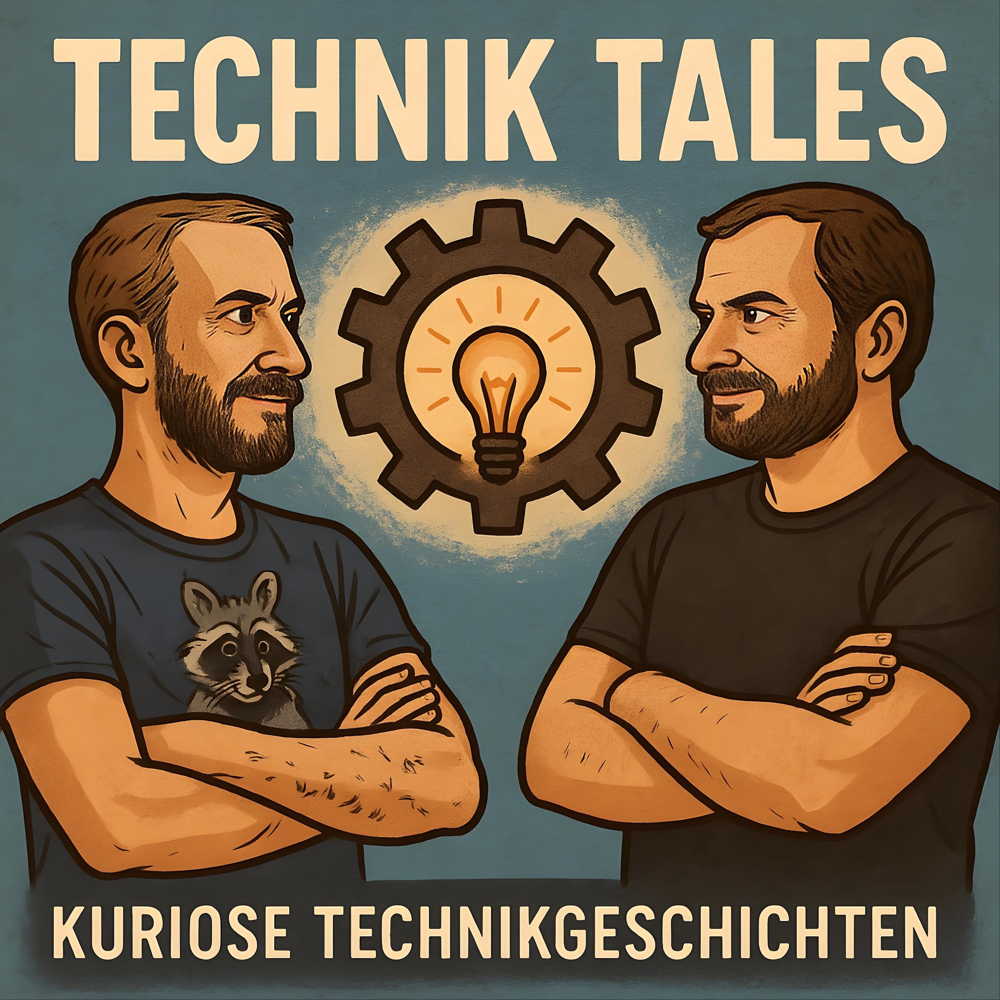
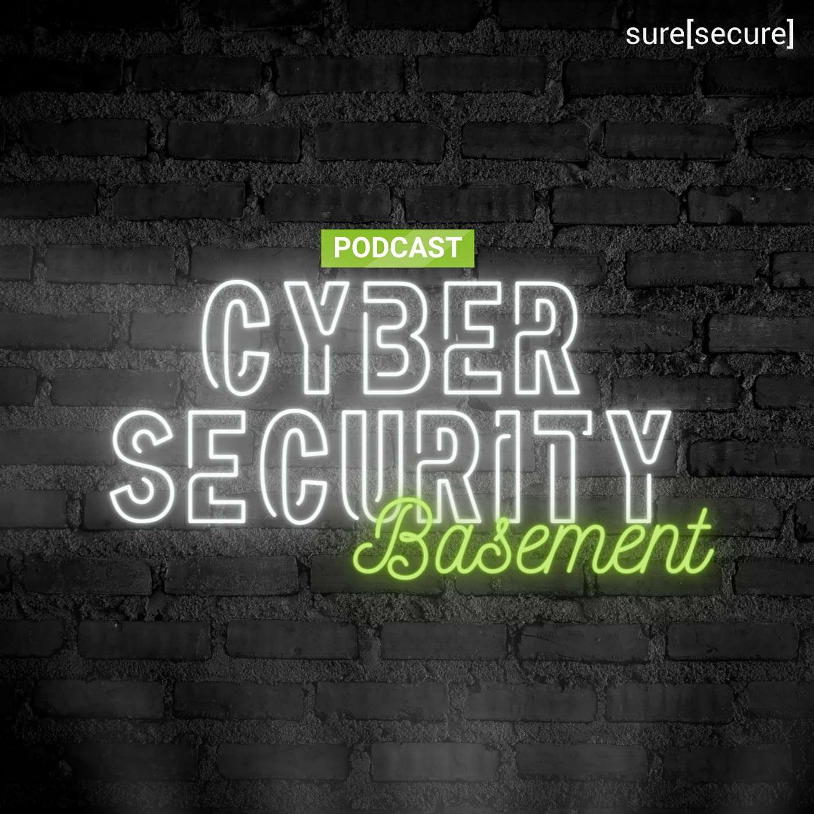

# GermanTechPodcasts

A curated list of German Tech Podcasts :de: :austria: :switzerland:

All listed podcasts are available as an [OPML file (podcasts.opml)](./podcasts.opml) to import those into your podcatcher as well.

## Table of Contents

* [Podcasts](#podcasts) (82 podcasts)
  * [#heiseshow](#heiseshow)
  * [((c3d2)) Pentaradio 24](#c3d2-pentaradio-24)
  * [0d - Zeroday](#0d-zeroday)
  * [Apfelfunk](#apfelfunk)
  * [Auslegungssache - der c&#39;t-Datenschutz-Podcast](#auslegungssache-der-ct-datenschutz-podcast)
  * [Binärgewitter](#binargewitter)
  * [Bit-Rauschen - der Prozessor-Podcast von c&#39;t](#bit-rauschen-der-prozessor-podcast-von-ct)
  * [Bits &amp; Böses - Der Tech Crime Podcast](#bits-and-boses-der-tech-crime-podcast)
  * [Bits und so](#bits-und-so)
  * [Breach FM](#breach-fm)
  * [BuzzZoom](#buzzzoom)
  * [c&#39;t uplink](#ct-uplink)
  * [Chaosradio](#chaosradio)
  * [Click! Clack! Hack!](#click-clack-hack)
  * [Code Culture](#code-culture)
  * [Coding Buddies](#coding-buddies)
  * [Computer und Kommunikation (Deutschlandfunk)](#computer-und-kommunikation-deutschlandfunk)
  * [Cybersecurity entschlüsselt](#cybersecurity-entschlusselt)
  * [Das Duumvirat](#das-duumvirat)
  * [DAS WAR SCHON KAPUTT](#das-war-schon-kaputt)
  * [Data Science Deep Dive](#data-science-deep-dive)
  * [Der GameDev Podcast](#der-gamedev-podcast)
  * [DevCouch](#devcouch)
  * [Devs on Tape](#devs-on-tape)
  * [Digitale Anomalien](#digitale-anomalien)
  * [Einfach Komplex](#einfach-komplex)
  * [Engineering Kiosk](#engineering-kiosk)
  * [Faxinformatiker](#faxinformatiker)
  * [Female TechTalk](#female-techtalk)
  * [FOCUS ON: DevOps](#focus-on-devops)
  * [Frauen und Technik – mit Eckert und Wolfangel](#frauen-und-technik-mit-eckert-und-wolfangel)
  * [Freakshow](#freakshow)
  * [Gamedev für die Platte - Der Unreal Podcast](#gamedev-fur-die-platte-der-unreal-podcast)
  * [GNU/Linux.ch](#gnu-linux-ch)
  * [heise Developer: SoftwareArchitekTOUR](#heise-developer-softwarearchitektour)
  * [Hobby Spieleentwickler Podcast](#hobby-spieleentwickler-podcast)
  * [Increase Cycle Time - Der JobRad® Development Podcast](#increase-cycle-time-der-jobrad-r-development-podcast)
  * [Index out of bounds](#index-out-of-bounds)
  * [INNOQ Podcast](#innoq-podcast)
  * [ISMS X-Plain](#isms-x-plain)
  * [IT ist alles](#it-ist-alles)
  * [IT-Berufe Podcast](#it-berufe-podcast)
  * [IT@DB](#itatdb)
  * [KI-Update](#ki-update)
  * [Kurz informiert by heise online](#kurz-informiert-by-heise-online)
  * [Logbuch Digitalien](#logbuch-digitalien)
  * [Logbuch: Netzpolitik](#logbuch-netzpolitik)
  * [Mac &amp; i - der Apple-Podcast](#mac-and-i-der-apple-podcast)
  * [Mein Scrum ist kaputt!](#mein-scrum-ist-kaputt)
  * [Mind the Tech](#mind-the-tech)
  * [Mixedcast](#mixedcast)
  * [Nachgehackt](#nachgehackt)
  * [Netzpolitik](#netzpolitik)
  * [Neuland](#neuland)
  * [programmier.bar](#programmier-bar)
  * [Python Podcast](#python-podcast)
  * [RadioTux](#radiotux)
  * [Ready for Review](#ready-for-review)
  * [Rheingehäckt](#rheingehackt)
  * [Schlüsseltechnologie](#schlusseltechnologie)
  * [Security-Insider](#security-insider)
  * [Server Side Stories](#server-side-stories)
  * [She Likes Tech](#she-likes-tech)
  * [Silicon Weekly](#silicon-weekly)
  * [SmartHütte](#smarthutte)
  * [SoftwareArchitekTOUR - von Entwicklern für Entwickler](#softwarearchitektour-von-entwicklern-fur-entwickler)
  * [SoftwareArchitektur im Stream](#softwarearchitektur-im-stream)
  * [SoftwerkerCast](#softwerkercast)
  * [t3n Interview](#t3n-interview)
  * [Technik Tales](#technik-tales)
  * [TechnikTechnik](#techniktechnik)
  * [The World of IT-Security](#the-world-of-it-security)
  * [They Talk Tech – mit Eckert und Wolfangel](#they-talk-tech-mit-eckert-und-wolfangel)
  * [ThinkPad-Museum Podcast](#thinkpad-museum-podcast)
  * [TILpod](#tilpod)
  * [todo:cast](#todo-cast)
  * [Unmute IT](#unmute-it)
  * [Urlaub im Userspace](#urlaub-im-userspace)
  * [Web &amp; Design Podcast](#web-and-design-podcast)
  * [Webcafé - Webentwicklung und Unternehmenskultur](#webcafe-webentwicklung-und-unternehmenskultur)
  * [Wo wir sind ist vorne](#wo-wir-sind-ist-vorne)
  * [Working Draft](#working-draft)
* [Archived podcasts](#archived-podcasts) (31 podcasts)
  * [Armchair Investigators](#armchair-investigators)
  * [Autoweird](#autoweird)
  * [Codestammtisch](#codestammtisch)
  * [dev.env](#dev-env)
  * [Digitalisierungsfieber](#digitalisierungsfieber)
  * [FOCUS ON: Linux](#focus-on-linux)
  * [GeekWeek](#geekweek)
  * [Herr Zenzes wills wissen](#herr-zenzes-wills-wissen)
  * [Herzbergs Hörsaal](#herzbergs-horsaal)
  * [INNOQ Security Podcast](#innoq-security-podcast)
  * [Ja sia!](#ja-sia)
  * [knowIT](#knowit)
  * [Macht der Craft](#macht-der-craft)
  * [Open Source Couch](#open-source-couch)
  * [Open Source in der Industrie](#open-source-in-der-industrie)
  * [Percepticon](#percepticon)
  * [Request for Comments](#request-for-comments)
  * [Schwarz, Code, Gold – Deutschland, Entwicklungsland?](#schwarz-code-gold-deutschland-entwicklungsland)
  * [SELECTrageFROMit;](#selectragefromit)
  * [She for what? She for IT!](#she-for-what-she-for-it)
  * [Software-Architektur als Beruf](#software-architektur-als-beruf)
  * [Speak 1337](#speak-1337)
  * [Super Duper Developers Club](#super-duper-developers-club)
  * [t3n Catch up](#t3n-catch-up)
  * [t3n Daily](#t3n-daily)
  * [Tech me if you can](#tech-me-if-you-can)
  * [Techtiefen](#techtiefen)
  * [Tux-Flash](#tux-flash)
  * [Unter 4 Ohren](#unter-4-ohren)
  * [Wartungsfenster](#wartungsfenster)
  * [WP Sofa](#wp-sofa)
* [Legend](#legend)
* [How to contribute](#how-to-contribute)
* [In the press](#in-the-press)
* [Frequently Asked Questions](#frequently-asked-questions)
* [Other](#other)
</ul>

## Podcasts

<h3 id="heiseshow">#heiseshow</h3>

Immer donnerstags live um 17 Uhr sprechen Anna Kalinowsky, Malte Kirchner und Volker Zota von heise online bei YouTube über die Tech-Themen der Woche. Zum Nachhören gibt es die #heiseshow auch als Podcast.

* Number of published episodes: 485
* Last episode published: 🟢 Thursday, 13 November 2025
* [#heiseshow Website](https://www.heise.de/thema/heiseshow)
* [#heiseshow @ Spotify](https://open.spotify.com/show/7iMjJRAHcOAumvPbdGDavJ)
* [#heiseshow @ Apple Podcasts](https://podcasts.apple.com/de/podcast/1082296572)
* [#heiseshow Podcast RSS](https://heiseshow.podigee.io/feed/mp3)
* Tags: News, Business

----

<h3 id="c3d2-pentaradio-24">((c3d2)) Pentaradio 24</h3>

Pentaradio24 ist eine Sendung, die jeden vierten Dienstag im Monat zwischen 21:30 und 23:00 Uhr auf coloRadio live ausgestrahlt wird, bestehend aus einem informativen Rahmenprogramm und Beiträgen zu einem sendungsspezifischen Thema.

* Number of published episodes: 34
* Last episode published: 🟢 Sunday, 02 November 2025
* [((c3d2)) Pentaradio 24 Website](https://www.c3d2.de/radio.html)
* [((c3d2)) Pentaradio 24 @ Apple Podcasts](https://podcasts.apple.com/de/podcast/350873124)
* [((c3d2)) Pentaradio 24 Podcast RSS](https://www.c3d2.de/pentaradio.xml)
* Tags: News, Gesellschaft, Internet

----

<h3 id="0d-zeroday">0d - Zeroday</h3>

Deutschsprachiger Podcast zu den Themen IT-Sicherheit und Privatsphäre. Stefan und Sven unterhalten sich über aktuelle News und allgemeine Themen rund um Security und Privacy.

* Number of published episodes: 127
* Last episode published: 🟢 Sunday, 19 October 2025
* Weekly downloads (avg): 2000 (updated: 2023-01-16)
* [0d - Zeroday Website](https://0x0d.de/)
* [0d - Zeroday @ Spotify](https://open.spotify.com/show/5XTyNo5r6H0rRptIgaE1w4)
* [0d - Zeroday @ Apple Podcasts](https://podcasts.apple.com/de/podcast/1190478484)
* [0d - Zeroday Podcast RSS](https://0x0d.de/feed/mp3/)
* Tags: Security, Informationssicherheit, Privatsphäre, Datenschutz

----

<h3 id="apfelfunk">Apfelfunk</h3>

Apfelfunk ist ein wöchentlicher Podcast über Apple-Themen. Jean-Claude Frick und Malte Kirchner berichten und bewerten darin die Neuigkeiten über den wichtigsten Computerkonzern der Welt.

* Number of published episodes: 500
* Last episode published: 🟢 Wednesday, 12 November 2025
* [Apfelfunk Website](http://www.apfelfunk.com/)
* [Apfelfunk @ Spotify](https://open.spotify.com/show/7FQLyWiNhMR0KS93ReaI4h)
* [Apfelfunk @ Apple Podcasts](https://podcasts.apple.com/de/podcast/1081146940)
* [Apfelfunk Podcast RSS](https://feeds.soundcloud.com/users/soundcloud:users:201768667/sounds.rss)
* Tags: Apple, Hardware

----

<h3 id="auslegungssache-der-ct-datenschutz-podcast">Auslegungssache - der c&#39;t-Datenschutz-Podcast</h3>

Sie möchten beim Thema Datenschutz auf dem Laufenden bleiben, aber keine seitenlange Literatur wälzen? Dann wenden Sie sich vertrauensvoll an unser Juristen-Redakteurs-Duo. Alle 14 Tage bespricht c&#39;t-Redakteur Holger Bleich mit Joerg Heidrich aktuelle Entwicklungen rund um den Datenschutz. Joerg ist beim c&#39;t-Mutterschiff Heise Medien als Justiziar für das Thema zuständig und hat täglich mit der europäischen Datenschutz-Grundverordnung (DSGVO) zu tun. Wechselnde Gäste ergänzen das Duo.&#34;

* Number of published episodes: 148
* Last episode published: 🟢 Friday, 14 November 2025
* [Auslegungssache - der c&#39;t-Datenschutz-Podcast Website](https://www.heise.de/thema/auslegungssache)
* [Auslegungssache - der c&#39;t-Datenschutz-Podcast @ Spotify](https://open.spotify.com/show/3Jrnu7vrTurguBaCiPapkA)
* [Auslegungssache - der c&#39;t-Datenschutz-Podcast @ Apple Podcasts](https://podcasts.apple.com/de/podcast/1485860893)
* [Auslegungssache - der c&#39;t-Datenschutz-Podcast Podcast RSS](https://ct-auslegungssache.podigee.io/feed/mp3)
* Tags: Datenschutz

----

<h3 id="binargewitter">Binärgewitter</h3>

Ein Podcast über Web, Entwicklung, Mobile und Technologie. Betrachtet aus der Sicht von Entwicklern bzw. Open Source Begeisterten. Das heißt aber nicht, dass wir alles mit einer Rosa-Roten Brille sehen. Wir suchen bei Apple und Microsoft genauso das Gute und Schlechte wie auch bei Linux und anderen Open Source Projekten. Wir wollen realistisch sein. Auch wenn wir damit anecken sollten.

* Number of published episodes: 50
* Last episode published: 🟢 Sunday, 16 November 2025
* [Binärgewitter Website](http://blog.binaergewitter.de/)
* [Binärgewitter @ Spotify](https://open.spotify.com/show/19LedqK0fGWfzfKzySDoVW)
* [Binärgewitter @ Apple Podcasts](https://podcasts.apple.com/de/podcast/216877594)
* [Binärgewitter Podcast RSS](http://feed.binaergewitter.de/binaergewitter_mp3.xml)
* Tags: Open Source, Software Development, Web

----

<h3 id="bit-rauschen-der-prozessor-podcast-von-ct">Bit-Rauschen - der Prozessor-Podcast von c&#39;t</h3>

Prozessoren, Grafikkarten, Notebooks, Desktop-PCs, Server, KI, Rechenzentren und IT-Markt: In &#34;Bit-Rauschen&#34;, dem Prozessor-Podcast des Computermagazins c’t, dreht sich alles um Chips.

* Number of published episodes: 127
* Last episode published: 🟢 Wednesday, 05 November 2025
* [Bit-Rauschen - der Prozessor-Podcast von c&#39;t Website](https://www.heise.de/thema/bit-rauschen)
* [Bit-Rauschen - der Prozessor-Podcast von c&#39;t @ Spotify](https://open.spotify.com/show/6JD6gwqgVR27GYZACrWOT1)
* [Bit-Rauschen - der Prozessor-Podcast von c&#39;t @ Apple Podcasts](https://podcasts.apple.com/de/podcast/1549821753)
* [Bit-Rauschen - der Prozessor-Podcast von c&#39;t Podcast RSS](https://bit-rauschen.podigee.io/feed/mp3)
* Tags: Hardware, CPU

----

<h3 id="bits-and-boses-der-tech-crime-podcast">Bits &amp; Böses - Der Tech Crime Podcast</h3>

Komm mit in die dunklen Ecken des Internets. Wir blicken in der ersten Staffel auf einen Fall von Identitätsdiebstahl bei Instagram und schauen uns an, wie er hätte verhindert werden können, wie die Polizei nach Cyber-Kriminellen fahndet und was man noch tun kann, wenn es eigentlich schon zu spät ist.

* Number of published episodes: 15
* Last episode published: 🟡 Tuesday, 16 September 2025
* [Bits &amp; Böses - Der Tech Crime Podcast Website](https://bitsundboeses.podigee.io/)
* [Bits &amp; Böses - Der Tech Crime Podcast @ Spotify](https://open.spotify.com/show/4RhbOvfpOLJDFwui3ujVn9)
* [Bits &amp; Böses - Der Tech Crime Podcast @ Apple Podcasts](https://podcasts.apple.com/de/podcast/1652515781)
* [Bits &amp; Böses - Der Tech Crime Podcast Podcast RSS](https://bitsundboeses.podigee.io/feed/mp3)
* Tags: Tech Crime

----

<h3 id="bits-und-so">Bits und so</h3>

Die wöchentliche Talkrunde rund um Apple, Mac, iPod &#43; iPhone, Gadgets und so. Fast live aus München.

* Number of published episodes: 10
* Last episode published: 🟢 Sunday, 16 November 2025
* [Bits und so Website](http://www.bitsundso.de/)
* [Bits und so @ Apple Podcasts](https://podcasts.apple.com/de/podcast/202753375)
* [Bits und so Podcast RSS](http://www.bitsundso.de/feed/)
* Tags: Hardware, Apple

----

<h3 id="breach-fm">Breach FM</h3>

Breach FM taucht tief in die Welt der Cybersicherheit, digitalen Konflikte und ihrer explosiven geopolitischen Folgen ein. Moderiert von Robert Wortmann und Max Imbiel, nimmt der Podcast aktuelle Bedrohungen, innovative Technologien und clevere Strategien unter die Lupe. Mit hochkarätigen Gästen aus Forschung, Industrie und Politik werden brisante Themen wie staatliche Cyberangriffe, Krisenmanagement und die Schattenseiten der Cyberkriminalität aufgedeckt. Spannend, praxisnah und voller wertvoller Perspektiven – hier wird die digitale Frontlinie hörbar.

* Number of published episodes: 109
* Last episode published: 🟢 Wednesday, 12 November 2025
* [Breach FM Website](https://creators.spotify.com/pod/profile/superrobeert1/)
* [Breach FM @ Spotify](https://open.spotify.com/show/4ooV9mM8Qiyfkj9jUkdZjj)
* [Breach FM @ Apple Podcasts](https://podcasts.apple.com/de/podcast/1641279793)
* [Breach FM Podcast RSS](https://anchor.fm/s/fcc344f0/podcast/rss)
* Tags: Security

----

<h3 id="buzzzoom">BuzzZoom</h3>

Zwei Admins sprechen über die Buzzwords, die ihr jeden Tag hört und benutzt, deren Bedeutung ihr aber noch nie zu hinterfragen wagtet.

* Number of published episodes: 122
* Last episode published: 🟢 Friday, 14 November 2025
* [BuzzZoom Website](https://buzzzoom.de/)
* [BuzzZoom @ Spotify](https://open.spotify.com/show/62IRAtqB4QWOeH6oXaJflx)
* [BuzzZoom @ Apple Podcasts](https://podcasts.apple.com/de/podcast/1534027177)
* [BuzzZoom Podcast RSS](https://buzzzoom.de/?feed=podcast)
* Tags: Tech-Kultur, Buzzwords

----

<h3 id="ct-uplink">c&#39;t uplink</h3>

Mitglieder der c&#39;t-Redaktion diskutieren über die aktuellen Themen aus dem c’t Magazin und was sonst noch so in der IT-Welt passiert.

* Number of published episodes: 621
* Last episode published: 🟢 Saturday, 15 November 2025
* [c&#39;t uplink Website](https://www.heise.de/thema/ct-uplink)
* [c&#39;t uplink @ Spotify](https://open.spotify.com/show/4LdN7lGr9winLtQSqoIjVD)
* [c&#39;t uplink @ Apple Podcasts](https://podcasts.apple.com/de/podcast/835717958)
* [c&#39;t uplink Podcast RSS](https://ct-uplink.podigee.io/feed/mp3)

----

<h3 id="chaosradio">Chaosradio</h3>

Im monatlichen Chaosradio informiert der Chaos Computer Club Berlin seit 1995 über die Auswirkungen von Technik auf die Gesellschaft.

* Number of published episodes: 291
* Last episode published: 🟡 Tuesday, 09 September 2025
* [Chaosradio Website](https://chaosradio.de/)
* [Chaosradio @ Apple Podcasts](https://podcasts.apple.com/de/podcast/135057225)
* [Chaosradio Podcast RSS](https://chaosradio.de/feed/m4a)
* Tags: Chaos Computer Club, Gesellschaft, Politik

----

<h3 id="click-clack-hack">Click! Clack! Hack!</h3>

Ein Podcast über den nahezu unendlich tiefen Kaninchenbau der mechanische Tastaturen. Ich erzähle euch was es neues im Hobby der mechanical Keyboards gibt, Groupbuys, Interestchecks, Neue Keyboards, Keycaps und Switches und noch viel viel mehr....

* Number of published episodes: 113
* Last episode published: 🟢 Monday, 06 October 2025
* [Click! Clack! Hack! Website](https://www.nerdbude.com/podcast/)
* [Click! Clack! Hack! @ Apple Podcasts](https://podcasts.apple.com/de/podcast/1551770169)
* [Click! Clack! Hack! Podcast RSS](https://www.nerdbude.com/podcast/feed/feed.xml)
* Tags: Hardware, Tastaturen

----

<h3 id="code-culture">Code Culture</h3>

Lucas Rott und Markus Herhoffer erzählen alle 14 Tage von Code und Nerd-Kultur. Mit News aus der Tech-Bubble, einem Thema der Woche über Software development und dem Code der Woche.

* Number of published episodes: 133
* Last episode published: 🟢 Tuesday, 11 November 2025
* [Code Culture Website](https://codeculture.podigee.io/)
* [Code Culture @ Spotify](https://open.spotify.com/show/01ZL2aPP50lLW51u2aTOkN)
* [Code Culture @ Apple Podcasts](https://podcasts.apple.com/de/podcast/1516904389)
* [Code Culture Podcast RSS](https://codeculture.podigee.io/feed/mp3)

----

<h3 id="coding-buddies">Coding Buddies</h3>

Dein Podcast rund um Softwareentwicklung und aktueller Tech News. Lernt die Coding Buddies Tino und Fabi kennen. Erfahrt spannende Dinge über diverse Themen aus der Softwareentwicklung und lauscht den Erfahrungen der Beiden. Dazu gibt es witzige Anekdoten der Coding Buddies.

* Number of published episodes: 139
* Last episode published: 🟢 Thursday, 13 November 2025
* [Coding Buddies Website](https://www.codingbuddies.de/)
* [Coding Buddies @ Spotify](https://open.spotify.com/show/5DaiBkAgQBt8DRCcwZY8xT?si=4acf817842f44c43)
* [Coding Buddies @ Apple Podcasts](https://podcasts.apple.com/de/podcast/1680339110)
* [Coding Buddies Podcast RSS](https://codingbuddies.podcaster.de/cb-podcast.rss)

----

<h3 id="computer-und-kommunikation-deutschlandfunk">Computer und Kommunikation (Deutschlandfunk)</h3>

Jeden Samstag das Neueste aus Computertechnik und Informationstechnologie. Beiträge, Reportagen und Interviews zu IT-Sicherheit, Informatik, Datenschutz, Smartphones, Cloud-Computing und IT-Politik. Die Trends der IT werden kompakt und informativ zusammengefasst.

* Number of published episodes: 20
* Last episode published: 🟢 Saturday, 15 November 2025
* [Computer und Kommunikation (Deutschlandfunk) Website](https://www.deutschlandfunk.de/computer-und-kommunikation-102.html)
* [Computer und Kommunikation (Deutschlandfunk) @ Spotify](https://open.spotify.com/show/4uy56W83RGe8SKmzNpyfAc)
* [Computer und Kommunikation (Deutschlandfunk) @ Apple Podcasts](https://podcasts.apple.com/de/podcast/173754605)
* [Computer und Kommunikation (Deutschlandfunk) Podcast RSS](https://www.deutschlandfunk.de/computer-und-kommunikation-102.xml)
* Tags: News

----

<h3 id="cybersecurity-entschlusselt">Cybersecurity entschlüsselt</h3>

Cybersecurity entschüsselt ist ein deutschsprachiger Podcast, in dem sich alles um Sicherheit dreht.

* Number of published episodes: 64
* Last episode published: 🟢 Tuesday, 04 November 2025
* [Cybersecurity entschlüsselt Website](https://www.cybersecurity-entschluesselt.de)
* [Cybersecurity entschlüsselt @ Spotify](https://open.spotify.com/show/0sAcefh8cixTxjJn9s1dvM)
* [Cybersecurity entschlüsselt @ Apple Podcasts](https://podcasts.apple.com/de/podcast/1637327527)
* [Cybersecurity entschlüsselt Podcast RSS](https://cybersecurity-entschluesselt.de/rss.xml)
* Tags: Security, IT Security, Technology

----

<h3 id="das-duumvirat">Das Duumvirat</h3>

Im Podcast Das Duumvirat unterhalten wir uns über verschiedene Mac-Themen aus dem Alltag von Anwendern. Wir schauen über den Tellerrand. Und manchmal haben wir auch Gäste.

* Number of published episodes: 71
* Last episode published: 🟢 Friday, 07 November 2025
* [Das Duumvirat Website](https://www.trommelspeicher.de/podcast/)
* [Das Duumvirat @ Apple Podcasts](https://podcasts.apple.com/de/podcast/1212750085)
* [Das Duumvirat Podcast RSS](https://www.trommelspeicher.de/resource/podcast/feed.xml)
* Tags: Hardware, Software, Apple

----

<h3 id="das-war-schon-kaputt">DAS WAR SCHON KAPUTT</h3>

Wir sind ein Laber-Technik-Lebensweisheiten-Podcast, mit News, Retrogeschichten und gelegentlich Filmbesprechungen. Bob berichtet was er wieder mal kaputt gemacht hat und Jay erklärt warum es kaputt gegangen ist. Technik ist vergänglich, einiges setzt sich nie durch anderes gerät in Vergessenheit. In unserem Podcast erklären wir dir wie man Emails per Post versendet, Podcasts auf Kassette veröffentlicht, mit einem Raumschiff aus Knetmasse zum Mars fliegt und Linux auf einem Toaster installiert. Außerdem sprechen wir über die Dinge die die Technikwelt gerade bewegen. Klingt abgedreht? Ist es auch. Hör rein dann verpasst du nichts.

* Number of published episodes: 86
* Last episode published: 🟢 Wednesday, 05 November 2025
* [DAS WAR SCHON KAPUTT Website](http://daswarschonkaputt.tech/)
* [DAS WAR SCHON KAPUTT @ Spotify](https://open.spotify.com/show/5F92Db3OFLQXxdh2OIXEzI)
* [DAS WAR SCHON KAPUTT Podcast RSS](https://daswarschonkaputt.tech/feed/dwsk.xml)
* Tags: Technews, Linux, Darknet, Retro-Tech

----

<h3 id="data-science-deep-dive">Data Science Deep Dive</h3>

Wir machen Data Science. Und in unserem Podcast Data Science Deep Dive reden wir darüber. Du bist ebenfalls Data Scientist oder interessierst dich für Daten, ML und AI? Dann ist dieser Podcast für dich. Wir teilen unsere Learnings aus über 180 Projekten, du bekommst Infos und Anregungen zu spannenden Themen rund um Daten. Wir klären auf, geben Hinweise und teilen unsere Erfahrungen, die wir in über 10 Jahren als Data Scientists im B2B Bereich gesammelt haben. Wir decken auf, was wirklich hinter den Hypes und Trends der Data Science Branche steckt. Wir hinterfragen, was ein Data Science Projekt erfolgreich macht und welche Faktoren es zum Scheitern verurteilen.

* Number of published episodes: 85
* Last episode published: 🟢 Thursday, 13 November 2025
* Weekly downloads (avg): 618 (updated: 2024-10-25)
* [Data Science Deep Dive Website](https://inwt.podbean.com/)
* [Data Science Deep Dive @ Spotify](https://open.spotify.com/show/089UlaVMdcppseWxxYr28O)
* [Data Science Deep Dive Podcast RSS](https://feed.podbean.com/inwt/feed.xml)
* Tags: Data Science, Machine Learning, Predictive Analytics, Artificial Intelligence, DevOps, MLOps, Softwareentwicklung

----

<h3 id="der-gamedev-podcast">Der GameDev Podcast</h3>

Wir reden über Spieleentwicklung und allgemein über die Branche aber gehen auch ins Detail wenn es um Software, Tipps und Fragen geht.

* Number of published episodes: 95
* Last episode published: 🟡 Sunday, 07 September 2025
* Weekly downloads (avg): 570 (updated: 2023-01-01)
* [Der GameDev Podcast Website](https://gamedevpodcast.de/)
* [Der GameDev Podcast @ Spotify](https://open.spotify.com/show/1AyPHtyeaeROvPtLsw1prl)
* [Der GameDev Podcast @ Apple Podcasts](https://podcasts.apple.com/de/podcast/1143613851)
* [Der GameDev Podcast Podcast RSS](http://feed.gamedevpodcast.de/)
* Tags: Game Development, Spieleentwicklung, 3D, VFX, Producing, Video games, AI, Procedural generation, Indie games

----

<h3 id="devcouch">DevCouch</h3>

Der Unterhaltungs-Podcast für .NET Entwickler - ca. alle zwei Wochen treffen sich die freiberuflichen Entwickler Oliver Vogel, Thomas Krause und Manuel Wenk um über allerlei News und Infos aus der .NET und Microsoft Azure Welt zu berichten. Ist das Essen schon da?

* Number of published episodes: 118
* Last episode published: 🟢 Tuesday, 30 September 2025
* Weekly downloads (avg): 471 (updated: 2023-01-03)
* [DevCouch Website](https://devcouch.de/)
* [DevCouch @ Spotify](https://open.spotify.com/show/0MfjnJ0I7SxJ89JIBWIcJJ)
* [DevCouch @ Apple Podcasts](https://podcasts.apple.com/de/podcast/1249563765)
* [DevCouch Podcast RSS](https://devcouch.de/feed/mp4/)
* Tags: .NET

----

<h3 id="devs-on-tape">Devs on Tape</h3>

&#34;Devs on Tape&#34; ist ein Podcast, der sich mit allen Themen rund um die professionelle Software-Entwicklung beschäftigt. Zwei kreative Köpfe teilen Ihr Wissen und ihre Erfahrungen im Bereich Development, DevOps, Vereinsarbeit und vielem mehr.

* Number of published episodes: 90
* Last episode published: 🟢 Wednesday, 12 November 2025
* [Devs on Tape Website](https://devsontape.podigee.io/)
* [Devs on Tape @ Spotify](https://open.spotify.com/show/6TwshmvspMnBzzh8mX8Me1)
* [Devs on Tape @ Apple Podcasts](https://podcasts.apple.com/de/podcast/1604337890)
* [Devs on Tape Podcast RSS](https://devsontape.podigee.io/feed/mp3)
* Tags: Oracle, Softwareentwicklung, Software Development

----

<h3 id="digitale-anomalien">Digitale Anomalien</h3>

Hier geht es um die kleinen und großen Fehlschläge in der Geschichte der Technik. Computer, die falsch rechnen, automatische Finanzsysteme, die Millionen von Dollar vernichten oder abstürzende Raketen: Hinter jedem Fehler steckt eine spannende und oftmals verblüffende Geschichte. Bei all den Fakten kommen ausschweifende Anekdoten, Witz und Bezüge zum aktuellen Zeitgeschehen nicht zu kurz.

* Number of published episodes: 115
* Last episode published: 🟢 Sunday, 19 October 2025
* Weekly downloads (avg): 1982 (updated: 2023-12-11)
* [Digitale Anomalien Website](https://digitaleanomalien.de/)
* [Digitale Anomalien @ Spotify](https://open.spotify.com/show/0aG1QAgC5wK5uYBfKxp6JB)
* [Digitale Anomalien @ Apple Podcasts](https://podcasts.apple.com/de/podcast/1556617076)
* [Digitale Anomalien Podcast RSS](https://digitaleanomalien.de/feed/mp3/)
* Tags: Technikgeschichte, Kuriose Technik, Fehlerkultur

----

<h3 id="einfach-komplex">Einfach Komplex</h3>

Einfach Komplex macht Software und IT verständlich – für Laien und Experten gleichermaßen. Jeden zweiten Dienstag bieten wir Einblicke in die Welt der Softwareentwicklung und IT. Unser Ziel: dich für Diskussionen rund um Softwareprojekte, IT/OT-Infrastruktur oder digitale Zukunftsfragen fit zu machen. Einfach erklärt, aber in all seiner Komplexität – damit du besser mitreden kannst und fundierte Entscheidungen triffst. Einfach Komplex wird präsentiert von Heisenware.

* Number of published episodes: 96
* Last episode published: 🟢 Tuesday, 04 November 2025
* Weekly downloads (avg): 1900 (updated: 2025-01-21)
* [Einfach Komplex Website](https://heisenware.com/podcast)
* [Einfach Komplex @ Spotify](https://open.spotify.com/show/4eTpBCjUos9xUXtX294CnY?si=457f567027574f40)
* [Einfach Komplex @ Apple Podcasts](https://podcasts.apple.com/de/podcast/1663188205)
* [Einfach Komplex Podcast RSS](https://anchor.fm/s/d4258904/podcast/rss)
* Tags: Softwareentwicklung, IoT, Technologie, Software, Manufacturing

----

<h3 id="engineering-kiosk">Engineering Kiosk</h3>

Der Engineering Kiosk ist der deutschsprachige Software-Engineering-Podcast mit Wolfgang Gassler und Andy Grunwald rund um die Themen Engineering-Kultur, Open Source, Menschen, Technologie und allen anderen Bereichen, die damit in Verbindung stehen.

* Number of published episodes: 223
* Last episode published: 🟢 Tuesday, 11 November 2025
* Weekly downloads (avg): 1099 (updated: 2023-01-31)
* [Engineering Kiosk Website](https://engineeringkiosk.dev/)
* [Engineering Kiosk @ Spotify](https://open.spotify.com/show/0tJRC0UsObPCWLmmzmOkIs)
* [Engineering Kiosk @ Apple Podcasts](https://podcasts.apple.com/de/podcast/1603082924)
* [Engineering Kiosk Podcast RSS](https://feeds.redcircle.com/0ecfdfd7-fda1-4c3d-9515-476727f9df5e)
* Tags: Development, Tech-Kultur, Open Source, DevOps, Cloud, Softwareentwicklung

----

<h3 id="faxinformatiker">Faxinformatiker</h3>

Willkommen beim Faxinformatiker-Podcast, wo wir die humorvolle und manchmal chaotische Welt der IT erkunden! Wir – Marius Quabeck, Claudia Kühn, Patrick Terlisten, Falk Rösing und Christian Stankowic – teilen unsere besten und schlimmsten Anekdoten aus dem Berufsalltag. Von unerwarteten Stromausfällen und durchgebrannten Telefonanlagen bis hin zu ausgefallenen Klimaanlagen – bei uns gibt es immer wieder Überraschungen, die uns auf Trab halten. Erlebt mit uns, wie wir mit kreativen Lösungen und einer Portion Humor diese Herausforderungen meistern. Unser Podcast ist ein Mix aus Tech-Talk und unterhaltsamen Geschichten direkt aus dem Leben eines Fachinformatikers. Ob ihr selbst in der IT arbeitet oder einfach nur neugierig auf die Welt hinter den Bildschirmen seid – bei uns seid ihr genau richtig. Schaltet ein, lacht mit uns und lernt aus unseren Erfahrungen.

* Number of published episodes: 10
* Last episode published: 🟢 Monday, 27 October 2025
* [Faxinformatiker Website](https://faxinformatiker.de/)
* [Faxinformatiker @ Spotify](https://open.spotify.com/show/2Ep8xMdjrvi46XJiPS9uAh)
* [Faxinformatiker @ Apple Podcasts](https://podcasts.apple.com/de/podcast/1750596424)
* [Faxinformatiker Podcast RSS](https://faxinformatiker.de/feed/podcast/)
* Tags: Tech-Talk

----

<h3 id="female-techtalk">Female TechTalk</h3>

Student*innen der Informatik, die einen Podcast machen, damit ihr alle checkt wie geil Informatik eigentlich ist.

* Number of published episodes: 68
* Last episode published: 🟢 Thursday, 06 November 2025
* [Female TechTalk Website](https://www.female-techtalk.com/)
* [Female TechTalk @ Spotify](https://open.spotify.com/show/23CmXEDANTleEB6hmeVj4W)
* [Female TechTalk @ Apple Podcasts](https://podcasts.apple.com/de/podcast/1589781968)
* [Female TechTalk Podcast RSS](https://anchor.fm/s/58b9bd94/podcast/rss)
* Tags: Female host

----

<h3 id="focus-on-devops">FOCUS ON: DevOps</h3>

Der FOCUS ON: DevOps Podcast beschäftigt sich mit verschiedenen Methoden und Werkzeugen rund um das Thema DevOps. Dabei wechseln sich technische mit methodischen Folgen ab. Unser Ziel ist es über relevante Themen zu informieren und auch die Hersteller auf dem Markt als Gäste mit einzubinden.

* Number of published episodes: 137
* Last episode published: 🟢 Wednesday, 12 November 2025
* [FOCUS ON: DevOps Website](https://focusondevops.podigee.io/)
* [FOCUS ON: DevOps @ Spotify](https://open.spotify.com/show/0gXBw5mGcqXQkPW9h2JTaa)
* [FOCUS ON: DevOps @ Apple Podcasts](https://podcasts.apple.com/de/podcast/1542623849)
* [FOCUS ON: DevOps Podcast RSS](https://focusondevops.podigee.io/feed/mp3)
* Tags: DevOps, Cloud

----

<h3 id="frauen-und-technik-mit-eckert-und-wolfangel">Frauen und Technik – mit Eckert und Wolfangel</h3>

Habt ihr diesen Spruch auch schon mal gehört – mit hochgezogenen Augenbrauen, dezentem Kopfschütteln und einem leicht genervten Ausatmen: “Frauen und Technik…”, dann seid ihr hier genau richtig. Der neue Technologie-Podcast der c&#39;t “Frauen und Technik mit Svea Eckert und Eva Wolfangel” spielt genau mit diesem Klischee, bricht es charmant auf und vermittelt dabei Wissen. Die beiden erfahrenen, freien Technologie-Journalistinnen widmen sich alle 14-Tage einem spannenden Tech-Thema und laden sich dazu inspirierende weibliche Gäste ein. Aber auch die Podcast-Hosts bringen etwas mit: investigative und spannende Recherchen, zu denen es in jeder Folge gleich zu Beginn einen kurzen Deepdive gibt.

* Number of published episodes: 56
* Last episode published: 🟢 Wednesday, 12 November 2025
* [Frauen und Technik – mit Eckert und Wolfangel Website](https://frauen-technik.podigee.io/)
* [Frauen und Technik – mit Eckert und Wolfangel @ Spotify](https://open.spotify.com/show/3HwNHImCFF1NvNMQnN2rFR)
* [Frauen und Technik – mit Eckert und Wolfangel @ Apple Podcasts](https://podcasts.apple.com/de/podcast/1762825923)
* [Frauen und Technik – mit Eckert und Wolfangel Podcast RSS](https://frauen-technik.podigee.io/feed/mp3)
* Tags: Female host, News, Gesellschaft, Technologie

----

<h3 id="freakshow">Freakshow</h3>

Freak Show ist ein Podcast, der sich mit dem Leben mit Technik im 21. Jahrhundert auseinandersetzt und dabei eine Vielzahl von Themen anschneidet. Es ist kein Geheimnis, dass das Team sich viel und gerne mit Apple und seinen Produkten, Programmierung, Bitcoin, Gitarren, Podcasting und anderen Lastern herumschlägt. Aber wir reden auch über was anderes.

* Number of published episodes: 299
* Last episode published: 🟢 Wednesday, 15 October 2025
* [Freakshow Website](https://freakshow.fm/)
* [Freakshow @ Apple Podcasts](https://podcasts.apple.com/de/podcast/277518737)
* [Freakshow Podcast RSS](https://feeds.metaebene.me/freakshow/m4a)

----

<h3 id="gamedev-fur-die-platte-der-unreal-podcast">Gamedev für die Platte - Der Unreal Podcast</h3>

Wir talken GameDev und haben Unreal News.

* Number of published episodes: 145
* Last episode published: 🟢 Tuesday, 04 November 2025
* [Gamedev für die Platte - Der Unreal Podcast Website](https://gamedevfuerdieplatte.podbean.com/)
* [Gamedev für die Platte - Der Unreal Podcast @ Spotify](https://open.spotify.com/show/3UtoyAbMfEvkSIx5w3HohY)
* [Gamedev für die Platte - Der Unreal Podcast Podcast RSS](https://feed.podbean.com/gamedevfuerdieplatte/feed.xml)
* Tags: Unreal, Game Development

----

<h3 id="gnu-linux-ch">GNU/Linux.ch</h3>

Ein wöchentlicher Podcast der GNU/Linux.ch Community mit Themen und Interviews rund um die Themen GNU/Linux, Freie Software und Freie Gesellschaft.

* Number of published episodes: 166
* Last episode published: 🟢 Wednesday, 12 November 2025
* [GNU/Linux.ch Website](https://gnulinux.ch/)
* [GNU/Linux.ch @ Spotify](https://open.spotify.com/show/0rs1Zm91TsjHhGo2lt0uPi)
* [GNU/Linux.ch @ Apple Podcasts](https://podcasts.apple.com/de/podcast/1527155920)
* [GNU/Linux.ch Podcast RSS](https://gnulinux.ch/podcast/gnulinux_newscast_rss.xml)
* Tags: Linux, GNU

----

<h3 id="heise-developer-softwarearchitektour">heise Developer: SoftwareArchitekTOUR</h3>

Der Podcast für den praktizierenden Softwarearchitekten

* Number of published episodes: 108
* Last episode published: 🟢 Monday, 06 October 2025
* [heise Developer: SoftwareArchitekTOUR Website](https://www.heise.de/developer/SoftwareArchitekTOUR-4076349.html)
* [heise Developer: SoftwareArchitekTOUR @ Spotify](https://open.spotify.com/show/2Uc7vL8U6kUZYSCOvDIJ67)
* [heise Developer: SoftwareArchitekTOUR @ Apple Podcasts](https://podcasts.apple.com/de/podcast/313825047)
* [heise Developer: SoftwareArchitekTOUR Podcast RSS](https://softwarearchitektour.podigee.io/feed/mp3)

----

<h3 id="hobby-spieleentwickler-podcast">Hobby Spieleentwickler Podcast</h3>

Zwei Softwareentwickler und Spiele-Enthusiasten entwickeln in ihrer Freizeit Videospiele und sprechen in einem Podcast über das, was sie tun, geben Tipps und diskutieren Technik sowie Methoden zur Spieleentwicklung.

* Number of published episodes: 25
* Last episode published: 🟡 Friday, 11 July 2025
* [Hobby Spieleentwickler Podcast Website](https://www.hobbyspieleentwicklerpodcast.de/)
* [Hobby Spieleentwickler Podcast @ Spotify](https://open.spotify.com/show/0T08Oz5l2ztunuVZCBPyvG?si=bad7bdc63e9c4bba)
* [Hobby Spieleentwickler Podcast @ Apple Podcasts](https://podcasts.apple.com/de/podcast/1554911727)
* [Hobby Spieleentwickler Podcast Podcast RSS](https://hobbyspieleentwicklerpodcast.de/podcast.xml)
* Tags: Game Development

----

<h3 id="increase-cycle-time-der-jobrad-r-development-podcast">Increase Cycle Time - Der JobRad® Development Podcast</h3>

Increase Cycle Time ist Euer JobRad® Podcast für Software-Entwicklung. Und alles, was damit zusammenhängt.

* Number of published episodes: 6
* Last episode published: 🟢 Tuesday, 11 November 2025
* Weekly downloads (avg): 158 (updated: 2025-08-11)
* [Increase Cycle Time - Der JobRad® Development Podcast Website](https://jobrad-increase-cycle-time.podigee.io/)
* [Increase Cycle Time - Der JobRad® Development Podcast @ Spotify](https://open.spotify.com/show/0hJlS2NMC0NEreoUzz7tp3?si=997aa47bd99b4ae3)
* [Increase Cycle Time - Der JobRad® Development Podcast @ Apple Podcasts](https://podcasts.apple.com/de/podcast/1825842432)
* [Increase Cycle Time - Der JobRad® Development Podcast Podcast RSS](https://jobrad-increase-cycle-time.podigee.io/feed/mp3)
* Tags: Software-Entwicklung, UX, Produkt-Entwicklung, Fahrrad, Cycle Time

----

<h3 id="index-out-of-bounds">Index out of bounds</h3>

Du bist Entwickler/Developer? Dann Lauscher auf! Thomas und Christian sprechen im &#34;Index out of bounds&#34; Entwickler/Developer Podcast über ihre persönlichen Erfahrungen aus der Welt der Programmierung von Software, Websites, Apps und was es sonst noch so gibt. Schon seit Jahren tauschen sich die beiden leidenschaftlich gerne über Entwicklung/Development, den Spaß am Programmieren und Technologie aus. Hin und wieder sind da auch ein paar helle Momente dabei! Ein Podcast von Programmierern für Programmierer.

* Number of published episodes: 115
* Last episode published: 🟢 Wednesday, 12 November 2025
* [Index out of bounds Website](https://www.ioob.de/)
* [Index out of bounds @ Spotify](https://open.spotify.com/show/2r1FGvYRkSYq4SmXyVKmnA)
* [Index out of bounds @ Apple Podcasts](https://podcasts.apple.com/de/podcast/1564647339)
* [Index out of bounds Podcast RSS](https://anchor.fm/s/54509264/podcast/rss)
* Tags: Softwareentwicklung

----

<h3 id="innoq-podcast">INNOQ Podcast</h3>

In dieser Serie diskutieren wir interessante Themen aus Software-Entwicklung und -Architektur – immer mit dem Fokus auf Praxistauglichkeit.

* Number of published episodes: 178
* Last episode published: 🟢 Monday, 27 October 2025
* [INNOQ Podcast Website](https://www.innoq.com/de/podcast/)
* [INNOQ Podcast @ Spotify](https://open.spotify.com/show/20svL8wDDgtidO2Qwf3EWx)
* [INNOQ Podcast @ Apple Podcasts](https://podcasts.apple.com/de/podcast/672695146)
* [INNOQ Podcast Podcast RSS](https://innoq.podigee.io/feed/aac)
* Tags: Softwareentwicklung, Software-Architektur

----

<h3 id="isms-x-plain">ISMS X-Plain</h3>

Dieser Podcast unterstützt schnell, konkret und umfänglich beim Einstieg in die Themen Informationssicherheit, ISMS, ISO27001 und TISAX und richtet sich an IT-Leiter, Informationssicherheitsbeauftragte (ISB / CISO), Auditoren, Mitarbeitende, die sich tiefer den Aufgaben Informationssicherheit und Informationssicherheitsmanagement widmen wollen. Im Austausch unter unseren Expertinnen und Experten, mit interessanten Interviewpartner*innen und der Betrachtung aktuellster Entwicklungen bleibst du bei allen Änderungen und neuen Versionen der Normen auf dem Laufenden und kennst die Standards - für Eure Informationssicherheit.

* Number of published episodes: 75
* Last episode published: 🟢 Sunday, 02 November 2025
* [ISMS X-Plain Website](https://www.abat.de/wissen/podcast-isms-x-plain)
* [ISMS X-Plain @ Spotify](https://open.spotify.com/show/5VGQNDbDqDciA4gFY3gXho)
* [ISMS X-Plain @ Apple Podcasts](https://podcasts.apple.com/de/podcast/1550125725)
* [ISMS X-Plain Podcast RSS](https://isms-x-plain.podigee.io/feed/mp3)
* Tags: Informationssicherheit, Security

----

<h3 id="it-ist-alles">IT ist alles</h3>

Nur etwas mehr als 60 Jahre liegen zwischen dem ersten Start eines Motorflugzeugs und dem ersten bemannten Flug zum Mond. Das Handy wurde in nur 30 Jahren zum wichtigsten Kommunikationskanal unserer Zeit. Und IT? Die entwickelt sich nicht weniger rasant und macht in einer vernetzten und digitalen Welt vor keinem Bereich mehr halt. Im Podcast sprechen wir über Trendthemen, die zwar nichts mit Raketenwissenschaft zu tun haben, dafür aber Menschen auf dem Weg in eine digitale Zukunft begleiten. Bist Du bereit?

* Number of published episodes: 162
* Last episode published: 🟢 Wednesday, 12 November 2025
* [IT ist alles Website](https://www.pco-online.de/magazin/2020/07/podcast)
* [IT ist alles @ Spotify](https://open.spotify.com/show/46EUTeJsHSfscbkrI38f6p)
* [IT ist alles @ Apple Podcasts](https://podcasts.apple.com/de/podcast/1524049773)
* [IT ist alles Podcast RSS](https://it-ist-alles.podigee.io/feed/mp3)
* Tags: Security

----

<h3 id="it-berufe-podcast">IT-Berufe Podcast</h3>

Der Podcast für Auszubildende, Ausbilder und IHK-Prüfer in den IT-Berufen (Fachinformatiker für Anwendungsentwicklung/Systemintegration/Daten- und Prozessanalyse/Digitale Vernetzung, IT-Systemelektroniker, Kaufmann für IT-Systemmanagement, Kaufmann für Digitalisierungsmanagement).

* Number of published episodes: 214
* Last episode published: 🟢 Monday, 10 November 2025
* Weekly downloads (avg): 5000 (updated: 2022-12-27)
* [IT-Berufe Podcast Website](https://it-berufe-podcast.de/episoden/)
* [IT-Berufe Podcast @ Spotify](https://open.spotify.com/show/3Z9nS0wsn9akCfo6zrmNb1)
* [IT-Berufe Podcast @ Apple Podcasts](https://podcasts.apple.com/de/podcast/979050513)
* [IT-Berufe Podcast Podcast RSS](https://it-berufe-podcast.de/feed/podcast/)
* Tags: IT-Berufe, Ausbildung

----

<h3 id="itatdb">IT@DB</h3>

IT@DB ist ein Podcast für IT Fach- und Führungskräfte (w/m/d). Hier erhältst du einen exklusiven Einblick zu spannenden IT Projekten der Deutschen Bahn.

* Number of published episodes: 94
* Last episode published: 🟡 Tuesday, 12 August 2025
* [IT@DB Website](https://cqlshb.podcaster.de/)
* [IT@DB @ Spotify](https://open.spotify.com/show/3uV0oOeigGJCAAQbXZ49Dv)
* [IT@DB @ Apple Podcasts](https://podcasts.apple.com/de/podcast/1462447493)
* [IT@DB Podcast RSS](https://cqlshb.podcaster.de/it-at-db.rss)

----

<h3 id="ki-update">KI-Update</h3>

Wie intelligent ist Künstliche Intelligenz eigentlich? Welche Folgen hat generative KI für unsere Arbeit, unsere Freizeit und die Gesellschaft? Im &#34;KI-Update&#34; von heise bringen wir Euch gemeinsam mit The Decoder werktäglich Updates zu den wichtigsten KI-Entwicklungen. Freitags beleuchten wir mit Experten die unterschiedlichen Aspekte der KI-Revolution.

* Number of published episodes: 500
* Last episode published: 🟢 Friday, 14 November 2025
* [KI-Update Website](https://www.heise.de/thema/KI-Update)
* [KI-Update @ Spotify](https://open.spotify.com/show/1rm6gMybQWnHePvY2eCpzp)
* [KI-Update @ Apple Podcasts](https://podcasts.apple.com/de/podcast/1691536182)
* [KI-Update Podcast RSS](https://kiupdate.podigee.io/feed/mp3)
* Tags: News, Business

----

<h3 id="kurz-informiert-by-heise-online">Kurz informiert by heise online</h3>

Die IT-News des Tages von heise online

* Number of published episodes: 1000
* Last episode published: 🟢 Friday, 14 November 2025
* [Kurz informiert by heise online Website](https://www.heise.de/Hoeren-Sie-von-uns-unsere-Podcasts-4206659.html)
* [Kurz informiert by heise online @ Spotify](https://open.spotify.com/show/2etf1jog8leNHbnhIArM9Z)
* [Kurz informiert by heise online Podcast RSS](https://kurzinformiert.podigee.io/feed/mp3)
* Tags: News, Business

----

<h3 id="logbuch-digitalien">Logbuch Digitalien</h3>

Der Podcast über unsere digitale Lebens- und Arbeitswelt mit Markus Hörster und Christian Cordes. Alle vier Wochen dienstags um 19.00 Uhr im Radio auf Radio Okerwelle (UKW 104,6 in der Region Braunschweig) und nach der Ausstrahlung als Podcast. Wir beschäftigen uns mit allen Themen, die etwas mit Digitalien zu tun haben.

* Number of published episodes: 100
* Last episode published: 🟢 Sunday, 26 October 2025
* [Logbuch Digitalien Website](https://www.logbuch-digitalien.de/)
* [Logbuch Digitalien @ Spotify](https://open.spotify.com/show/5HxbvAOx6qOMOXbtulHji1)
* [Logbuch Digitalien @ Apple Podcasts](https://podcasts.apple.com/de/podcast/1240755398)
* [Logbuch Digitalien Podcast RSS](https://www.logbuch-digitalien.de/feed/podcast/)
* Tags: News, Digitalisierung

----

<h3 id="logbuch-netzpolitik">Logbuch: Netzpolitik</h3>

Logbuch:Netzpolitik ist ein in der Regel wöchentlich erscheinender Podcast, der im Dialog zwischen Linus Neumann und Tim Pritlove die wichtigsten Themen und Ereignisse mit netzpolitischem Bezug aufgreift und diskutiert.

* Number of published episodes: 540
* Last episode published: 🟢 Sunday, 16 November 2025
* [Logbuch: Netzpolitik Website](https://logbuch-netzpolitik.de/)
* [Logbuch: Netzpolitik @ Apple Podcasts](https://podcasts.apple.com/de/podcast/476856034)
* [Logbuch: Netzpolitik Podcast RSS](https://feeds.metaebene.me/lnp/m4a)
* Tags: Politik, Gesellschaft, Internet

----

<h3 id="mac-and-i-der-apple-podcast">Mac &amp; i - der Apple-Podcast</h3>

Hintergründe, Einschätzungen, Tipps und Neuigkeiten: Im Zweiwochenrhythmus unterhalten sich Malte Kirchner und Leo Becker im Mac &amp; i-Podcast mit Gästen über Fachthemen zu iPhone, iPad, Mac, Watch &amp;amp; Co sowie Apple-Betriebssysteme, Dienste und das Drumherum.

* Number of published episodes: 108
* Last episode published: 🟢 Tuesday, 04 November 2025
* [Mac &amp; i - der Apple-Podcast Website](https://www.heise.de/mac-and-i/meldung/Mac-i-Der-Apple-Podcast-4681220.html)
* [Mac &amp; i - der Apple-Podcast @ Spotify](https://open.spotify.com/show/5Tcgc97HvYREYM7kIRsxii)
* [Mac &amp; i - der Apple-Podcast @ Apple Podcasts](https://podcasts.apple.com/de/podcast/1499510618)
* [Mac &amp; i - der Apple-Podcast Podcast RSS](https://heise.de/mac-and-i/mac-and-i-audio-podcast.rss)
* Tags: Hardware, Apple

----

<h3 id="mein-scrum-ist-kaputt">Mein Scrum ist kaputt!</h3>

Scrum kann doch inzwischen eh jeder? Von wegen! Denn - ganz unter uns: genug falsch machen kann man ohne Probleme. Daher möchten wir über Stolpersteine sprechen, über Smells und unsere Erfahrungen mitteilen, die wir mit Scrum, Kanban und Agil im Allgemeinen gemacht haben.

* Number of published episodes: 144
* Last episode published: 🟢 Monday, 17 November 2025
* Weekly downloads (avg): 14449 (updated: 2022-12-28)
* [Mein Scrum ist kaputt! Website](https://meinscrumistkaputt.de/)
* [Mein Scrum ist kaputt! @ Spotify](https://open.spotify.com/show/7lECdowQCq0OWlf0EZnSpL)
* [Mein Scrum ist kaputt! @ Apple Podcasts](https://podcasts.apple.com/de/podcast/1150361013)
* [Mein Scrum ist kaputt! Podcast RSS](https://meinscrumistkaputt.de/feed/podcast/)
* Tags: Agilität, Scrum, Kanban, Management, Agile, Agile Software Development, Product Owner, Scrum Master, Product Management, Project Management, Female host

----

<h3 id="mind-the-tech">Mind the Tech</h3>

Mind the Tech ist ein Podcast, der die dunklen Seiten der IT- und Tech-Welt beleuchtet. Dazu zählen legendäre Hackerangriffe, Datendiebstähle und Cyberattacken. Ebenso kommen die unzähligen Geschichten von Menschen auf den Tisch, die es mit Recht und Gesetz im Web nicht so ernst nehmen – und irgendwann die Konsequenzen ihres Handelns zu spüren bekommen. Wir widmen uns Antitrends und Mythen, stellen Entwicklungen im und rund ums Internet in Frage, wägen ab. Denn wir sind fest davon überzeugt: Nur wenn wir uns ihren Schattenseiten widmen, können wir die (digitale) Welt zu einem besseren Ort machen.

* Number of published episodes: 100
* Last episode published: 🟢 Saturday, 15 November 2025
* [Mind the Tech Website](https://www.mindthetech.de/)
* [Mind the Tech @ Spotify](https://open.spotify.com/show/6FydYmBjELizU8k8DOIcaA)
* [Mind the Tech @ Apple Podcasts](https://podcasts.apple.com/de/podcast/1515173582)
* [Mind the Tech Podcast RSS](https://mind-the-tech.podigee.io/feed/mp3)
* Tags: Cyber, Crime, Gesellschaft, Female host, Security

----

<h3 id="mixedcast">Mixedcast</h3>

Der MIXEDCAST ist Deutschlands Podcast über Virtual Reality, Augmented Reality, Mixed Reality, Künstliche Intelligenz und generell neue Formen der Mensch-Computer-Interaktion. Wir sprechen über Themen wie Virtual Reality für Games, Entertainment und das Business, neue Augmented-Reality-Technologien oder Transhumanisums und wie sich die Beziehung zwischen Mensch, Computer und digitaler Welt verändert.

* Number of published episodes: 387
* Last episode published: 🟡 Sunday, 01 June 2025
* [Mixedcast Website](https://mixed.de/podcast/)
* [Mixedcast @ Spotify](https://open.spotify.com/show/7nqUnwk9j5qFfjACXzc8Yg)
* [Mixedcast @ Apple Podcasts](https://podcasts.apple.com/de/podcast/1141873988)
* [Mixedcast Podcast RSS](https://feeds.soundcloud.com/users/soundcloud:users:246129251/sounds.rss)
* Tags: Virtual Reality, Augmented Reality, Mixed Reality, Künstliche Intelligenz

----

<h3 id="nachgehackt">Nachgehackt</h3>

Die Welt wird immer digitaler und IT-Sicherheit auch im Alltag immer wichtiger. Im Podcast „Nachgehackt“ spricht Moderator  Henrik Hanses mit Expertinnen, Experten und anderen spannenden Gästen über unterschiedliche Aspekte der IT Security – und zwar so, dass es auch für Laien verständlich ist.

* Number of published episodes: 33
* Last episode published: 🟡 Tuesday, 15 July 2025
* [Nachgehackt Website](https://nachgehacktpodcast.podigee.io/)
* [Nachgehackt @ Spotify](https://open.spotify.com/show/0fn3tYRiZAR3wlkSw5vJdQ)
* [Nachgehackt @ Apple Podcasts](https://podcasts.apple.com/de/podcast/1641242207)
* [Nachgehackt Podcast RSS](https://nachgehacktpodcast.podigee.io/feed/mp3)
* Tags: Security

----

<h3 id="netzpolitik">Netzpolitik</h3>

Wir thematisieren die wichtigen Fragestellungen rund um Internet, Gesellschaft und Politik und zeigen Wege auf, wie man sich auch selbst mit Hilfe des Netzes für digitale Freiheiten und Offenheit engagieren kann. Mit netzpolitik.org beschreiben wir, wie die Politik das Internet durch Regulierung verändert und wie das Netz Politik, Öffentlichkeiten und alles andere verändert.

* Number of published episodes: 25
* Last episode published: 🟢 Saturday, 15 November 2025
* [Netzpolitik Website](https://netzpolitik.org/podcast/)
* [Netzpolitik @ Spotify](https://open.spotify.com/show/2GLuMhSNEFzUIXfx9BDxBt)
* [Netzpolitik @ Apple Podcasts](https://podcasts.apple.com/de/podcast/1281525246)
* [Netzpolitik Podcast RSS](https://netzpolitik.org/category/netzpolitik-podcast/?feed=itunes&amp;)
* Tags: Internet, Gesellschaft, Politik

----

<h3 id="neuland">Neuland</h3>

Mehr Wissen über die digitale Welt. Experten des Hasso-Plattner-Instituts sprechen verständlich über digitale Entwicklungen und Trends, über Chancen und Risiken der Digitalisierung. Jede Sendung widmet sich einem gesellschaftlich relevanten Thema: Von der Macht der Künstlichen Intelligenz über die Blockchain bis zu Hetze in den sozialen Medien.

* Number of published episodes: 103
* Last episode published: 🟡 Wednesday, 23 July 2025
* [Neuland Website](https://podcast.hpi.de/)
* [Neuland @ Spotify](https://open.spotify.com/show/0kd8vXJDv3sN7VMtcLRsH9)
* [Neuland @ Apple Podcasts](https://podcasts.apple.com/de/podcast/1448992875)
* [Neuland Podcast RSS](https://podcast.hpi.de/feed.xml)
* Tags: Digitalisierung, IT, Forschung, Wissenspodcast, Bildung

----

<h3 id="programmier-bar">programmier.bar</h3>

Mit geballter Dev-Power nehmen Dennis, Fabi, Sebi und Jojo neue Podcastfolgen auf und werden dabei regelmäßig von Gäst:innen aus der Branche unterstützt. Taucht in unseren Deep Dives mit uns in Frameworks und Datenbanken ein, hört euch in den CTO-Specials die Erfahrungen führender Persönlichkeiten großer Unternehmen an und bleibt mit unseren News-Folgen stets am Ball in der Welt der App- und Webentwicklung.

* Number of published episodes: 461
* Last episode published: 🟢 Thursday, 13 November 2025
* Weekly downloads (avg): 8744 (updated: 2023-04-12)
* [programmier.bar Website](https://www.programmier.bar/podcast)
* [programmier.bar @ Spotify](https://open.spotify.com/show/0ik0sXv9paTQCeThcOLCCJ)
* [programmier.bar @ Apple Podcasts](https://podcasts.apple.com/de/podcast/1371409964)
* [programmier.bar Podcast RSS](https://feeds.buzzsprout.com/176239.rss)
* Tags: Softwareentwicklung, News

----

<h3 id="python-podcast">Python Podcast</h3>

Ein deutschsprachiger Podcast rund um die Programmiersprache Python

* Number of published episodes: 66
* Last episode published: 🟡 Monday, 30 June 2025
* Weekly downloads (avg): 3470 (updated: 2023-02-15)
* [Python Podcast Website](https://python-podcast.de/)
* [Python Podcast @ Spotify](https://open.spotify.com/show/5AvPhPaP1ZNSjNUXY3Gf6M)
* [Python Podcast @ Apple Podcasts](https://podcasts.apple.com/de/podcast/1445331513)
* [Python Podcast Podcast RSS](https://python-podcast.de/show/feed/podcast/m4a/rss.xml)
* Tags: Python, Softwareentwicklung

----

<h3 id="radiotux">RadioTux</h3>

Rund um Open Source, Freie Software, Linux und gesellschaftspolitische Themen.

* Number of published episodes: 1
* Last episode published: 🟢 Monday, 27 October 2025
* [RadioTux Website](https://www.radiotux.de/)
* [RadioTux @ Spotify](https://open.spotify.com/show/3ycOmt9723grwgr0wCbTye)
* [RadioTux @ Apple Podcasts](https://podcasts.apple.com/de/podcast/122070498)
* [RadioTux Podcast RSS](http://prometheus.radiotux.de/index.php?/feeds/categories/12-Sendung.rss)
* Tags: Linux

----

<h3 id="ready-for-review">Ready for Review</h3>

Sandra Parsick &amp; Daniel Zenzes präsentieren mit Ready for Review einen bunten Mix aus aktuellen IT-Themen und ihrem täglichen Entwickler-Alltag.

* Number of published episodes: 89
* Last episode published: 🟢 Thursday, 13 November 2025
* Weekly downloads (avg): 66 (updated: 2022-07-29)
* [Ready for Review Website](https://ready-for-review.dev/)
* [Ready for Review @ Spotify](https://open.spotify.com/show/7dxK2wi4ZMGEYO3UHhTSc4)
* [Ready for Review @ Apple Podcasts](https://podcasts.apple.com/de/podcast/1535026156)
* [Ready for Review Podcast RSS](https://ready-for-review.podigee.io/feed/mp3)
* Tags: Software Development, Softwareentwicklung, Java, JavaScript, Female host

----

<h3 id="rheingehackt">Rheingehäckt</h3>

Wie können wir Cybersicherheit als gesamtgesellschaftliches Problem verstehen? Wolfgang Straßer, langjähriger Experte im Bereich Cybersicherheit und Marian Blok, Politikberater mit Schwerpunkt Cybersecurity, sprechen mit Cyber-Experten aus Unternehmen, Behörden und Verbänden.

* Number of published episodes: 25
* Last episode published: 🟢 Wednesday, 22 October 2025
* [Rheingehäckt Website](https://www.at-yet.de/aktuelles)
* [Rheingehäckt @ Spotify](https://open.spotify.com/show/1CFAcjQuET8Yv35k6v38fs)
* [Rheingehäckt @ Apple Podcasts](https://podcasts.apple.com/de/podcast/1585954195)
* [Rheingehäckt Podcast RSS](https://2axxur.podcaster.de/rheingehaeckt.rss)
* Tags: Security

----

<h3 id="schlusseltechnologie">Schlüsseltechnologie</h3>

Die IT hat unser Leben in den letzten Jahrzehnten von Grund auf verändert. Aber wie funktioniert sie wirklich? Das möchte ttimeless mal erklärt bekommen. Zum Glück hat Xyrill Antworten.

* Number of published episodes: 83
* Last episode published: 🟢 Thursday, 13 November 2025
* [Schlüsseltechnologie Website](https://xyrillian.de/noises/stp/)
* [Schlüsseltechnologie @ Apple Podcasts](https://podcasts.apple.com/de/podcast/1559995829)
* [Schlüsseltechnologie Podcast RSS](https://xyrillian.de/noises/stp/rss.xml)
* Tags: Softwareentwicklung, Technologie, Security

----

<h3 id="security-insider">Security-Insider</h3>

Der Security-Insider Podcast ist ein Podcast für Security-Profis mit Infos, Nachrichten und Meinungen rund um die IT-Sicherheit. Hier unterhält sich Chefredakteur Peter Schmitz mit seinem Co-Host Dirk Srocke und manchmal auch mit spannenden Gästen. Zum Gespräch stehen alle Themen rund um die IT-Sicherheit, Datenschutz und Compliance.

* Number of published episodes: 111
* Last episode published: 🟢 Friday, 14 November 2025
* Weekly downloads (avg): 1060 (updated: 2023-01-16)
* [Security-Insider Website](https://www.security-insider.de/)
* [Security-Insider @ Spotify](https://open.spotify.com/show/3n8Pbu19oN32bzq7zsQbvC)
* [Security-Insider @ Apple Podcasts](https://podcasts.apple.com/de/podcast/1470962583)
* [Security-Insider Podcast RSS](https://security-insider.podigee.io/feed/mp3)
* Tags: Security, IT-Sicherheit, Cybersecurity, Datenschutz, Compliance, Malware, Sicherheitslücken

----

<h3 id="server-side-stories">Server Side Stories</h3>

Mark und Maurice unterhalten sich über ihren gemeinsamen Alltag als Webentwickler. Sie sprechen über die Technologien, die sie nutzen, oder nutzen wollen. Sie berichten über aktuelle Projekte und wie sie umgesetzt werden, über Fallstricke und praktische Hacks ...

* Number of published episodes: 29
* Last episode published: 🟢 Thursday, 13 November 2025
* [Server Side Stories Website](https://konzentrik.de/de/server-side-stories)
* [Server Side Stories @ Spotify](https://open.spotify.com/show/5P4NQCFwVoS4fxppGtxpAn)
* [Server Side Stories @ Apple Podcasts](https://podcasts.apple.com/de/podcast/1775196783)
* [Server Side Stories Podcast RSS](https://konzentrik.de/server-side-stories/feed)
* Tags: Softwareentwicklung, Entwickleralltag

----

<h3 id="she-likes-tech">She Likes Tech</h3>

Jung, weiblich, genial: Im Tech-Podcast von NDR Info sucht die Tech-Journalistin Svea Eckert immer nach Antworten von Expertinnen aus der IT-Welt. In aufwendigen Recherchen taucht sie ein in die Welt der Querdenker, die sich über Telegram oder YouTube radikalisieren. Sie begegnet auch angeblichen Coaches, die Magersüchtige auf Instagram anschreiben. Svea nimmt euch in diesem Podcast mit auf ihre Recherchen, damit ihr die Tech-Welt besser versteht. Mit Experimenten zeigt sie euch, was gerade nicht so gut läuft und welche Ideen es gibt, die Technik für uns alle etwas besser zu machen.

* Number of published episodes: 50
* Last episode published: 🔴 Monday, 29 April 2024
* [She Likes Tech Website](https://www.ndr.de/nachrichten/info/podcast4808.html)
* [She Likes Tech @ Spotify](https://open.spotify.com/show/6fE6BwxM7bHI9vseET01YA)
* [She Likes Tech @ Apple Podcasts](https://podcasts.apple.com/de/podcast/1530596058)
* [She Likes Tech Podcast RSS](https://www.ndr.de/nachrichten/info/podcast4808.xml)
* Tags: Female host

----

<h3 id="silicon-weekly">Silicon Weekly</h3>

Themen wie KI oder Cybersecurity werden immer wichtiger und ein immer größerer Teil unseres Lebens. Einmal die Woche besprechen Elisabeth, Stella und Caspar die wichtigsten Tech-News und helfen euch dabei, sie zu verstehen. Schnappt euch einen Kaffee, Kakao oder Tee und setzt euch dazu!

* Number of published episodes: 74
* Last episode published: 🟢 Wednesday, 12 November 2025
* [Silicon Weekly Website](https://silicon-weekly.de/)
* [Silicon Weekly @ Spotify](https://open.spotify.com/show/1zaQ4IXAfm5J7XjcsKQ4Y7)
* [Silicon Weekly @ Apple Podcasts](https://podcasts.apple.com/de/podcast/1741135990)
* [Silicon Weekly Podcast RSS](https://letscast.fm/podcasts/silicon-weekly-97f9c1f8/feed)
* Tags: News

----

<h3 id="smarthutte">SmartHütte</h3>

Zwei Freunde, ihr Smart Home, Self-Hosting, Technik und das ein oder andere Interview mit Makern

* Number of published episodes: 17
* Last episode published: 🟢 Saturday, 15 November 2025
* [SmartHütte Website](https://podcast.smarthuette.de)
* [SmartHütte @ Spotify](https://open.spotify.com/show/3cYGMZNGW9C8jVYEOx052k)
* [SmartHütte @ Apple Podcasts](https://podcasts.apple.com/de/podcast/1829137207)
* [SmartHütte Podcast RSS](https://feeds.transistor.fm/smarthuette)
* Tags: Smart Home, Home Assistant, Self-Hosting, Linux, Technology, Maker, Hardware, Interviews

----

<h3 id="softwarearchitektour-von-entwicklern-fur-entwickler">SoftwareArchitekTOUR - von Entwicklern für Entwickler</h3>

Der Podcast für praktische Softwarearchitektur. Mit: Carola Lilienthal, Patrick Roos, Johannes Seitz, Michael Stal, Gernot Starke, Eberhard Wolff.

* Number of published episodes: 108
* Last episode published: 🟢 Monday, 06 October 2025
* [SoftwareArchitekTOUR - von Entwicklern für Entwickler Website](https://www.heise.de/thema/softwarearchitektour)
* [SoftwareArchitekTOUR - von Entwicklern für Entwickler @ Spotify](https://open.spotify.com/show/2Uc7vL8U6kUZYSCOvDIJ67)
* [SoftwareArchitekTOUR - von Entwicklern für Entwickler @ Apple Podcasts](https://podcasts.apple.com/de/podcast/313825047)
* [SoftwareArchitekTOUR - von Entwicklern für Entwickler Podcast RSS](https://www.heise.de/developer/rss/podcast-softwarearchitektour.rss)
* Tags: Softwarearchitektur

----

<h3 id="softwarearchitektur-im-stream">SoftwareArchitektur im Stream</h3>

Live-Diskussion zu Software-Architektur im Stream. Einmal in der Woche diskutiert Eberhard Wolff Software-Architektur im Live-Stream auf YouTube und Twitch - oft zusammen mit einem Gast. Zuschauer können über den Chat mitdiskutieren oder Fragen stellen. Der Podcast enthält die Audio-Spur des Streams.

* Number of published episodes: 286
* Last episode published: 🟢 Saturday, 15 November 2025
* [SoftwareArchitektur im Stream Website](https://software-architektur.tv/)
* [SoftwareArchitektur im Stream @ Spotify](https://open.spotify.com/show/7ySg1eZoWYBshd6QpGaW8B)
* [SoftwareArchitektur im Stream @ Apple Podcasts](https://podcasts.apple.com/de/podcast/1538545458)
* [SoftwareArchitektur im Stream Podcast RSS](https://1evriw.podcaster.de/software-architektur-im-stream.rss)
* Tags: Bildung, How To, Technologie

----

<h3 id="softwerkercast">SoftwerkerCast</h3>

Der SoftwerkerCast präsentiert euch Softwerker-Wissen zum Reinhören und Nachhören. Wie auch bei den anderen Softwerker-Formaten erwartet euch im SoftwerkerCast das volle Themenspektrum aus der bunten Welt der Softwareentwicklung: von A wie APM bis Z wie Zero Downtime. Paradigmen und neue Trends, Evergreens und Eintagsfliegen.

* Number of published episodes: 73
* Last episode published: 🟢 Friday, 26 September 2025
* [SoftwerkerCast Website](https://www.codecentric.de/softwerkercast)
* [SoftwerkerCast @ Spotify](https://open.spotify.com/show/0GMFlDJabOtXYm8u8HfAvL)
* [SoftwerkerCast @ Apple Podcasts](https://podcasts.apple.com/de/podcast/1592472699)
* [SoftwerkerCast Podcast RSS](https://softwerkercast.podigee.io/feed/mp3)
* Tags: Softwareentwicklung, Software Development, Cloud, IT Security, Platform Engineering

----

<h3 id="t3n-interview">t3n Interview</h3>

In diesem Podcast diskutiert die t3n-Redaktion mit Gästen über die spannendsten digitalen Themen unserer Zeit. Ob innovative Führungskonzepte, die Digitalisierung der Gesellschaft, smarte Gadgets, neue Mobilität oder Zukunftstechnologien. Jeden Freitag um 10 Uhr!

* Number of published episodes: 709
* Last episode published: 🟢 Friday, 14 November 2025
* [t3n Interview Website](https://t3n.de/podcast#interview)
* [t3n Interview @ Spotify](https://open.spotify.com/show/7obTbZaywhQEiUUOMswQBQ)
* [t3n Interview @ Apple Podcasts](https://podcasts.apple.com/de/podcast/1115601393)
* [t3n Interview Podcast RSS](https://t3n-podcast.podigee.io/feed/mp3)

----

<h3 id="technik-tales">Technik Tales</h3>

Willkommen bei &#34;Technik-Tales: Kuriose Technikgeschichten&#34; – dem Podcast, der sich auf die spannendsten und skurrilsten Geschichten aus der Welt der Technik konzentriert! In jeder Episode treffen sich unsere beiden Technik-Enthusiasten, Kai und Paddy, um sich gegenseitig mit den ungewöhnlichsten und faszinierendsten Anekdoten aus der Welt der Innovation und Ingenieurskunst zu überraschen. Von den kuriosen Pannen bei der Raumfahrt bis hin zu den witzigsten Missgeschicken in der Softwareentwicklung – &#34;Technik-Tales&#34; bietet euch jede Menge Unterhaltung, Wissenswertes und natürlich viele Lacher. Erfahrt, wie ein kleiner Fehler in einem Algorithmus zu einem weltweiten Chaos führen kann, oder hört, welche verrückten Erfindungen einmal im Hype waren und dann in der Versenkung verschwanden.Ob ihr Technik-Fans, Nerds oder einfach nur neugierig auf die lustigen Seiten der High-Tech-Welt seid – dieser Podcast bringt euch die spannenden Geschichten, die man nicht im Lehrbuch findet. Schaltet ein, lehnt euch zurück und lasst euch von uns auf eine aufregende Reise durch die kurvenreiche Welt der Technik entführen!Abonnieren und nichts verpassen!

* Number of published episodes: 46
* Last episode published: 🟢 Sunday, 16 November 2025
* Weekly downloads (avg): 200 (updated: 2025-08-08)
* [Technik Tales Website](http://www.techniktales.com/)
* [Technik Tales @ Spotify](https://open.spotify.com/show/7k6FWQiFXbaQenxDHNpKuP)
* [Technik Tales Podcast RSS](https://www.techniktales.com/feed/mp3)
* Tags: Technik, Geschichte, Wissenschaft

----

<h3 id="techniktechnik">TechnikTechnik</h3>

Irgendwas mit Technik

* Number of published episodes: 198
* Last episode published: 🟡 Friday, 25 July 2025
* [TechnikTechnik Website](https://techniktechnik.de/)
* [TechnikTechnik @ Spotify](https://open.spotify.com/show/31hRI4ll65FoIzDJThWHJM)
* [TechnikTechnik @ Apple Podcasts](https://podcasts.apple.com/de/podcast/1285407879)
* [TechnikTechnik Podcast RSS](https://techniktechnik.de/?feed=mp3)

----

<h3 id="the-world-of-it-security">The World of IT-Security</h3>

IT-Security, unendliche Weiten ... So oder so ähnlich lässt sich die Größenordnung von alldem, was IT-Security betrifft, beschreiben - Netzwerk, Cloud, Endpoint, E-Mail, SOC, Schwachstellen, Sicherheitsvorfall, Awareness und vieeeles mehr. Klingt unfassbar kompliziert – ist aber auch unfassbar spannend. In unserem Podcast berichten wir über aktuelle Themen und zeigen euch, warum das Thema IT-Sicherheit auch für euren Alltag extrem wichtig ist. Denn das ist unsere Leidenschaft: eure Unternehmen und eure Arbeit sicher zu machen. Habt ihr heute schon auf einen Link geklickt? 😉

* Number of published episodes: 81
* Last episode published: 🟢 Thursday, 13 November 2025
* [The World of IT-Security Website](https://www.suresecure.de/aktuelles/podcast)
* [The World of IT-Security @ Spotify](https://open.spotify.com/show/38ro5pDX7ToVMA9w6RVyNM)
* [The World of IT-Security @ Apple Podcasts](https://podcasts.apple.com/de/podcast/1567043544)
* [The World of IT-Security Podcast RSS](https://feeds.buzzsprout.com/1779426.rss)
* Tags: Security

----

<h3 id="they-talk-tech-mit-eckert-und-wolfangel">They Talk Tech – mit Eckert und Wolfangel</h3>

Der neue Technologie-Podcast mit Svea Eckert und Eva Wolfangel. Die beiden freien Technologie-Journalistinnen widmen sich jeden Mittwoch spannenden Tech-Thema und laden sich dazu inspirierende weibliche Gäste ein. Aber auch die Podcast-Hosts bringen etwas mit: investigative und spannende Recherchen, zu denen es in jeder Folge gleich zu Beginn einen kurzen Deepdive gibt.

* Number of published episodes: 56
* Last episode published: 🟢 Wednesday, 12 November 2025
* [They Talk Tech – mit Eckert und Wolfangel Website](https://frauen-technik.podigee.io/)
* [They Talk Tech – mit Eckert und Wolfangel @ Spotify](https://open.spotify.com/show/3HwNHImCFF1NvNMQnN2rFR)
* [They Talk Tech – mit Eckert und Wolfangel @ Apple Podcasts](https://podcasts.apple.com/de/podcast/1762825923)
* [They Talk Tech – mit Eckert und Wolfangel Podcast RSS](https://frauen-technik.podigee.io/feed/mp3)
* Tags: Female host, News, Gesellschaft, Technologie

----

<h3 id="thinkpad-museum-podcast">ThinkPad-Museum Podcast</h3>

Besonders in Business- und Hacker:innen-Kreisen trifft man sie häufig an - ThinkPads. Dieser Podcast beschäftigt sich mit der Geschichte und Gegenwart der Geräte. So sprechen wir über denkwürdige Modelle, revolutionäre Techniken und spannende Persönlichkeiten aus dem ThinkPad-Kosmos.

* Number of published episodes: 20
* Last episode published: 🟢 Monday, 27 October 2025
* Weekly downloads (avg): 105 (updated: 2025-03-27)
* [ThinkPad-Museum Podcast Website](https://thinkpad-museum.de/)
* [ThinkPad-Museum Podcast @ Spotify](https://open.spotify.com/show/1Tyf65RpY3bKZr0xYVFhjc)
* [ThinkPad-Museum Podcast @ Apple Podcasts](https://podcasts.apple.com/de/podcast/1722845536)
* [ThinkPad-Museum Podcast Podcast RSS](https://podcasts.darmstadt.social/@thinkpadmuseum/feed.xml)
* Tags: Hardware, Retrocomputing, ThinkPad

----

<h3 id="tilpod">TILpod</h3>

Sujeevan und Dirk reden über Themen, die Ihnen in der letzten Zeit untergekommen sind. Die Abkürzung &#34;TIL&#34; steht für &#34;Today I learned&#34;, es geht also um Themen, die neu für die beiden waren oder die sie in der letzten Zeit erst so richtig verstanden haben. Dazu kommen Hinweise, wie sie versuchen, ihr Arbeitsleben zu verbessern und zusätzlich gibt es auch den einen oder anderen Karrierehinweis.

* Number of published episodes: 63
* Last episode published: 🟢 Friday, 31 October 2025
* [TILpod Website](https://tilpod.net/)
* [TILpod @ Spotify](https://open.spotify.com/show/53zmbsz2sGO4UoSe8Qviyu)
* [TILpod @ Apple Podcasts](https://podcasts.apple.com/de/podcast/1542159410)
* [TILpod Podcast RSS](https://tilpod.net/feed/mp3)
* Tags: Tech-Kultur, Open Source, Karriere, DevOps, Selfimprovement

----

<h3 id="todo-cast">todo:cast</h3>

Deutschsprachiger Podcast für die großen und kleinen Fragen des Developeralltags. Schon seit Langem tauschen sich Malte und Robin-Manuel in regelmäßigen Abständen über diverse Themen aus ihrem Alltag in der Softwareentwicklung aus. Dabei lernen sie jedes Mal etwas Neues! Warum also das Ganze nicht aufzeichnen und als Podcast zur Verfügung stellen?

* Number of published episodes: 139
* Last episode published: 🟢 Monday, 10 November 2025
* [todo:cast Website](https://www.todocast.io/)
* [todo:cast @ Spotify](https://open.spotify.com/show/2tIlVD6vBAtEhOZM4jS1mw)
* [todo:cast @ Apple Podcasts](https://podcasts.apple.com/de/podcast/1467179396)
* [todo:cast Podcast RSS](https://anchor.fm/s/f0b4224c/podcast/rss)
* Tags: Softwareentwicklung

----

<h3 id="unmute-it">Unmute IT</h3>

Wir sind UNMUTE IT, der Podcast von und mit Frauen aus der IT. Wir erzählen von unseren Erfahrungen, begegneten Herausforderungen, Tipps &amp; Tricks und teilen die eine oder andere Anekdote. Frauen gehören in STEM Felder.Mit unserer Präsenz wollen wir dies untermauern und Frauen motivieren, sich mit dem Thema zu beschäftigen und den Schritt in die IT zu gehen.

* Number of published episodes: 88
* Last episode published: 🟢 Saturday, 01 November 2025
* Weekly downloads (avg): 177 (updated: 2023-01-21)
* [Unmute IT Website](https://linkr.bio/unmute-it)
* [Unmute IT @ Spotify](https://open.spotify.com/show/4v3xXuY5Km98xnmeXeGZgx)
* [Unmute IT Podcast RSS](https://feeds.soundcloud.com/users/soundcloud:users:965624446/sounds.rss)
* Tags: Female host, Development, Softwareentwicklung

----

<h3 id="urlaub-im-userspace">Urlaub im Userspace</h3>

Wir sind eine Gruppe Technikbegeisterter mit einer Leidenschaft für Linux, DevOps und Open Source. In unserem Podcast sprechen wir über aktuelle Entwicklungen, neue Tools und bewährte Methoden.

* Number of published episodes: 12
* Last episode published: 🟢 Wednesday, 12 November 2025
* [Urlaub im Userspace Website](https://user.space)
* [Urlaub im Userspace @ Spotify](https://open.spotify.com/show/5bImWO7D6vy2eBNbL59XOw)
* [Urlaub im Userspace @ Apple Podcasts](https://podcasts.apple.com/de/podcast/1816909210)
* [Urlaub im Userspace Podcast RSS](https://user.space/feed/mp3/)
* Tags: Linux, Open Source, DevOps

----

<h3 id="web-and-design-podcast">Web &amp; Design Podcast</h3>

In diesem Podcast geht es um Web und User Interface Design, Freelancing, Arbeitsprozesse, Kunden und alles, wo sich diese Bereiche überschneiden.

* Number of published episodes: 236
* Last episode published: 🟢 Monday, 10 November 2025
* [Web &amp; Design Podcast Website](https://www.jonasarleth.com/podcast)
* [Web &amp; Design Podcast @ Spotify](https://open.spotify.com/show/6P3ovTvnUXUQZdjEMLEBer)
* [Web &amp; Design Podcast @ Apple Podcasts](https://podcasts.apple.com/de/podcast/1197452865)
* [Web &amp; Design Podcast Podcast RSS](https://feeds.soundcloud.com/users/soundcloud:users:283362505/sounds.rss)
* Tags: User Interface Design, Web Design, Freelancing

----

<h3 id="webcafe-webentwicklung-und-unternehmenskultur">Webcafé - Webentwicklung und Unternehmenskultur</h3>

Im Webcafé erzählen Felix und Kay aus ihrem Arbeitsalltag bei der Geenen IT-Systeme GmbH und nehmen euch mit auf eine spannende Reise durch ihre Technologielandschaft, Programmierthemen und die Herausforderungen der Unternehmens- und Personalführung. Damit richtet sich der Podcast an EntwicklerInnen, FreelancerInnen und Führungskräfte.

* Number of published episodes: 34
* Last episode published: 🟢 Tuesday, 28 October 2025
* [Webcafé - Webentwicklung und Unternehmenskultur Website](https://geenen-it-systeme.de/#podcast)
* [Webcafé - Webentwicklung und Unternehmenskultur @ Spotify](https://open.spotify.com/show/6KnpB0BENh4XcHiqr4isHt)
* [Webcafé - Webentwicklung und Unternehmenskultur @ Apple Podcasts](https://podcasts.apple.com/de/podcast/1727941100)
* [Webcafé - Webentwicklung und Unternehmenskultur Podcast RSS](https://webcafe.podigee.io/feed/mp3)
* Tags: Webentwicklung, Softwareentwicklung, Unternehmensführung

----

<h3 id="wo-wir-sind-ist-vorne">Wo wir sind ist vorne</h3>

Latenight-Frontend-Talkshow rund um Webdesign und Entwicklung. Es reden sich um &lt;HEAD&gt; und Kragen: HTML-Fundamentalist Moritz Gießmann und JavaScript Jongleur Constantin Groß.

* Number of published episodes: 79
* Last episode published: 🟢 Sunday, 02 November 2025
* [Wo wir sind ist vorne Website](https://wowirsindistvorne.show/)
* [Wo wir sind ist vorne @ Spotify](https://open.spotify.com/show/54K1DpiQYHBHSnIO6OzSKs)
* [Wo wir sind ist vorne @ Apple Podcasts](https://podcasts.apple.com/de/podcast/1500485579)
* [Wo wir sind ist vorne Podcast RSS](https://wowirsindistvorne.show/feed/mp3/)
* Tags: Frontend, UX, HTML, CSS, JavaScript, Tooling, Frameworks, Accessibility

----

<h3 id="working-draft">Working Draft</h3>

Wöchentlicher Podcast für Webdesigner:innen und -entwickler:innen

* Number of published episodes: 711
* Last episode published: 🟢 Tuesday, 11 November 2025
* [Working Draft Website](https://workingdraft.de/)
* [Working Draft @ Spotify](https://open.spotify.com/show/78iH7cIFzu1ejoB6aQUsIh)
* [Working Draft @ Apple Podcasts](https://podcasts.apple.com/de/podcast/402204581)
* [Working Draft Podcast RSS](https://workingdraft.de/feed/)
* Tags: Softwareentwicklung

----

## Archived podcasts

<h3 id="armchair-investigators">Armchair Investigators</h3>

Ein Dialog über Malware, Cybercrime und Cyberspionage

* Number of published episodes: 10
* Last episode published: 🔴 Wednesday, 04 September 2024
* [Armchair Investigators Website](https://armchairinvestigators.de/)
* [Armchair Investigators @ Spotify](https://open.spotify.com/show/1xaPIhkQWfAtmHPg8llCEJ)
* [Armchair Investigators @ Apple Podcasts](https://podcasts.apple.com/de/podcast/1555931250)
* [Armchair Investigators Podcast RSS](https://armchairinvestigators.de/feed/podcast/)
* Tags: Malware, Cybercrime, Cyberspionage, Security

----

<h3 id="autoweird">Autoweird</h3>

@Autoweird.fm ist der regelmäßig erscheinende Podcast rund um die Themen Software Entwicklung, Agilität und Software Crafting.

* Number of published episodes: 121
* Last episode published: 🔴 Monday, 24 July 2023
* Weekly downloads (avg): 175 (updated: 2022-12-29)
* [Autoweird Website](https://autoweird.fm/)
* [Autoweird @ Spotify](https://open.spotify.com/show/6TDrYLHYxoo7VjvSglunew)
* [Autoweird @ Apple Podcasts](https://podcasts.apple.com/de/podcast/1180414602)
* [Autoweird Podcast RSS](http://autoweird.fm/feed/podcast/)
* Tags: Software-Crafting, Agilität, Softskills, Nerdquatsch, Funktionale Programmierung, Testing, Development Trends, Craft-Beer

----

<h3 id="codestammtisch">Codestammtisch</h3>

Zwei Softwareentwickler — Max und Nathan — unterhalten sich ein Getränk lang über Themen aus der Softwareentwicklung. Da beide keine Ahnung von Bier haben, aber es gerne trinken, trinken die beiden meistens Bier.

* Number of published episodes: 91
* Last episode published: 🔴 Monday, 25 April 2022
* [Codestammtisch Website](https://codestammtis.ch/)
* [Codestammtisch @ Apple Podcasts](https://podcasts.apple.com/de/podcast/1410854302)
* [Codestammtisch Podcast RSS](https://codestammtis.ch/feed/mp3/)

----

<h3 id="dev-env">dev.env</h3>

Der einzige IT Podcast in dem es nicht um IT geht. Ivan Ushmorov spricht mit Menschen aus der IT Industrie. Freelancer, Tech Leads, Headhunter, Founder, PMs, Agile Coaches und digitale Hustler hier kommen alle zu Wort.

* Number of published episodes: 44
* Last episode published: 🔴 Wednesday, 11 October 2023
* [dev.env Website](https://shows.acast.com/dev-env)
* [dev.env @ Spotify](https://open.spotify.com/show/6e9gpjtx54G0293RsH6agn)
* [dev.env @ Apple Podcasts](https://podcasts.apple.com/de/podcast/1667384138)
* [dev.env Podcast RSS](https://python-podcast.de/show/feed/podcast/m4a/rss.xml)

----

<h3 id="digitalisierungsfieber">Digitalisierungsfieber</h3>

Digitalisierungsfieber, dem Podcast für IT Security, Datenschutz, und IT Service! Erfahren Sie, wie Sie Ihr Unternehmen sicher in das 21. Jahrhundert steuern und so bestens für die Zukunft gewappnet sind. Im Angesicht der Digitalisierung hat IT Security oberste Priorität!

* Number of published episodes: 211
* Last episode published: 🔴 Thursday, 10 August 2023
* [Digitalisierungsfieber Website](https://andreaskunz.it/)
* [Digitalisierungsfieber @ Spotify](https://open.spotify.com/show/3ByjcOlWeQxCfVwSfxn4gd)
* [Digitalisierungsfieber @ Apple Podcasts](https://podcasts.apple.com/de/podcast/1490620957)
* [Digitalisierungsfieber Podcast RSS](https://andreaskunz.libsyn.com/rss)
* Tags: Security, Datenschutz

----

<h3 id="focus-on-linux">FOCUS ON: Linux</h3>

Der FOCUS ON: Linux Podcast beschäftigt sich mit verschiedenen Themen rund um Linux. Unser Ziel ist es, euch monatlich über die Entwicklungen und Neuigkeiten zu informieren und auch praktische Tool-Tipps an die Hand zu geben.

* Number of published episodes: 151
* Last episode published: 🔴 Thursday, 08 May 2025
* Weekly downloads (avg): 1750 (updated: 2025-03-27)
* [FOCUS ON: Linux Website](https://focusonlinux.podigee.io/)
* [FOCUS ON: Linux @ Spotify](https://open.spotify.com/show/4Yj9EaidQuwEZL0NkAafzh)
* [FOCUS ON: Linux @ Apple Podcasts](https://podcasts.apple.com/de/podcast/1606139089)
* [FOCUS ON: Linux Podcast RSS](https://focusonlinux.podigee.io/feed/mp3)
* Tags: Linux, Open Source

----

<h3 id="geekweek">GeekWeek</h3>

Nothing But Tech - Aus Deutschland, der Schweiz und den USA. geek-week.de berichtet jede Woche über jüngste Entwicklungen aus der Online- und Tech-Welt.

* Number of published episodes: 100
* Last episode published: 🔴 Monday, 10 July 2023
* [GeekWeek Website](https://geek-week.de/)
* [GeekWeek @ Spotify](https://open.spotify.com/show/4GrgnNFNgHNbZxu6DVxJIy)
* [GeekWeek Podcast RSS](https://geekweekde.libsyn.com/rss)
* Tags: News, Hardware, Cloud

----

<h3 id="herr-zenzes-wills-wissen">Herr Zenzes wills wissen</h3>

&#34;Herr Zenzes wills wissen&#34; stellt jeden Monat eine interessante Person und ihre Themen aus der IT-Welt vor.

* Number of published episodes: 56
* Last episode published: 🔴 Monday, 05 February 2024
* [Herr Zenzes wills wissen Website](https://zenzes.me/)
* [Herr Zenzes wills wissen @ Spotify](https://open.spotify.com/show/0RsiWLsZwLMnB70HpA5hnk)
* [Herr Zenzes wills wissen @ Apple Podcasts](https://podcasts.apple.com/de/podcast/1257454170)
* [Herr Zenzes wills wissen Podcast RSS](https://zenzes.me/podcast/feed.xml)
* Tags: Agilität, Softwareentwicklung, Software-Crafting, Interviews

----

<h3 id="herzbergs-horsaal">Herzbergs Hörsaal</h3>

Dieser Podcast ist ein Hörsaal für die Ohren meiner Studierenden an der THM und alle Interessierten. Die Themen sind u.a.: Grundlagen der Informatik (GDI), Objekt-Orientierte Programmierung (OOP/Java), Programmierung interaktiver Systeme (PiS), Quantencomputing (QC), Wissenschaftliches Arbeiten (in der Informatik) (WA bzw. WAI), Bits und Bäume: Digitalisierung nachhaltig gestalten (BuB).

* Number of published episodes: 107
* Last episode published: 🔴 Monday, 11 March 2024
* [Herzbergs Hörsaal Website](https://www.thm.de/site/hochschule/service/schulportal/lehrerinnen-und-lehrer/studieren-probieren/podcast-herzbergs-hoersaal.html)
* [Herzbergs Hörsaal @ Spotify](https://open.spotify.com/show/5FDlXkn4fnAgp2ucaT7hL6)
* [Herzbergs Hörsaal @ Apple Podcasts](https://podcasts.apple.com/de/podcast/1510742953)
* [Herzbergs Hörsaal Podcast RSS](https://anchor.fm/s/ba9c0bc/podcast/rss)
* Tags: Bildung

----

<h3 id="innoq-security-podcast">INNOQ Security Podcast</h3>

In diesem Podcast sprechen wir über die Grundlagen von IT-Security. Ein praktischer Einstieg für alle, die an Software arbeiten.

* Number of published episodes: 102
* Last episode published: 🔴 Wednesday, 31 July 2024
* [INNOQ Security Podcast Website](https://www.innoq.com/de/podcast/?channel=security)
* [INNOQ Security Podcast @ Spotify](https://open.spotify.com/show/44tnFXbuDShbJ7vNecXCaF)
* [INNOQ Security Podcast @ Apple Podcasts](https://podcasts.apple.com/de/podcast/1518284030)
* [INNOQ Security Podcast Podcast RSS](https://innoqsecurity.podigee.io/feed/aac)
* Tags: Security

----

<h3 id="ja-sia">Ja sia!</h3>

Ja sia! Der Technikpodcast von und mit Chris und Pati. Wir bringen euch regelmäßig neue Infos zu aktuellen technologischen- und dazugehörigen wissenschaftlichen Themen kombiniert mit der einen oder anderen unterhaltsamen Spaßrubrik. ;)

* Number of published episodes: 103
* Last episode published: 🔴 Tuesday, 17 December 2024
* [Ja sia! Website](https://www.ja-sia.de/)
* [Ja sia! @ Spotify](https://open.spotify.com/show/6hjVDLM5ldA2t3YEwLfeKI)
* [Ja sia! @ Apple Podcasts](https://podcasts.apple.com/de/podcast/1527996174)
* [Ja sia! Podcast RSS](https://www.ja-sia.de/jasia.rss)

----

<h3 id="knowit">knowIT</h3>

know Information Technology (kurz knowIT) - in diesem Sinne behandelt der Podcast aktuelle und zukünftige Themen der Informatik, mit Blick auf die wissenschaftliche Relevanz und die praktische Anwendbarkeit. Wir, das sind Prof. Dr. Claudia Heß und Prof. Dr. Sibylle Kunz, greifen Themen auf die euch und uns interessieren und besprechen diese mit Expert:innen und interessanten Gästen.

* Number of published episodes: 16
* Last episode published: 🔴 Monday, 31 October 2022
* [knowIT Website](https://inside.iu-fernstudium.de/knowit/)
* [knowIT @ Spotify](https://open.spotify.com/show/3DPCT4FTVIhmllxyZ31Z3l)
* [knowIT @ Apple Podcasts](https://podcasts.apple.com/de/podcast/1564646449)
* [knowIT Podcast RSS](https://anchor.fm/s/57935150/podcast/rss)
* Tags: Female host

----

<h3 id="macht-der-craft">Macht der Craft</h3>

Von Menschen für Menschen, die Software entwickeln, ist dieser Podcast gedacht. Damit Du in diesem Leben durch stetiges Lernen, den bestmöglichen Code kreieren kannst. Wir erzählen dir von agiler Softwareentwicklung, Software Craft, Methoden, Techniken und allem, was dazu gehört, um deine Fähigkeiten zu verbessern. Das Bestmögliche zu erschaffen, bedeutet mit dem Puls der Zeit zu gehen und ständig zu lernen.

* Number of published episodes: 33
* Last episode published: 🔴 Thursday, 06 June 2024
* [Macht der Craft Website](https://macht-der-craft.soler-sanandres.net/)
* [Macht der Craft @ Spotify](https://open.spotify.com/show/5232Av5Ibaf4shvJzpSKEa)
* [Macht der Craft @ Apple Podcasts](https://podcasts.apple.com/de/podcast/1557997738)
* [Macht der Craft Podcast RSS](https://macht-der-craft.soler-sanandres.net/feed/podcast)
* Tags: Softwareentwicklung

----

<h3 id="open-source-couch">Open Source Couch</h3>

Oli und Michael sprechen über alles Wichtige aus der Welt der Open Source, Technologie und dem Geek-tum.

* Number of published episodes: 42
* Last episode published: 🔴 Tuesday, 09 July 2024
* [Open Source Couch Website](https://www.opensourcecouch.de/)
* [Open Source Couch @ Spotify](https://open.spotify.com/show/3fNThjRvMKJhhyg7eCTY8v)
* [Open Source Couch @ Apple Podcasts](https://podcasts.apple.com/de/podcast/1529154227)
* [Open Source Couch Podcast RSS](https://letscast.fm/podcasts/die-open-source-couch-0743e028/feed)
* Tags: Open Source

----

<h3 id="open-source-in-der-industrie">Open Source in der Industrie</h3>

Wir berichten alle zwei Wochen über Open Source Anwendungen, Ideen und Konzepte aus der Industrie.

* Number of published episodes: 35
* Last episode published: 🔴 Monday, 26 August 2024
* [Open Source in der Industrie Website](https://opensourcepodcast.podigee.io/)
* [Open Source in der Industrie @ Spotify](https://open.spotify.com/show/7e0khh6f5m1NArO3ggwCSH)
* [Open Source in der Industrie Podcast RSS](https://opensourcepodcast.podigee.io/feed/mp3)
* Tags: Industrie, Open Source

----

<h3 id="percepticon">Percepticon</h3>

Ein Podcast über die dunkle Seite der Digitalisierung: Spionage, Hacker, Sabotage, Subversion, Desinformation und die Cyber Konflikte der Vergangenheit und Zukunft. Irgendwo zwischen IT-Sicherheit und Cyber Security geht es um die großen Linien, um eine kritische, politik- bzw. sozialwissenschaftliche Einordnung der Phänomene, statt um das Verbreiten von FUD: Fear, Uncertainty and Doubt. Betrieben wird das ganze von Dr. Matthias Schulze, der unter percepticon.de schon seit Jahren dazu bloggt.

* Number of published episodes: 49
* Last episode published: 🔴 Thursday, 15 May 2025
* Weekly downloads (avg): 375 (updated: 2023-01-02)
* [Percepticon Website](https://percepticon.de/category/podcast/)
* [Percepticon @ Spotify](https://open.spotify.com/show/1BgA82Dtniy7Aaj2aktJI2)
* [Percepticon @ Apple Podcasts](https://podcasts.apple.com/de/podcast/1458318548)
* [Percepticon Podcast RSS](https://percepticon.de/category/podcast/feed/podcast/)
* Tags: IT-Sicherheit, Cyber Security, Sicherheitspolitik, Security

----

<h3 id="request-for-comments">Request for Comments</h3>

RFC definieren das Internet. Nahezu jeder Informationsaustausch zwischen zwei Rechnern verläuft über Protokolle, die einmal durch einen Request for Comments definiert und standardisiert wurden. Genug Material, um darüber zu reden.

* Number of published episodes: 20
* Last episode published: 🔴 Monday, 18 May 2020
* [Request for Comments Website](https://requestforcomments.de/)
* [Request for Comments @ Apple Podcasts](https://podcasts.apple.com/de/podcast/1082223939)
* [Request for Comments Podcast RSS](https://requestforcomments.de/feed/m4a)

----

<h3 id="schwarz-code-gold-deutschland-entwicklungsland">Schwarz, Code, Gold – Deutschland, Entwicklungsland?</h3>

Digitalisierung in Deutschland? Sagen wir mal so: Niemand klebt sich heute das Qualitätssiegel „Made in Germany“ stolz auf den Laptop-Deckel. Als IT-Standort sind wir zurecht digitales Schlusslicht in Europa. Aber, halt, Moment! Das wollen wir so nicht akzeptieren! Wir suchen jenseits vergeigter IT-Projekte, knapp vorbei an der Breitband-Wüste und mittendrin im LTE-Flickenteppich auf die Antwort nach einer zentralen Frage: Ist Deutschland ein Software-Entwicklungsland?

* Number of published episodes: 17
* Last episode published: 🔴 Saturday, 27 May 2023
* [Schwarz, Code, Gold – Deutschland, Entwicklungsland? Website](https://www.brandad-systems.de/podcast-schwarz-code-gold-deutschland-entwicklungsland)
* [Schwarz, Code, Gold – Deutschland, Entwicklungsland? @ Spotify](https://open.spotify.com/show/5hXUx2Y3sbCL9O5xPdE8i6)
* [Schwarz, Code, Gold – Deutschland, Entwicklungsland? @ Apple Podcasts](https://podcasts.apple.com/de/podcast/1597296417)
* [Schwarz, Code, Gold – Deutschland, Entwicklungsland? Podcast RSS](https://feed.schwarz-code-gold.de)
* Tags: Softwareentwicklung, Made in Germany, Computerspiele, Digtalisierung, E-Health, Startups

----

<h3 id="selectragefromit">SELECTrageFROMit;</h3>

Der etwas andere Podcast über IT-Themen. Echte Erfahrungen aus dem Feld. Ungefiltert, ehrlich, ungeschnitten. (Mitschnitt von Twitch Live Diskussionen zwischen IT-Administratoren)

* Number of published episodes: 7
* Last episode published: 🔴 Saturday, 02 July 2022
* [SELECTrageFROMit; Website](https://linktr.ee/selectragefromit)
* [SELECTrageFROMit; @ Spotify](https://open.spotify.com/show/0grOBOKTLvtBKwj9ZpxpAW)
* [SELECTrageFROMit; @ Apple Podcasts](https://podcasts.apple.com/de/podcast/1547576873)
* [SELECTrageFROMit; Podcast RSS](https://anchor.fm/s/6c46c0c8/podcast/rss)
* Tags: DevOps, Admin, Hardware

----

<h3 id="she-for-what-she-for-it">She for what? She for IT!</h3>

Fünf schnelle Fragen an…. In unserem She for IT Podcast geht es um Themen rund um IT und digitale Transformation – und das mit der besonderen weiblichen Note. Unsere Moderatorinnen interviewen IT-Frauen, die etwas zu sagen haben. Locker, spannend und kurzweilig. Hören Sie rein, wo immer Sie auch sind. Langeweile ist woanders!

* Number of published episodes: 38
* Last episode published: 🔴 Wednesday, 05 April 2023
* [She for what? She for IT! Website](https://www.adesso.de/de/unternehmen/she-for-it/podcasts.jsp)
* [She for what? She for IT! @ Spotify](https://open.spotify.com/show/2WKgGIRsBWp7VkC5hMI66p)
* [She for what? She for IT! @ Apple Podcasts](https://podcasts.apple.com/de/podcast/1538127890)
* [She for what? She for IT! Podcast RSS](https://sheforwhat-sheforit.podigee.io/feed/mp3)
* Tags: Female host

----

<h3 id="software-architektur-als-beruf">Software-Architektur als Beruf</h3>

Bei &#34;Software-Architektur als Beruf&#34; erzählen Menschen, wie ihr beruflicher Werdegang aussieht und welche Rolle Software-Architektur dabei spielt.

* Number of published episodes: 17
* Last episode published: 🔴 Tuesday, 17 January 2023
* [Software-Architektur als Beruf Website](https://software-architektur.tv/beruf.html)
* [Software-Architektur als Beruf @ Spotify](https://open.spotify.com/show/2DpgXYFgzqOvNy30pLRj0S)
* [Software-Architektur als Beruf @ Apple Podcasts](https://podcasts.apple.com/de/podcast/1609845784)
* [Software-Architektur als Beruf Podcast RSS](https://1evriw.podcaster.de/software-architektur-als-beruf.rss)
* Tags: Karriere, Technologie

----

<h3 id="speak-1337">Speak 1337</h3>

Ich bin Cedric und in diesem Podcast rede ich immer wieder mal über Informatik, Datenschutz, Sicherheit und alles erwähnenswerte. Mit dabei sind immer wieder sehr bekannte und engagierte Menschen, die Experte auf ihrem Gebiet sind.

* Number of published episodes: 42
* Last episode published: 🔴 Friday, 22 March 2024
* Weekly downloads (avg): 180 (updated: 2022-08-01)
* [Speak 1337 Website](https://the-morpheus.de/)
* [Speak 1337 @ Spotify](https://open.spotify.com/show/0xlIih789FcMbZaASyhuAm)
* [Speak 1337 @ Apple Podcasts](https://podcasts.apple.com/de/podcast/1577956101)
* [Speak 1337 Podcast RSS](https://anchor.fm/s/c821b10/podcast/rss)
* Tags: Informatik, Datenschutz, Sicherheit, Security

----

<h3 id="super-duper-developers-club">Super Duper Developers Club</h3>

Jede Woche setzen wir uns mit Expert:innen aus der Webentwicklung zusammen. Immer eine Stunde und immer ein neues Thema. Wir glauben, dass zu guten und erfolgreichen Web-Projekte immer mehr gehört, als nur Programmierung. All diese Bestandteile werden in unserem Podcast besprochen.

* Number of published episodes: 40
* Last episode published: 🔴 Wednesday, 18 October 2023
* [Super Duper Developers Club Website](https://superdev.club/podcasts/)
* [Super Duper Developers Club @ Spotify](https://open.spotify.com/show/5Ax1DMiSeTUTHMZwxtX1yR)
* [Super Duper Developers Club @ Apple Podcasts](https://podcasts.apple.com/de/podcast/1649104892)
* [Super Duper Developers Club Podcast RSS](https://anchor.fm/s/bcd04b04/podcast/rss)
* Tags: Webentwicklung, Softwareentwicklung, Web

----

<h3 id="t3n-catch-up">t3n Catch up</h3>

Digitalisierung ist komplex. Heute entsteht dies, morgen das. Und was übermorgen noch wichtig ist, wissen die wenigsten. Wir schon! Im Podcast besprechen wir mit den Expert:innen unserer Redaktion die wichtigsten Entwicklungen der Woche und der Zukunft. Wir geben Wissensvorsprung und Impulse.

* Number of published episodes: 92
* Last episode published: 🔴 Wednesday, 24 April 2024
* [t3n Catch up Website](https://t3n.de/podcast#catchup)
* [t3n Catch up @ Spotify](https://open.spotify.com/show/0Bjrzu6l2RtRRyvTf0QEKQ)
* [t3n Catch up @ Apple Podcasts](https://podcasts.apple.com/de/podcast/1627024991)
* [t3n Catch up Podcast RSS](https://t3n-catch-up.podigee.io/feed/mp3)

----

<h3 id="t3n-daily">t3n Daily</h3>

Dein täglicher Podcast mit dem, was wichtig war und was wichtig wird im digitalen Kosmos und dem Arbeitsleben der Zukunft. Die perfekte Begleitung zum Abschluss des Arbeitstages und auf dem Weg in den Abend.

* Number of published episodes: 183
* Last episode published: 🔴 Thursday, 01 June 2023
* [t3n Daily Website](https://t3n.de/podcast#daily)
* [t3n Daily @ Spotify](https://open.spotify.com/show/1Fc1zS8yvRS7Zf0leKn54o)
* [t3n Daily @ Apple Podcasts](https://podcasts.apple.com/de/podcast/1643152920)
* [t3n Daily Podcast RSS](https://t3n-daily.podigee.io/feed/mp3)
* Tags: News

----

<h3 id="tech-me-if-you-can">Tech me if you can</h3>

Der Podcast rund um Technologie, Smart Home, Gadgets und mehr. Patrick und Ingo sprechen regelmäßig über Hard- und Software, die Ihnen im Alltag helfen - doch das ist noch längst nicht alles. Sie probieren Neues aus, berichten ganz offen und ehrlich über Vor- und Nachteile verschiedenster Produkte und geben Ihrer Meinung freien Lauf. Designliebe, Produktivitäts-Junkies, neugierige Technik-Besessene, Smart Home Neulinge und Liebhaber von Innovationen finden sich hier schnell zu Recht - alle andere sollten einschalten, mitreden und staunen, was alles möglich ist!

* Number of published episodes: 50
* Last episode published: 🔴 Thursday, 27 June 2024
* [Tech me if you can Website](https://techmeifyoucan.letscast.fm/)
* [Tech me if you can @ Spotify](https://open.spotify.com/show/34sAq6pHjadCQyPoydwZfN?si=5a0cf3dda5f74983)
* [Tech me if you can @ Apple Podcasts](https://podcasts.apple.com/de/podcast/1674729698)
* [Tech me if you can Podcast RSS](https://letscast.fm/podcasts/tech-me-if-you-can-24f146bd/feed)
* Tags: Hardware, Apple

----

<h3 id="techtiefen">Techtiefen</h3>

Ausführliche, häufig zeitlose Gespräche von Gastgeber Nico Kreiling mit wechselnden Gästen der IT-Welt zu deren Fach-Gebieten. Von Nerds, für Nerds!

* Number of published episodes: 45
* Last episode published: 🔴 Monday, 03 June 2024
* Weekly downloads (avg): 900 (updated: 2022-08-01)
* [Techtiefen Website](https://techtiefen.de/)
* [Techtiefen @ Spotify](https://open.spotify.com/show/6hyfYJi5yvjWgcqOTtNzRo)
* [Techtiefen @ Apple Podcasts](https://podcasts.apple.com/de/podcast/1349481289)
* [Techtiefen Podcast RSS](https://techtiefen.de//index.php/feed/mp3/)
* Tags: Softwareentwicklung, Data Science, Machine Learning

----

<h3 id="tux-flash">Tux-Flash</h3>

Der Podcast des Tux-Tage Teams. Wir wollen euch über die wichtigsten Themen in der Open Source und Linux Welt am monatlich am Laufenden halten, und diese diskutieren.

* Number of published episodes: 53
* Last episode published: 🔴 Monday, 21 October 2024
* [Tux-Flash Website](https://www.youtube.com/playlist?list=PLPK5iNo_kpNe0dtNukSwl02w64dKSYBlJ)
* [Tux-Flash @ Spotify](https://open.spotify.com/show/5j5C5a3nTq2L2Z2RBOvLuE)
* [Tux-Flash Podcast RSS](https://anchor.fm/s/97e43ecc/podcast/rss)
* Tags: Linux, GNU

----

<h3 id="unter-4-ohren">Unter 4 Ohren</h3>

IT Security Podcast

* Number of published episodes: 1
* Last episode published: 🔴 Monday, 25 March 2024
* [Unter 4 Ohren Website](https://www.all-about-security.de/unter4ohren/)
* [Unter 4 Ohren @ Spotify](https://open.spotify.com/show/7EQFf6fL4dytVJWB4DXYsQ)
* [Unter 4 Ohren @ Apple Podcasts](https://podcasts.apple.com/de/podcast/1551939691)
* [Unter 4 Ohren Podcast RSS](https://www.all-about-security.de/feed/mp3/)
* Tags: Security

----

<h3 id="wartungsfenster">Wartungsfenster</h3>

Alle 14 Tage laden wir zu einer kleinen Kaminzimmerrunde über IT-Kram ein. In Ermangelung eines Kaminzimmers sitzen wir in der Hot Aisle eines Datacenters, statt feudaler Sessel gibt es faltbare Campingstühle, und die Cognacschwenker durften wir auch nicht mit reinnehmen. :/

* Number of published episodes: 78
* Last episode published: 🔴 Tuesday, 25 March 2025
* Weekly downloads (avg): 250 (updated: 2024-01-11)
* [Wartungsfenster Website](https://wartungsfenster.podigee.io/)
* [Wartungsfenster @ Spotify](https://open.spotify.com/show/063YcVklbp1N8z1ZHSA709)
* [Wartungsfenster @ Apple Podcasts](https://podcasts.apple.com/de/podcast/1607047978)
* [Wartungsfenster Podcast RSS](https://wartungsfenster.podigee.io/feed/mp3)
* Tags: Datacenter, Cloud, Security, Female host

----

<h3 id="wp-sofa">WP Sofa</h3>

Wir berichten zweiwöchentlich über News und Updates aus dem WordPress Universum.

* Number of published episodes: 182
* Last episode published: 🔴 Sunday, 04 February 2024
* [WP Sofa Website](https://wp-sofa.de/)
* [WP Sofa @ Spotify](https://open.spotify.com/show/5deyJkxMw1cAMKGxnrx5wO)
* [WP Sofa Podcast RSS](https://wp-sofa.de/feed/mp3/)
* Tags: Wordpress

----

## Legend

We calculate a traffic light indicator on when the last podcast episode was published:
* 🔴 Last episode published > 6 months ago
* 🟡 Last episode published something between 2 months and 6 months ago
* 🟢 Last episode published in the timeframe of today and the last 2 months

## How to contribute

If you want to 
* add a new podcast to the list, check out our [Contribution Guide](/CONTRIBUTING.md)
* modify the tooling and structure; check out our [Development Guide](/DEVELOPMENT.md)

## In the press

* [Deutschsprachige Tech-Podcasts @ GNU/Linux.ch](https://gnulinux.ch/deutschsprachige-tech-podcasts)

## Frequently Asked Questions

### Why is this repository in English?

... but it has mainly German content?

Tricky question, and both languages (German or English) would be feasible candidates for this repository's primary language.
Eventually, we decided to do a split:

#### On GitHub: English

On GitHub, the primary language is English.
Mainly because the engineering community primarily communicates in English (yeah, there are also a lot of Chinese repositories).
For all German-speaking people, we also did an episode and talked about this topic why
[English is an important language in software engineering](https://engineeringkiosk.dev/podcast/episode/26-my-english-is-not-the-yellow-from-the-egg-arbeiten-in-internationalen-teams/).
Hence, we went for English in the GitHub version because this repository contains software written/commented in English.
This leads to a language mix in the `README.md` because the titles and descriptions of the podcasts are German.
This is a tradeoff we took, at least for now.

### On the website: German

We have a German version available on the [Engineering Kiosk website](https://engineeringkiosk.dev/deutsche-tech-podcasts/) because the whole website is German.

## Other

If you seek more German-speaking technology-related podcasts without guidelines (see [our policies](./CONTRIBUTING.md)), take a look at the [technology section at fyyd.de](https://fyyd.de/discover/cat/technology/0).