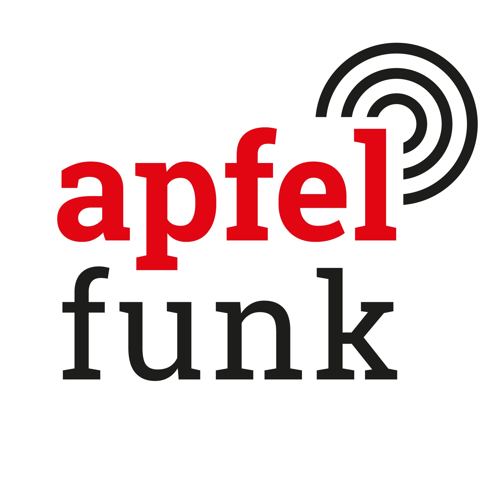

# GermanTechPodcasts

A curated list of German Tech Podcasts :de: :austria: :switzerland:

## Table of Contents

* [Podcasts](#podcasts) (57 podcasts)
  * [Apfelfunk](#apfelfunk)
  * [Auslegungssache](#auslegungssache)
  * [Autoweird](#autoweird)
  * [Binärgewitter](#binargewitter)
  * [Bit-Rauschen](#bit-rauschen)
  * [Bits und so](#bits-und-so)
  * [c't uplink](#ct-uplink)
  * [Chaosradio](#chaosradio)
  * [Click! Clack! Hack!](#click-clack-hack)
  * [Code and Ship](#code-and-ship)
  * [Code Culture](#code-culture)
  * [Codestammtisch](#codestammtisch)
  * [Computer und Kommunikation (Deutschlandfunk)](#computer-und-kommunikation-deutschlandfunk)
  * [Das Duumvirat](#das-duumvirat)
  * [DAS WAR SCHON KAPUTT](#das-war-schon-kaputt)
  * [Der GameDev Podcast](#der-gamedev-podcast)
  * [DevCouch](#devcouch)
  * [Engineering Kiosk](#engineering-kiosk)
  * [FOCUS ON: DevOps](#focus-on-devops)
  * [FOCUS ON: Linux](#focus-on-linux)
  * [Freakshow](#freakshow)
  * [GeekWeek](#geekweek)
  * [heise Developer: SoftwareArchitekTOUR](#heise-developer-softwarearchitektour)
  * [Herzbergs Hörsaal](#herzbergs-horsaal)
  * [Index out of bounds](#index-out-of-bounds)
  * [INNOQ Podcast](#innoq-podcast)
  * [IT ist alles](#it-ist-alles)
  * [IT-Berufe Podcast](#it-berufe-podcast)
  * [IT@DB](#itatdb)
  * [knowIT](#knowit)
  * [Kurz informiert by heise online](#kurz-informiert-by-heise-online)
  * [Logbuch Digitalien](#logbuch-digitalien)
  * [Logbuch: Netzpolitik](#logbuch-netzpolitik)
  * [Mac & I](#mac-and-i)
  * [Macht der Craft](#macht-der-craft)
  * [Mein Scrum ist kaputt!](#mein-scrum-ist-kaputt)
  * [Netzpolitik](#netzpolitik)
  * [Neuland](#neuland)
  * [Open Source Couch](#open-source-couch)
  * [Open Source in der Industrie](#open-source-in-der-industrie)
  * [programmier.bar](#programmier-bar)
  * [Ready for Review](#ready-for-review)
  * [Request for Comments](#request-for-comments)
  * [Schwarz, Code, Gold – Deutschland, Entwicklungsland?](#schwarz-code-gold-deutschland-entwicklungsland)
  * [SELECTrageFROMit;](#selectragefromit)
  * [Software-Architektur als Beruf](#software-architektur-als-beruf)
  * [SoftwareArchitektur im Stream](#softwarearchitektur-im-stream)
  * [Speak 1337](#speak-1337)
  * [t3n](#t3n)
  * [Techtiefen](#techtiefen)
  * [TILpod](#tilpod)
  * [todo:cast](#todo-cast)
  * [Wartungsfenster](#wartungsfenster)
  * [Web & Design Podcast](#web-and-design-podcast)
  * [Wo wir sind ist vorne](#wo-wir-sind-ist-vorne)
  * [Working Draft](#working-draft)
  * [WP Sofa](#wp-sofa)
* [Legend](#legend)
* [How to contribute](#how-to-contribute)
* [Frequently Asked Questions](#frequently-asked-questions)
</ul>

## Podcasts

<h3 id="apfelfunk">Apfelfunk</h3>

Apfelfunk ist ein wöchentlicher Podcast über Apple-Themen. Jean-Claude Frick und Malte Kirchner berichten und bewerten darin die Neuigkeiten über den wichtigsten Computerkonzern der Welt.

* Number of published episodes: 356
* Last episode published: 🟢 Wednesday, 30 November 2022
* [Apfelfunk Website](http://www.apfelfunk.com/)
* [Apfelfunk @ Spotify](https://open.spotify.com/show/7FQLyWiNhMR0KS93ReaI4h)
* [Apfelfunk @ Apple Podcasts](https://podcasts.apple.com/de/podcast/1081146940)
* [Apfelfunk Podcast RSS](https://feeds.soundcloud.com/users/soundcloud:users:201768667/sounds.rss)
* Tags: Apple

----

<h3 id="auslegungssache">Auslegungssache</h3>

Sie möchten beim Thema Datenschutz auf dem Laufenden bleiben, aber keine seitenlange Literatur wälzen? Dann wenden Sie sich vertrauensvoll an unser Juristen-Redakteurs-Duo. Alle 14 Tage bespricht c&#39;t-Redakteur Holger Bleich mit Joerg Heidrich aktuelle Entwicklungen rund um den Datenschutz. Joerg ist beim c&#39;t-Mutterschiff Heise Medien als Justiziar für das Thema zuständig und hat täglich mit der europäischen Datenschutz-Grundverordnung (DSGVO) zu tun. Wechselnde Gäste ergänzen das Duo.

* Number of published episodes: 76
* Last episode published: 🟢 Friday, 02 December 2022
* [Auslegungssache Website](https://heise.de/-4571821)
* [Auslegungssache @ Spotify](https://open.spotify.com/show/3Jrnu7vrTurguBaCiPapkA)
* [Auslegungssache @ Apple Podcasts](https://podcasts.apple.com/de/podcast/1485860893)
* [Auslegungssache Podcast RSS](https://ct-auslegungssache.podigee.io/feed/mp3)
* Tags: Datenschutz

----

<h3 id="autoweird">Autoweird</h3>

@Autoweird.fm ist der regelmäßig erscheinende Podcast rund um die Themen Software Entwicklung, Agilität und Software Crafting.

* Number of published episodes: 118
* Last episode published: 🔴 Tuesday, 24 May 2022
* [Autoweird Website](https://autoweird.fm/)
* [Autoweird @ Spotify](https://open.spotify.com/show/6TDrYLHYxoo7VjvSglunew?si=5a668ec0ee144db2)
* [Autoweird @ Apple Podcasts](https://podcasts.apple.com/de/podcast/1180414602)
* [Autoweird Podcast RSS](http://autoweird.fm/feed/podcast/)

----

<h3 id="binargewitter">Binärgewitter</h3>

ein Podcast über Web, Entwicklung, Mobile und Technologie. Betrachtet aus der Sicht von Entwicklern bzw. Open Source Begeisterten. Das heißt aber nicht, dass wir alles mit einer Rosa-Roten Brille sehen. Wir suchen bei Apple und Microsoft genauso das Gute und Schlechte wie auch bei Linux und anderen Open Source Projekten. Wir wollen realistisch sein. Auch wenn wir damit anecken sollten.

* Number of published episodes: 50
* Last episode published: 🟢 Saturday, 03 December 2022
* [Binärgewitter Website](http://blog.binaergewitter.de/)
* [Binärgewitter @ Spotify](https://open.spotify.com/show/19LedqK0fGWfzfKzySDoVW)
* [Binärgewitter @ Apple Podcasts](https://podcasts.apple.com/de/podcast/216877594)
* [Binärgewitter Podcast RSS](http://feed.binaergewitter.de/binaergewitter_mp3.xml)
* Tags: Open Source, Software Development, Web

----

<h3 id="bit-rauschen">Bit-Rauschen</h3>

Prozessoren, Grafikkarten, Notebooks, Desktop-PCs, Server, KI, Rechenzentren und IT-Markt: In &#34;Bit-Rauschen&#34;, dem Prozessor-Podcast des Computermagazins c’t, dreht sich alles um Chips.

* Number of published episodes: 51
* Last episode published: 🟢 Wednesday, 07 December 2022
* [Bit-Rauschen Website](https://www.ct.de/bit-rauschen)
* [Bit-Rauschen @ Spotify](https://open.spotify.com/show/6JD6gwqgVR27GYZACrWOT1)
* [Bit-Rauschen @ Apple Podcasts](https://podcasts.apple.com/de/podcast/1549821753)
* [Bit-Rauschen Podcast RSS](https://bit-rauschen.podigee.io/feed/mp3)
* Tags: Hardware, CPU

----

<h3 id="bits-und-so">Bits und so</h3>

Die wöchentliche Talkrunde rund um Apple, Mac, iPod &#43; iPhone, Gadgets und so. Fast live aus München.

* Number of published episodes: 10
* Last episode published: 🟢 Monday, 05 December 2022
* [Bits und so Website](http://www.bitsundso.de/)
* [Bits und so @ Apple Podcasts](https://podcasts.apple.com/de/podcast/202753375)
* [Bits und so Podcast RSS](http://www.bitsundso.de/feed/)
* Tags: Hardware

----

<h3 id="ct-uplink">c&#39;t uplink</h3>

Mitglieder der c&#39;t-Redaktion diskutieren über die aktuellen Themen aus dem c’t Magazin und was sonst noch so in der IT-Welt passiert.

* Number of published episodes: 463
* Last episode published: 🟢 Saturday, 03 December 2022
* [c&#39;t uplink Website](https://www.heise.de/ct/entdecken/?hauptrubrik=%40ctmagazin&amp;unterrubrik=c%27t&#43;uplink)
* [c&#39;t uplink @ Spotify](https://open.spotify.com/show/4LdN7lGr9winLtQSqoIjVD)
* [c&#39;t uplink @ Apple Podcasts](https://podcasts.apple.com/de/podcast/835717958)
* [c&#39;t uplink Podcast RSS](https://ct-uplink.podigee.io/feed/mp3)

----

<h3 id="chaosradio">Chaosradio</h3>

Im monatlichen Chaosradio informiert der Chaos Computer Club Berlin seit 1995 über die Auswirkungen von Technik auf die Gesellschaft.

* Number of published episodes: 266
* Last episode published: 🟡 Sunday, 26 June 2022
* [Chaosradio Website](https://chaosradio.de/)
* [Chaosradio @ Apple Podcasts](https://podcasts.apple.com/de/podcast/135057225)
* [Chaosradio Podcast RSS](https://chaosradio.de/feed/m4a)
* Tags: Chaos Computer Club, Gesellschaft

----

<h3 id="click-clack-hack">Click! Clack! Hack!</h3>

Ein Podcast über den nahezu unendlich tiefen Kaninchenbau der mechanische Tastaturen. Ich erzähle euch was es neues im Hobby der mechanical Keyboards gibt, Groupbuys, Interestchecks, Neue Keyboards, Keycaps und Switches und noch viel viel mehr....

* Number of published episodes: 51
* Last episode published: 🟢 Monday, 05 December 2022
* [Click! Clack! Hack! Website](https://www.nerdbude.com/podcast/)
* [Click! Clack! Hack! @ Apple Podcasts](https://podcasts.apple.com/de/podcast/1551770169)
* [Click! Clack! Hack! Podcast RSS](https://www.nerdbude.com/podcast/feed/feed.xml)
* Tags: Hardware, Tastaturen

----

<h3 id="code-and-ship">Code and Ship</h3>

Jonathan und Ingmar sprechen übers Programmieren und Ausliefern von Software Projekten. Außerdem tauschen die beiden Bremer sich über Tools, Frameworks und das Leben als Softwareentwickler aus.

* Number of published episodes: 46
* Last episode published: 🟡 Tuesday, 28 June 2022
* [Code and Ship Website](https://codeandship.rocks/)
* [Code and Ship @ Spotify](https://open.spotify.com/show/68VGe4DFCUxvcJp44VDVL3)
* [Code and Ship @ Apple Podcasts](https://podcasts.apple.com/de/podcast/1458278980)
* [Code and Ship Podcast RSS](https://codeandship.rocks/podcast/index.xml)

----

<h3 id="code-culture">Code Culture</h3>

Lucas Rott und Markus Herhoffer erzählen von Code und Nerd-Kultur.

* Number of published episodes: 93
* Last episode published: 🟢 Sunday, 04 December 2022
* [Code Culture Website](https://codeculture.podigee.io/)
* [Code Culture @ Spotify](https://open.spotify.com/show/01ZL2aPP50lLW51u2aTOkN?si=634b3a94fc844b0e)
* [Code Culture @ Apple Podcasts](https://podcasts.apple.com/de/podcast/1516904389)
* [Code Culture Podcast RSS](https://codeculture.podigee.io/feed/mp3)

----

<h3 id="codestammtisch">Codestammtisch</h3>

Zwei Softwareentwickler — Max und Nathan — unterhalten sich ein Getränk lang über Themen aus der Softwareentwicklung. Da beide keine Ahnung von Bier haben, aber es gerne trinken, trinken die beiden meistens Bier.

* Number of published episodes: 91
* Last episode published: 🔴 Monday, 25 April 2022
* [Codestammtisch Website](https://codestammtis.ch/)
* [Codestammtisch @ Apple Podcasts](https://podcasts.apple.com/de/podcast/1410854302)
* [Codestammtisch Podcast RSS](https://codestammtis.ch/feed/mp3/)

----

<h3 id="computer-und-kommunikation-deutschlandfunk">Computer und Kommunikation (Deutschlandfunk)</h3>

Jeden Samstag das Neueste aus Computertechnik und Informationstechnologie. Beiträge, Reportagen und Interviews zu IT-Sicherheit, Informatik, Datenschutz, Smartphones, Cloud-Computing und IT-Politik. Die Trends der IT werden kompakt und informativ zusammengefasst.

* Number of published episodes: 20
* Last episode published: 🟢 Saturday, 03 December 2022
* [Computer und Kommunikation (Deutschlandfunk) Website](https://www.deutschlandfunk.de/computer-und-kommunikation-102.html)
* [Computer und Kommunikation (Deutschlandfunk) @ Spotify](https://open.spotify.com/episode/3G8QHJpZPeD40gJ3YkEQoP?si=7e3e754187514d57)
* [Computer und Kommunikation (Deutschlandfunk) @ Apple Podcasts](https://podcasts.apple.com/de/podcast/173754605)
* [Computer und Kommunikation (Deutschlandfunk) Podcast RSS](https://www.deutschlandfunk.de/computer-und-kommunikation-102.xml)
* Tags: News

----

<h3 id="das-duumvirat">Das Duumvirat</h3>

Im Podcast Das Duumvirat unterhalten wir uns über verschiedene Mac-Themen aus dem Alltag von Anwendern. Wir schauen über den Tellerrand. Und manchmal haben wir auch Gäste.

* Number of published episodes: 49
* Last episode published: 🟢 Tuesday, 06 December 2022
* [Das Duumvirat Website](https://www.trommelspeicher.de/podcast/)
* [Das Duumvirat @ Apple Podcasts](https://podcasts.apple.com/de/podcast/1212750085)
* [Das Duumvirat Podcast RSS](https://www.trommelspeicher.de/resource/podcast/feed.xml)
* Tags: Hardware, Software, Apple

----

<h3 id="das-war-schon-kaputt">DAS WAR SCHON KAPUTT</h3>

Wir sind ein Laber-Technik-Lebensweisheiten-Podcast, mit News, Retrogeschichten und gelegentlich Filmbesprechungen. Bob berichtet was er wieder mal kaputt gemacht hat und Jay erklärt warum es kaputt gegangen ist. Technik ist vergänglich, einiges setzt sich nie durch anderes gerät in Vergessenheit. In unserem Podcast erklären wir dir wie man Emails per Post versendet, Podcasts auf Kassette veröffentlicht, mit einem Raumschiff aus Knetmasse zum Mars fliegt und Linux auf einem Toaster installiert. Außerdem sprechen wir über die Dinge die die Technikwelt gerade bewegen. Klingt abgedreht? Ist es auch. Hör rein dann verpasst du nichts.

* Number of published episodes: 37
* Last episode published: 🟢 Wednesday, 16 November 2022
* [DAS WAR SCHON KAPUTT Website](http://www.daswarschonkaputt.tech/)
* [DAS WAR SCHON KAPUTT @ Spotify](https://open.spotify.com/show/5F92Db3OFLQXxdh2OIXEzI)
* [DAS WAR SCHON KAPUTT Podcast RSS](https://daswarschonkaputt.tech/feed/dwsk.xml)
* Tags: Technews, Linux, Darknet, Retro-Tech

----

<h3 id="der-gamedev-podcast">Der GameDev Podcast</h3>

Wir reden über Spieleentwicklung und allgemein über die Branche aber gehen auch ins Detail wenn es um Software, Tipps und Fragen geht.

* Number of published episodes: 63
* Last episode published: 🟢 Thursday, 01 December 2022
* [Der GameDev Podcast Website](https://gamedevpodcast.de/)
* [Der GameDev Podcast @ Spotify](https://open.spotify.com/show/1AyPHtyeaeROvPtLsw1prl)
* [Der GameDev Podcast @ Apple Podcasts](https://podcasts.apple.com/de/podcast/1143613851)
* [Der GameDev Podcast Podcast RSS](http://feed.gamedevpodcast.de/)
* Tags: Game Development

----

<h3 id="devcouch">DevCouch</h3>

Der Unterhaltungs-Podcast für .NET Entwickler

* Number of published episodes: 93
* Last episode published: 🟢 Tuesday, 06 December 2022
* [DevCouch Website](https://devcouch.de/)
* [DevCouch @ Spotify](https://open.spotify.com/show/0MfjnJ0I7SxJ89JIBWIcJJ)
* [DevCouch @ Apple Podcasts](https://podcasts.apple.com/de/podcast/1249563765)
* [DevCouch Podcast RSS](https://devcouch.de/feed/mp4/)
* Tags: .NET

----

<h3 id="engineering-kiosk">Engineering Kiosk</h3>

Der Engineering Kiosk ist der deutschsprachige Software-Engineering-Podcast mit Wolfgang Gassler und Andy Grunwald rund um die Themen Engineering-Kultur, Open Source, Menschen, Technologie und allen anderen Bereichen, die damit in Verbindung stehen.

* Number of published episodes: 49
* Last episode published: 🟢 Tuesday, 06 December 2022
* Weekly downloads (avg): 473 (updated: 2022-07-25)
* [Engineering Kiosk Website](https://engineeringkiosk.dev/)
* [Engineering Kiosk @ Spotify](https://open.spotify.com/show/0tJRC0UsObPCWLmmzmOkIs)
* [Engineering Kiosk @ Apple Podcasts](https://podcasts.apple.com/de/podcast/1603082924)
* [Engineering Kiosk Podcast RSS](https://feeds.redcircle.com/0ecfdfd7-fda1-4c3d-9515-476727f9df5e)
* Tags: Development, Tech-Kultur, Open Source

----

<h3 id="focus-on-devops">FOCUS ON: DevOps</h3>

Der FOCUS ON: DevOps Podcast beschäftigt sich mit verschiedenen Methoden und Werkzeugen rund um das Thema DevOps. Dabei wechseln sich technische mit methodischen Folgen ab. Unser Ziel ist es über relevante Themen zu informieren und auch die Hersteller auf dem Markt als Gäste mit einzubinden.

* Number of published episodes: 56
* Last episode published: 🟢 Wednesday, 23 November 2022
* [FOCUS ON: DevOps Website](https://ageofdevops.de/index.php/series/fodo/)
* [FOCUS ON: DevOps @ Spotify](https://open.spotify.com/show/0gXBw5mGcqXQkPW9h2JTaa)
* [FOCUS ON: DevOps @ Apple Podcasts](https://podcasts.apple.com/de/podcast/1542623849)
* [FOCUS ON: DevOps Podcast RSS](https://ageofdevops.de/feed/podcast/fodo)
* Tags: DevOps, Cloud

----

<h3 id="focus-on-linux">FOCUS ON: Linux</h3>

Der FOCUS ON: Linux Podcast beschäftigt sich mit verschiedenen Themen rund um Linux. Unser Ziel ist es, euch monatlich über die Entwicklungen und Neuigkeiten zu informieren und auch praktische Tool-Tipps an die Hand zu geben.

* Number of published episodes: 25
* Last episode published: 🟢 Tuesday, 06 December 2022
* Weekly downloads (avg): 710 (updated: 2022-10-26)
* [FOCUS ON: Linux Website](https://ageofdevops.de/index.php/series/fol/)
* [FOCUS ON: Linux @ Spotify](https://open.spotify.com/show/4Yj9EaidQuwEZL0NkAafzh)
* [FOCUS ON: Linux @ Apple Podcasts](https://podcasts.apple.com/de/podcast/1606139089)
* [FOCUS ON: Linux Podcast RSS](https://ageofdevops.de/feed/podcast/fol)
* Tags: Linux, Open Source

----

<h3 id="freakshow">Freakshow</h3>

Freak Show ist ein Podcast, der sich mit dem Leben mit Technik im 21. Jahrhundert auseinandersetzt und dabei eine Vielzahl von Themen anschneidet. Es ist kein Geheimnis, dass das Team sich viel und gerne mit Apple und seinen Produkten, Programmierung, Bitcoin, Gitarren, Podcasting und anderen Lastern herumschlägt. Aber wir reden auch über was anderes.

* Number of published episodes: 264
* Last episode published: 🔴 Friday, 12 November 2021
* [Freakshow Website](https://freakshow.fm/)
* [Freakshow @ Apple Podcasts](https://podcasts.apple.com/de/podcast/277518737)
* [Freakshow Podcast RSS](https://feeds.metaebene.me/freakshow/m4a)

----

<h3 id="geekweek">GeekWeek</h3>

Nothing But Tech - Aus Deutschland, der Schweiz und den USA. geek-week.de berichtet jede Woche über jüngste Entwicklungen aus der Online- und Tech-Welt.

* Number of published episodes: 100
* Last episode published: 🟡 Monday, 18 July 2022
* [GeekWeek Website](https://geek-week.de/)
* [GeekWeek @ Spotify](https://open.spotify.com/show/4GrgnNFNgHNbZxu6DVxJIy?si=5d2fb5a2e6bd4639)
* [GeekWeek Podcast RSS](https://geekweekde.libsyn.com/rss)
* Tags: News, Hardware, Cloud

----

<h3 id="heise-developer-softwarearchitektour">heise Developer: SoftwareArchitekTOUR</h3>

Der Podcast für den praktizierenden Softwarearchitekten

* Number of published episodes: 92
* Last episode published: 🟡 Wednesday, 08 June 2022
* [heise Developer: SoftwareArchitekTOUR Website](https://www.heise.de/developer/SoftwareArchitekTOUR-4076349.html)
* [heise Developer: SoftwareArchitekTOUR @ Spotify](https://open.spotify.com/show/2Uc7vL8U6kUZYSCOvDIJ67)
* [heise Developer: SoftwareArchitekTOUR @ Apple Podcasts](https://podcasts.apple.com/de/podcast/313825047)
* [heise Developer: SoftwareArchitekTOUR Podcast RSS](https://softwarearchitektour.podigee.io/feed/mp3)

----

<h3 id="herzbergs-horsaal">Herzbergs Hörsaal</h3>

Dieser Podcast ist ein Hörsaal für die Ohren meiner Studierenden an der THM und alle Interessierten. Die Themen sind u.a.: Grundlagen der Informatik (GDI), Objekt-Orientierte Programmierung (OOP/Java), Programmierung interaktiver Systeme (PiS), Quantencomputing (QC), Wissenschaftliches Arbeiten (in der Informatik) (WA bzw. WAI), Bits und Bäume: Digitalisierung nachhaltig gestalten (BuB).

* Number of published episodes: 99
* Last episode published: 🟡 Wednesday, 31 August 2022
* [Herzbergs Hörsaal Website](https://www.thm.de/site/hochschule/service/schulportal/lehrerinnen-und-lehrer/studieren-probieren/podcast-herzbergs-hoersaal.html)
* [Herzbergs Hörsaal @ Spotify](https://open.spotify.com/show/5FDlXkn4fnAgp2ucaT7hL6)
* [Herzbergs Hörsaal @ Apple Podcasts](https://podcasts.apple.com/de/podcast/1510742953)
* [Herzbergs Hörsaal Podcast RSS](https://anchor.fm/s/ba9c0bc/podcast/rss)
* Tags: Bildung

----

<h3 id="index-out-of-bounds">Index out of bounds</h3>

Du bist Entwickler/Developer? Dann Lauscher auf! Thomas und Christian sprechen im &#34;Index out of bounds&#34; Entwickler/Developer Podcast über ihre persönlichen Erfahrungen aus der Welt der Programmierung von Software, Websites, Apps und was es sonst noch so gibt. Schon seit Jahren tauschen sich die beiden leidenschaftlich gerne über Entwicklung/Development, den Spaß am Programmieren und Technologie aus. Hin und wieder sind da auch ein paar helle Momente dabei! Ein Podcast von Programmierern für Programmierer.

* Number of published episodes: 41
* Last episode published: 🟢 Tuesday, 06 December 2022
* [Index out of bounds Website](https://anchor.fm/indexoutofbounds)
* [Index out of bounds @ Spotify](https://open.spotify.com/show/2r1FGvYRkSYq4SmXyVKmnA)
* [Index out of bounds @ Apple Podcasts](https://podcasts.apple.com/de/podcast/1564647339)
* [Index out of bounds Podcast RSS](https://anchor.fm/s/54509264/podcast/rss)

----

<h3 id="innoq-podcast">INNOQ Podcast</h3>

In dieser Serie diskutieren wir interessante Themen aus Software-Entwicklung und -Architektur – immer mit dem Fokus auf Praxistauglichkeit.

* Number of published episodes: 115
* Last episode published: 🟢 Monday, 05 December 2022
* [INNOQ Podcast Website](https://www.innoq.com/de/podcast/)
* [INNOQ Podcast @ Spotify](https://open.spotify.com/show/20svL8wDDgtidO2Qwf3EWx?si=c91210785679436e)
* [INNOQ Podcast @ Apple Podcasts](https://podcasts.apple.com/de/podcast/672695146)
* [INNOQ Podcast Podcast RSS](https://innoq.podigee.io/feed/aac)
* Tags: Software-Entwicklung, Software-Architektur

----

<h3 id="it-ist-alles">IT ist alles</h3>

Nur etwas mehr als 60 Jahre liegen zwischen dem ersten Start eines Motorflugzeugs und dem ersten bemannten Flug zum Mond. Das Handy wurde in nur 30 Jahren zum wichtigsten Kommunikationskanal unserer Zeit. Und IT? Die entwickelt sich nicht weniger rasant und macht in einer vernetzten und digitalen Welt vor keinem Bereich mehr halt. Im Podcast sprechen wir über Trendthemen, die zwar nichts mit Raketenwissenschaft zu tun haben, dafür aber Menschen auf dem Weg in eine digitale Zukunft begleiten. Bist Du bereit?

* Number of published episodes: 49
* Last episode published: 🟢 Wednesday, 30 November 2022
* [IT ist alles Website](https://www.pco-online.de/magazin/2020/07/podcast)
* [IT ist alles @ Spotify](https://open.spotify.com/show/46EUTeJsHSfscbkrI38f6p)
* [IT ist alles @ Apple Podcasts](https://podcasts.apple.com/de/podcast/1524049773)
* [IT ist alles Podcast RSS](https://it-ist-alles.podigee.io/feed/mp3)
* Tags: Security

----

<h3 id="it-berufe-podcast">IT-Berufe Podcast</h3>

Der Podcast für Auszubildende, Ausbilder und IHK-Prüfer in den IT-Berufen (Fachinformatiker für Anwendungsentwicklung/Systemintegration/Daten- und Prozessanalyse/Digitale Vernetzung, IT-Systemelektroniker, Kaufmann für IT-Systemmanagement, Kaufmann für Digitalisierungsmanagement).

* Number of published episodes: 193
* Last episode published: 🟢 Monday, 24 October 2022
* [IT-Berufe Podcast Website](https://it-berufe-podcast.de/episoden/)
* [IT-Berufe Podcast @ Spotify](https://open.spotify.com/show/3Z9nS0wsn9akCfo6zrmNb1)
* [IT-Berufe Podcast @ Apple Podcasts](https://podcasts.apple.com/de/podcast/979050513)
* [IT-Berufe Podcast Podcast RSS](https://it-berufe-podcast.de/feed/podcast/)
* Tags: IT-Berufe, Ausbildung

----

<h3 id="itatdb">IT@DB</h3>

IT@DB ist ein Podcast für IT Fach- und Führungskräfte (w/m/d). Hier erhältst du einen exklusiven Einblick zu spannenden IT Projekten der Deutschen Bahn.

* Number of published episodes: 55
* Last episode published: 🟢 Friday, 25 November 2022
* [IT@DB Website](https://cqlshb.podcaster.de/)
* [IT@DB @ Spotify](https://open.spotify.com/show/3uV0oOeigGJCAAQbXZ49Dv)
* [IT@DB @ Apple Podcasts](https://podcasts.apple.com/de/podcast/1462447493)
* [IT@DB Podcast RSS](https://cqlshb.podcaster.de/it-at-db.rss)

----

<h3 id="knowit">knowIT</h3>

know Information Technology (kurz knowIT) - in diesem Sinne behandelt der Podcast aktuelle und zukünftige Themen der Informatik, mit Blick auf die wissenschaftliche Relevanz und die praktische Anwendbarkeit. Wir, das sind Prof. Dr. Claudia Heß und Prof. Dr. Sibylle Kunz, greifen Themen auf die euch und uns interessieren und besprechen diese mit Expert:innen und interessanten Gästen.

* Number of published episodes: 16
* Last episode published: 🟢 Monday, 31 October 2022
* [knowIT Website](https://inside.iu-fernstudium.de/knowit/)
* [knowIT @ Spotify](https://open.spotify.com/show/3DPCT4FTVIhmllxyZ31Z3l?si=cfb32232c536414a)
* [knowIT @ Apple Podcasts](https://podcasts.apple.com/de/podcast/1564646449)
* [knowIT Podcast RSS](https://anchor.fm/s/57935150/podcast/rss)

----

<h3 id="kurz-informiert-by-heise-online">Kurz informiert by heise online</h3>

Die IT-News des Tages von heise online

* Number of published episodes: 291
* Last episode published: 🟢 Friday, 02 December 2022
* [Kurz informiert by heise online Website](http://www.heise.de/)
* [Kurz informiert by heise online @ Spotify](https://open.spotify.com/show/2etf1jog8leNHbnhIArM9Z)
* [Kurz informiert by heise online @ Apple Podcasts](https://podcasts.apple.com/de/podcast/1485884061)
* [Kurz informiert by heise online Podcast RSS](https://www.heise.de/rss/topnews-audio.rss)
* Tags: News, Business

----

<h3 id="logbuch-digitalien">Logbuch Digitalien</h3>

Der Podcast über unsere digitale Lebens- und Arbeitswelt mit Markus Hörster und Christian Cordes. Alle vier Wochen dienstags um 19.00 Uhr im Radio auf Radio Okerwelle (UKW 104,6 in der Region Braunschweig) und nach der Ausstrahlung als Podcast. Wir beschäftigen uns mit allen Themen, die etwas mit Digitalien zu tun haben.

* Number of published episodes: 69
* Last episode published: 🟢 Sunday, 27 November 2022
* [Logbuch Digitalien Website](https://www.logbuch-digitalien.de/)
* [Logbuch Digitalien @ Spotify](https://open.spotify.com/show/5HxbvAOx6qOMOXbtulHji1)
* [Logbuch Digitalien @ Apple Podcasts](https://podcasts.apple.com/de/podcast/1240755398)
* [Logbuch Digitalien Podcast RSS](https://www.logbuch-digitalien.de/feed/podcast/)
* Tags: News, Digitalisierung

----

<h3 id="logbuch-netzpolitik">Logbuch: Netzpolitik</h3>

Logbuch:Netzpolitik ist ein in der Regel wöchentlich erscheinender Podcast, der im Dialog zwischen Linus Neumann und Tim Pritlove die wichtigsten Themen und Ereignisse mit netzpolitischem Bezug aufgreift und diskutiert.

* Number of published episodes: 449
* Last episode published: 🟢 Friday, 25 November 2022
* [Logbuch: Netzpolitik Website](https://logbuch-netzpolitik.de/)
* [Logbuch: Netzpolitik @ Apple Podcasts](https://podcasts.apple.com/de/podcast/476856034)
* [Logbuch: Netzpolitik Podcast RSS](https://feeds.metaebene.me/lnp/m4a)
* Tags: Politik, Gesellschaft, Internet

----

<h3 id="mac-and-i">Mac &amp; I</h3>

Redakteure von heise Mac &amp; i beschäftigen sich jeden Monat mit Apple-Produkten, -Betriebssystemen und dem Drumherum, stellen Testergebnisse vor und geben Tipps.

* Number of published episodes: 34
* Last episode published: 🟢 Thursday, 10 November 2022
* [Mac &amp; I Website](https://www.heise.de/mac-and-i/meldung/Mac-i-Der-Apple-Podcast-4681220.html)
* [Mac &amp; I @ Spotify](https://open.spotify.com/show/5Tcgc97HvYREYM7kIRsxii)
* [Mac &amp; I @ Apple Podcasts](https://podcasts.apple.com/de/podcast/1499510618)
* [Mac &amp; I Podcast RSS](https://mac-and-i.podigee.io/feed/mp3)
* Tags: Hardware, Apple

----

<h3 id="macht-der-craft">Macht der Craft</h3>

Von Menschen für Menschen, die Software entwickeln, ist dieser Podcast gedacht. Damit Du in diesem Leben durch stetiges Lernen, den bestmöglichen Code kreieren kannst. Wir erzählen dir von agiler Softwareentwicklung, Software Craft, Methoden, Techniken und allem, was dazu gehört, um deine Fähigkeiten zu verbessern. Das Bestmögliche zu erschaffen, bedeutet mit dem Puls der Zeit zu gehen und ständig zu lernen.

* Number of published episodes: 10
* Last episode published: 🟢 Monday, 05 December 2022
* [Macht der Craft Website](https://macht-der-craft.soler-sanandres.net/)
* [Macht der Craft @ Spotify](https://open.spotify.com/show/5232Av5Ibaf4shvJzpSKEa)
* [Macht der Craft Podcast RSS](https://macht-der-craft.soler-sanandres.net/feed/podcast)
* Tags: Development

----

<h3 id="mein-scrum-ist-kaputt">Mein Scrum ist kaputt!</h3>

Scrum kann doch inzwischen eh jeder? Von wegen! Denn - ganz unter uns: genug falsch machen kann man ohne Probleme. Daher möchten wir über Stolpersteine sprechen, über Smells und unsere Erfahrungen mitteilen, die wir mit Scrum, Kanban und Agil im Allgemeinen gemacht haben.

* Number of published episodes: 118
* Last episode published: 🟢 Tuesday, 29 November 2022
* [Mein Scrum ist kaputt! Website](https://meinscrumistkaputt.de/)
* [Mein Scrum ist kaputt! @ Spotify](https://open.spotify.com/show/7lECdowQCq0OWlf0EZnSpL)
* [Mein Scrum ist kaputt! @ Apple Podcasts](https://podcasts.apple.com/de/podcast/1150361013)
* [Mein Scrum ist kaputt! Podcast RSS](https://meinscrumistkaputt.de/feed/podcast/)
* Tags: Agilität, Scrum, Kanban

----

<h3 id="netzpolitik">Netzpolitik</h3>

Wir thematisieren die wichtigen Fragestellungen rund um Internet, Gesellschaft und Politik und zeigen Wege auf, wie man sich auch selbst mit Hilfe des Netzes für digitale Freiheiten und Offenheit engagieren kann. Mit netzpolitik.org beschreiben wir, wie die Politik das Internet durch Regulierung verändert und wie das Netz Politik, Öffentlichkeiten und alles andere verändert.

* Number of published episodes: 25
* Last episode published: 🟢 Saturday, 03 December 2022
* [Netzpolitik Website](https://netzpolitik.org/podcast/)
* [Netzpolitik @ Spotify](https://open.spotify.com/show/2GLuMhSNEFzUIXfx9BDxBt)
* [Netzpolitik @ Apple Podcasts](https://podcasts.apple.com/de/podcast/1281525246)
* [Netzpolitik Podcast RSS](https://netzpolitik.org/category/netzpolitik-podcast/?feed=itunes&amp;)
* Tags: Internet, Gesellschaft, Politik

----

<h3 id="neuland">Neuland</h3>

Mehr Wissen über die digitale Welt. Experten des Hasso-Plattner-Instituts sprechen verständlich über digitale Entwicklungen und Trends, über Chancen und Risiken der Digitalisierung. Jede Sendung widmet sich einem gesellschaftlich relevanten Thema: Von der Macht der Künstlichen Intelligenz über die Blockchain bis zu Hetze in den sozialen Medien.

* Number of published episodes: 63
* Last episode published: 🟢 Wednesday, 09 November 2022
* [Neuland Website](https://podcast.hpi.de/)
* [Neuland @ Spotify](https://open.spotify.com/show/0kd8vXJDv3sN7VMtcLRsH9)
* [Neuland @ Apple Podcasts](https://podcasts.apple.com/de/podcast/1448992875)
* [Neuland Podcast RSS](https://podcast.hpi.de/feed.xml)

----

<h3 id="open-source-couch">Open Source Couch</h3>

Oli und Michael sprechen über alles Wichtige aus der Welt der Open Source, Technologie und dem Geek-tum.

* Number of published episodes: 33
* Last episode published: 🟢 Tuesday, 25 October 2022
* [Open Source Couch Website](https://www.opensourcecouch.de/)
* [Open Source Couch @ Spotify](https://open.spotify.com/show/3fNThjRvMKJhhyg7eCTY8v)
* [Open Source Couch @ Apple Podcasts](https://podcasts.apple.com/de/podcast/1529154227)
* [Open Source Couch Podcast RSS](https://letscast.fm/podcasts/die-open-source-couch-0743e028/feed)
* Tags: Open Source

----

<h3 id="open-source-in-der-industrie">Open Source in der Industrie</h3>

Wir berichten alle zwei Wochen über Open Source Anwendungen, Ideen und Konzepte aus der Industrie.

* Number of published episodes: 24
* Last episode published: 🟢 Tuesday, 06 December 2022
* [Open Source in der Industrie Website](https://opensourcepodcast.podigee.io/)
* [Open Source in der Industrie @ Spotify](https://open.spotify.com/show/7e0khh6f5m1NArO3ggwCSH)
* [Open Source in der Industrie Podcast RSS](https://opensourcepodcast.podigee.io/feed/mp3)
* Tags: Industrie, Open Source

----

<h3 id="programmier-bar">programmier.bar</h3>

Mit geballter Dev-Power nehmen Dennis, Fabi, Sebi und Jojo neue Podcastfolgen auf und werden dabei regelmäßig von Gäst:innen aus der Branche unterstützt. Taucht in unseren Deep Dives mit uns in Frameworks und Datenbanken ein, hört euch in den CTO-Specials die Erfahrungen führender Persönlichkeiten großer Unternehmen an und bleibt mit unseren News-Folgen stets am Ball in der Welt der App- und Webentwicklung.

* Number of published episodes: 210
* Last episode published: 🟢 Friday, 02 December 2022
* Weekly downloads (avg): 8936 (updated: 2022-08-04)
* [programmier.bar Website](https://www.programmier.bar/podcast)
* [programmier.bar @ Spotify](https://open.spotify.com/show/0ik0sXv9paTQCeThcOLCCJ)
* [programmier.bar @ Apple Podcasts](https://podcasts.apple.com/de/podcast/1371409964)
* [programmier.bar Podcast RSS](https://feeds.buzzsprout.com/176239.rss)

----

<h3 id="ready-for-review">Ready for Review</h3>

Sandra Parsick &amp; Daniel Zenzes präsentieren mit Ready for Review einen bunten Mix aus aktuellen IT-Themen und ihrem täglichen Entwickler-Alltag.

* Number of published episodes: 37
* Last episode published: 🟢 Saturday, 03 December 2022
* Weekly downloads (avg): 66 (updated: 2022-07-29)
* [Ready for Review Website](https://ready-for-review.dev/)
* [Ready for Review @ Spotify](https://open.spotify.com/show/7dxK2wi4ZMGEYO3UHhTSc4)
* [Ready for Review @ Apple Podcasts](https://podcasts.apple.com/de/podcast/1535026156)
* [Ready for Review Podcast RSS](https://ready-for-review.podigee.io/feed/mp3)
* Tags: Software Development, Kochen, Klingel, Comics, IT Family Support, Filme, Brettspiele, Serien, Java, JavaScript

----

<h3 id="request-for-comments">Request for Comments</h3>

RFC definieren das Internet. Nahezu jeder Informationsaustausch zwischen zwei Rechnern verläuft über Protokolle, die einmal durch einen Request for Comments definiert und standardisiert wurden. Genug Material, um darüber zu reden.

* Number of published episodes: 20
* Last episode published: 🔴 Monday, 18 May 2020
* [Request for Comments Website](https://requestforcomments.de/)
* [Request for Comments @ Apple Podcasts](https://podcasts.apple.com/de/podcast/1082223939)
* [Request for Comments Podcast RSS](https://requestforcomments.de/feed/m4a)

----

<h3 id="schwarz-code-gold-deutschland-entwicklungsland">Schwarz, Code, Gold – Deutschland, Entwicklungsland?</h3>

Digitalisierung in Deutschland? Sagen wir mal so: Niemand klebt sich heute das Qualitätssiegel „Made in Germany“ stolz auf den Laptop-Deckel. Als IT-Standort sind wir zurecht digitales Schlusslicht in Europa. Aber, halt, Moment! Das wollen wir so nicht akzeptieren! Wir suchen jenseits vergeigter IT-Projekte, knapp vorbei an der Breitband-Wüste und mittendrin im LTE-Flickenteppich auf die Antwort nach einer zentralen Frage: Ist Deutschland ein Software-Entwicklungsland?

* Number of published episodes: 13
* Last episode published: 🟢 Monday, 28 November 2022
* [Schwarz, Code, Gold – Deutschland, Entwicklungsland? Website](https://www.brandad-systems.de/podcast-schwarz-code-gold-deutschland-entwicklungsland)
* [Schwarz, Code, Gold – Deutschland, Entwicklungsland? @ Spotify](https://open.spotify.com/show/5hXUx2Y3sbCL9O5xPdE8i6)
* [Schwarz, Code, Gold – Deutschland, Entwicklungsland? @ Apple Podcasts](https://podcasts.apple.com/de/podcast/1597296417)
* [Schwarz, Code, Gold – Deutschland, Entwicklungsland? Podcast RSS](https://feed.schwarz-code-gold.de)
* Tags: Softwarentwicklung, Made in Germany, Computerspiele, Digtalisierung, E-Health, Startups

----

<h3 id="selectragefromit">SELECTrageFROMit;</h3>

Der etwas andere Podcast über IT-Themen. Echte Erfahrungen aus dem Feld. Ungefiltert, ehrlich, ungeschnitten. (Mitschnitt von Twitch Live Diskussionen zwischen IT-Administratoren)

* Number of published episodes: 3
* Last episode published: 🔴 Wednesday, 03 February 2021
* [SELECTrageFROMit; Website](https://linktr.ee/selectragefromit)
* [SELECTrageFROMit; @ Spotify](https://open.spotify.com/show/0grOBOKTLvtBKwj9ZpxpAW)
* [SELECTrageFROMit; @ Apple Podcasts](https://podcasts.apple.com/de/podcast/1547576873)
* [SELECTrageFROMit; Podcast RSS](https://anchor.fm/s/6c46c0c8/podcast/rss)
* Tags: DevOps, Admin, Hardware

----

<h3 id="software-architektur-als-beruf">Software-Architektur als Beruf</h3>

Bei &#34;Software-Architektur als Beruf&#34; erzählen Menschen, wie ihr beruflicher Werdegang aussieht und welche Rolle Software-Architektur dabei spielt.

* Number of published episodes: 16
* Last episode published: 🟢 Wednesday, 09 November 2022
* [Software-Architektur als Beruf Website](https://software-architektur.tv/beruf.html)
* [Software-Architektur als Beruf @ Spotify](https://open.spotify.com/show/2DpgXYFgzqOvNy30pLRj0S)
* [Software-Architektur als Beruf @ Apple Podcasts](https://podcasts.apple.com/de/podcast/1609845784)
* [Software-Architektur als Beruf Podcast RSS](https://1evriw.podcaster.de/software-architektur-als-beruf.rss)
* Tags: Karriere, Technologie

----

<h3 id="softwarearchitektur-im-stream">SoftwareArchitektur im Stream</h3>

Live-Diskussion zu Software-Architektur im Stream. Einmal in der Woche diskutiert Eberhard Wolff Software-Architektur im Live-Stream auf YouTube und Twitch - oft zusammen mit einem Gast. Zuschauer können über den Chat mitdiskutieren oder Fragen stellen. Der Podcast enthält die Audio-Spur des Streams.

* Number of published episodes: 142
* Last episode published: 🟢 Friday, 02 December 2022
* [SoftwareArchitektur im Stream Website](https://software-architektur.tv/)
* [SoftwareArchitektur im Stream @ Spotify](https://open.spotify.com/show/7ySg1eZoWYBshd6QpGaW8B)
* [SoftwareArchitektur im Stream @ Apple Podcasts](https://podcasts.apple.com/de/podcast/1538545458)
* [SoftwareArchitektur im Stream Podcast RSS](https://1evriw.podcaster.de/software-architektur-im-stream.rss)
* Tags: Bildung, How To, Technologie

----

<h3 id="speak-1337">Speak 1337</h3>

Ich bin Cedric und in diesem Podcast rede ich immer wieder mal über Informatik, Datenschutz, Sicherheit und alles erwähnenswerte. Mit dabei sind immer wieder sehr bekannte und engagierte Menschen, die Experte auf ihrem Gebiet sind.

* Number of published episodes: 32
* Last episode published: 🟢 Monday, 07 November 2022
* Weekly downloads (avg): 180 (updated: 2022-08-01)
* [Speak 1337 Website](https://the-morpheus.de/)
* [Speak 1337 @ Spotify](https://open.spotify.com/show/0xlIih789FcMbZaASyhuAm)
* [Speak 1337 @ Apple Podcasts](https://podcasts.apple.com/de/podcast/1577956101)
* [Speak 1337 Podcast RSS](https://anchor.fm/s/c821b10/podcast/rss)
* Tags: Informatik, Datenschutz, Sicherheit

----

<h3 id="t3n">t3n</h3>

Im t3n Podcast diskutiert die t3n-Redaktion mit prominenten Gästen über die spannendsten digitalen Themen unserer Zeit. Ob innovative Führungskonzepte, die Digitalisierung der Gesellschaft, smarte Gadgets, neue Mobilität oder Zukunftstechnologien. Das Update für digitale Pioniere – jede Woche neu!

* Number of published episodes: 458
* Last episode published: 🟢 Monday, 05 December 2022
* [t3n Website](https://t3n.de/podcast/)
* [t3n @ Spotify](https://open.spotify.com/show/7obTbZaywhQEiUUOMswQBQ)
* [t3n @ Apple Podcasts](https://podcasts.apple.com/de/podcast/1115601393)
* [t3n Podcast RSS](https://t3n-podcast.podigee.io/feed/mp3)
* Tags: News, Business

----

<h3 id="techtiefen">Techtiefen</h3>

Ausführliche, häufig zeitlose Gespräche von Gastgeber Nico Kreiling mit wechselnden Gästen der IT-Welt zu deren Fach-Gebieten. Von Nerds, für Nerds!

* Number of published episodes: 39
* Last episode published: 🟡 Monday, 27 June 2022
* Weekly downloads (avg): 900 (updated: 2022-08-01)
* [Techtiefen Website](https://techtiefen.de/)
* [Techtiefen @ Spotify](https://open.spotify.com/show/6hyfYJi5yvjWgcqOTtNzRo)
* [Techtiefen @ Apple Podcasts](https://podcasts.apple.com/de/podcast/1349481289)
* [Techtiefen Podcast RSS](https://techtiefen.de//index.php/feed/mp3/)
* Tags: Development, IT, Data Science, Machine Learning, Interviews

----

<h3 id="tilpod">TILpod</h3>

Sujeevan und Dirk reden über Themen, die Ihnen in der letzten Zeit untergekommen sind. Die Abkürzung &#34;TIL&#34; steht für &#34;Today I learned&#34;, es geht also um Themen, die neu für die beiden waren oder die sie in der letzten Zeit erst so richtig verstanden haben. Dazu kommen Hinweise, wie sie versuchen, ihr Arbeitsleben zu verbessern und zusätzlich gibt es auch den einen oder anderen Karrierehinweis.

* Number of published episodes: 27
* Last episode published: 🟢 Wednesday, 30 November 2022
* [TILpod Website](https://tilpod.net/)
* [TILpod @ Spotify](https://open.spotify.com/show/53zmbsz2sGO4UoSe8Qviyu)
* [TILpod @ Apple Podcasts](https://podcasts.apple.com/de/podcast/1542159410)
* [TILpod Podcast RSS](https://tilpod.net/feed/mp3)
* Tags: Tech-Kultur, Open Source, Karriere, DevOps, Selfimprovement

----

<h3 id="todo-cast">todo:cast</h3>

todo:cast ist ein deutschsprachiger Podcast für die großen und kleinen Fragen des Entwickler*innenalltags. Schon seit Langem tauschen sich Malte und Robin-Manuel in regelmäßigen Abständen über diverse Themen aus ihrem Alltag in der Softwareentwicklung aus. Dabei lernen sie jedes Mal etwas Neues! Warum also das Ganze nicht aufzeichnen und als Podcast zur Verfügung stellen?

* Number of published episodes: 52
* Last episode published: 🟢 Monday, 05 December 2022
* [todo:cast Website](https://todocast.io/)
* [todo:cast @ Spotify](https://open.spotify.com/show/2tIlVD6vBAtEhOZM4jS1mw)
* [todo:cast @ Apple Podcasts](https://podcasts.apple.com/de/podcast/1467179396)
* [todo:cast Podcast RSS](https://feeds.soundcloud.com/users/soundcloud:users:637814493/sounds.rss)

----

<h3 id="wartungsfenster">Wartungsfenster</h3>

Alle 14 Tage laden wir zu einer kleinen Kaminzimmerrunde rund um den Themenkomplex Datacenter, Cloud und IT ein. In Ermangelung eines Kaminzimmers sitzen wir in der Hot Aisle eines Datacenters, statt feudaler Sessel gibt es faltbare Campingstühle, und die Cognacschwenker durften wir auch nicht mit reinnehmen. :/

* Number of published episodes: 22
* Last episode published: 🟢 Tuesday, 06 December 2022
* Weekly downloads (avg): 100 (updated: 2022-07-31)
* [Wartungsfenster Website](https://wartungsfenster.podigee.io/)
* [Wartungsfenster @ Spotify](https://open.spotify.com/show/063YcVklbp1N8z1ZHSA709)
* [Wartungsfenster @ Apple Podcasts](https://podcasts.apple.com/de/podcast/1607047978)
* [Wartungsfenster Podcast RSS](https://wartungsfenster.podigee.io/feed/mp3)
* Tags: Datacenter, Cloud, Microsoft, Security

----

<h3 id="web-and-design-podcast">Web &amp; Design Podcast</h3>

In diesem Podcast geht es um Web und User Interface Design, Freelancing, Arbeitsprozesse, Kunden und alles, wo sich diese Bereiche überschneiden.

* Number of published episodes: 175
* Last episode published: 🟢 Monday, 28 November 2022
* [Web &amp; Design Podcast Website](https://www.jonasarleth.com/podcast)
* [Web &amp; Design Podcast @ Spotify](https://open.spotify.com/show/6P3ovTvnUXUQZdjEMLEBer)
* [Web &amp; Design Podcast @ Apple Podcasts](https://podcasts.apple.com/de/podcast/1197452865)
* [Web &amp; Design Podcast Podcast RSS](https://feeds.soundcloud.com/users/soundcloud:users:283362505/sounds.rss)
* Tags: User Interface Design, Web Design, Freelancing

----

<h3 id="wo-wir-sind-ist-vorne">Wo wir sind ist vorne</h3>

Latenight-Frontend-Talkshow rund um Webdesign und Entwicklung. Es reden sich um &lt;HEAD&gt; und Kragen: HTML-Fundamentalist Moritz Gießmann und JavaScript Jongleur Constantin Groß.

* Number of published episodes: 50
* Last episode published: 🟢 Sunday, 04 December 2022
* [Wo wir sind ist vorne Website](https://wowirsindistvorne.show/)
* [Wo wir sind ist vorne @ Spotify](https://open.spotify.com/show/54K1DpiQYHBHSnIO6OzSKs)
* [Wo wir sind ist vorne @ Apple Podcasts](https://podcasts.apple.com/de/podcast/1500485579)
* [Wo wir sind ist vorne Podcast RSS](https://wowirsindistvorne.show/feed/mp3/)
* Tags: Frontend, UX, HTML, CSS, JavaScript, Tooling, Frameworks, Accessibility

----

<h3 id="working-draft">Working Draft</h3>

Wöchentlicher Podcast für Webdesigner:innen und -entwickler:innen

* Number of published episodes: 565
* Last episode published: 🟢 Tuesday, 06 December 2022
* [Working Draft Website](https://workingdraft.de/)
* [Working Draft @ Spotify](https://open.spotify.com/show/78iH7cIFzu1ejoB6aQUsIh)
* [Working Draft @ Apple Podcasts](https://podcasts.apple.com/de/podcast/402204581)
* [Working Draft Podcast RSS](https://workingdraft.de/feed/)

----

<h3 id="wp-sofa">WP Sofa</h3>

Wir berichten zweiwöchentlich über News und Updates aus dem WordPress Universum.

* Number of published episodes: 169
* Last episode published: 🟢 Saturday, 26 November 2022
* [WP Sofa Website](https://wp-sofa.de/)
* [WP Sofa @ Spotify](https://open.spotify.com/show/5deyJkxMw1cAMKGxnrx5wO)
* [WP Sofa Podcast RSS](https://wp-sofa.de/feed/mp3/)
* Tags: Wordpress

----

## Legend

We calculate a traffic light indicator on when the last podcast episode was published:
* 🔴 Last Episode published > 6 months ago
* 🟡 Last Episode published something between 2 months and 6 months ago
* 🟢 Last Episode published within today and last 2 month

## How to contribute

If you want to 
* add a new podcast to the list, check out our [Contribution Guide](/CONTRIBUTING.md)
* modify the tooling and structure, check out our [Development Guide](/DEVELOPMENT.md)

## Frequently Asked Questions

### Why is this repository in English?

... but it has mainly German content?

Tricky question and both languages (German or English) would be feasible candidates for this repository's primary language.
Eventually, we decided to do a split:

#### On GitHub: English

On GitHub, the primary language is English.
Mainly because the engineering community primarily communicates in English (yeah, there are also a lot of Chinese repositories).
For all German speaking people, we also did an episode and talked about this topic why
[English is an important language in software engineering](https://engineeringkiosk.dev/podcast/episode/26-my-english-is-not-the-yellow-from-the-egg-arbeiten-in-internationalen-teams/).
Hence, we went for English in the GitHub version because this repository contains software written/commented in English.
This leads to a language mix in the `README.md` because the titles and descriptions of the podcasts are German.
This is a tradeoff we took, at least for now.

### On the website: German

We have a German version available on the [Engineering Kiosk website](https://engineeringkiosk.dev/deutsche-tech-podcasts/) because the whole website is German.
