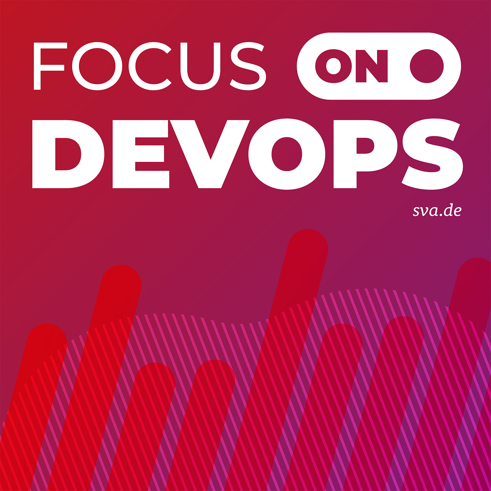
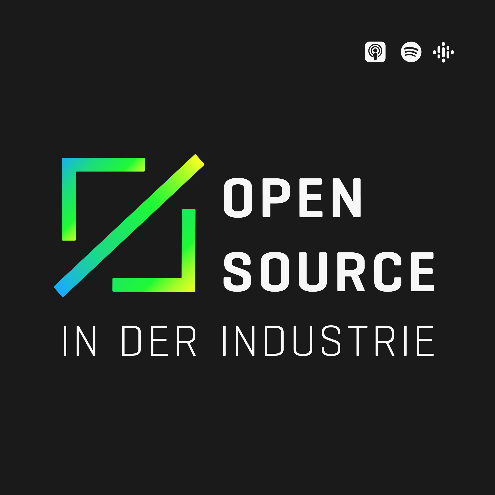
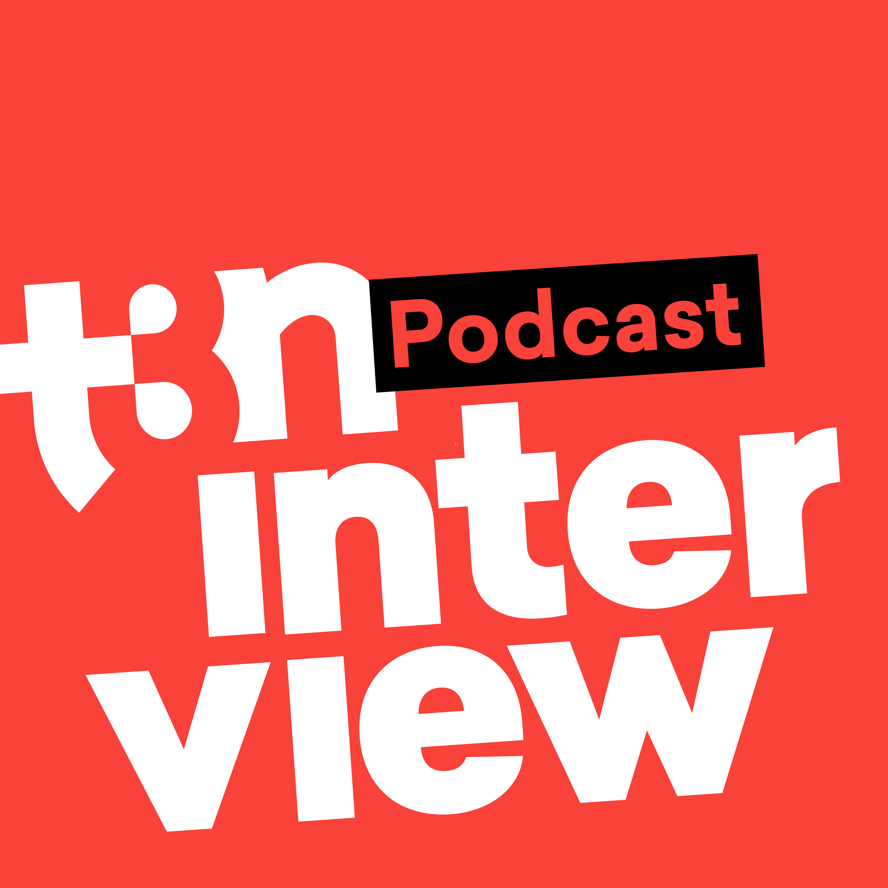

# GermanTechPodcasts

A curated list of German Tech Podcasts :de: :austria: :switzerland:

## Table of Contents

* [Podcasts](#podcasts)
  * [Engineering Kiosk](#engineering-kiosk)
  * [FOCUS ON: DevOps](#focus-on-devops)
  * [FOCUS ON: Linux](#focus-on-linux)
  * [Logbuch: Netzpolitik](#logbuch-netzpolitik)
  * [Macht der Craft](#macht-der-craft)
  * [Netzpolitik](#netzpolitik)
  * [Neuland](#neuland)
  * [Open Source Couch](#open-source-couch)
  * [Open Source in der Industrie](#open-source-in-der-industrie)
  * [programmier.bar](#programmier-bar)
  * [Ready for Review](#ready-for-review)
  * [Speak 1337](#speak-1337)
  * [t3n](#t3n)
  * [todo:cast](#todo-cast)
  * [Wartungsfenster](#wartungsfenster)
  * [Wo wir sind ist vorne](#wo-wir-sind-ist-vorne)
  * [Working Draft](#working-draft)
* [Legend](#legend)
* [How to contribute](#how-to-contribute)
</ul>

## Podcasts

<h3 id="engineering-kiosk">Engineering Kiosk</h3>

Der Engineering Kiosk ist der deutschsprachige Software-Engineering-Podcast mit Wolfgang Gassler und Andy Grunwald rund um die Themen Engineering-Kultur, Open Source, Menschen, Technologie und allen anderen Bereichen, die damit in Verbindung stehen.

* Number of published episodes: 31
* Last episode published: 🟢 Tuesday, 02 August 2022
* Weekly downloads (avg): 473 (updated: 2022-07-25)
* [Engineering Kiosk Website](https://engineeringkiosk.dev/)
* [Engineering Kiosk @ Spotify](https://open.spotify.com/show/0tJRC0UsObPCWLmmzmOkIs)
* [Engineering Kiosk @ Apple Podcasts](https://podcasts.apple.com/de/podcast/1603082924)
* [Engineering Kiosk Podcast RSS](https://feeds.redcircle.com/0ecfdfd7-fda1-4c3d-9515-476727f9df5e)
* Tags: Development, Tech-Kultur, Open Source

----

<h3 id="focus-on-devops">FOCUS ON: DevOps</h3>

Der FOCUS ON: DevOps Podcast beschäftigt sich mit verschiedenen Methoden und Werkzeugen rund um das Thema DevOps. Dabei wechseln sich technische mit methodischen Folgen ab. Unser Ziel ist es über relevante Themen zu informieren und auch die Hersteller auf dem Markt als Gäste mit einzubinden.

* Number of published episodes: 45
* Last episode published: 🟢 Wednesday, 27 July 2022
* [FOCUS ON: DevOps Website](https://ageofdevops.de/index.php/series/fodo/)
* [FOCUS ON: DevOps @ Spotify](https://open.spotify.com/show/0gXBw5mGcqXQkPW9h2JTaa)
* [FOCUS ON: DevOps @ Apple Podcasts](https://podcasts.apple.com/de/podcast/1542623849)
* [FOCUS ON: DevOps Podcast RSS](https://ageofdevops.de/feed/podcast/fodo)
* Tags: DevOps, Cloud

----

<h3 id="focus-on-linux">FOCUS ON: Linux</h3>

Der FOCUS ON: Linux Podcast beschäftigt sich mit verschiedenen Themen rund um Linux. Unser Ziel ist es, euch monatlich über die Entwicklungen und Neuigkeiten zu informieren und auch praktische Tool-Tipps an die Hand zu geben.

* Number of published episodes: 11
* Last episode published: 🟢 Friday, 29 July 2022
* [FOCUS ON: Linux Website](https://ageofdevops.de/index.php/series/fol/)
* [FOCUS ON: Linux @ Spotify](https://open.spotify.com/show/4Yj9EaidQuwEZL0NkAafzh)
* [FOCUS ON: Linux @ Apple Podcasts](https://podcasts.apple.com/de/podcast/1606139089)
* [FOCUS ON: Linux Podcast RSS](https://ageofdevops.de/feed/podcast/fol)
* Tags: Linux, Open Source

----

<h3 id="logbuch-netzpolitik">Logbuch: Netzpolitik</h3>

Logbuch:Netzpolitik ist ein in der Regel wöchentlich erscheinender Podcast, der im Dialog zwischen Linus Neumann und Tim Pritlove die wichtigsten Themen und Ereignisse mit netzpolitischem Bezug aufgreift und diskutiert.

* Number of published episodes: 438
* Last episode published: 🟢 Thursday, 14 July 2022
* [Logbuch: Netzpolitik Website](https://logbuch-netzpolitik.de/)
* [Logbuch: Netzpolitik @ Apple Podcasts](https://podcasts.apple.com/de/podcast/476856034)
* [Logbuch: Netzpolitik Podcast RSS](https://feeds.metaebene.me/lnp/m4a)
* Tags: Politik, Gesellschaft, Internet

----

<h3 id="macht-der-craft">Macht der Craft</h3>

Von Menschen für Menschen, die Software entwickeln, ist dieser Podcast gedacht. Damit Du in diesem Leben durch stetiges Lernen, den bestmöglichen Code kreieren kannst. Wir erzählen dir von agiler Softwareentwicklung, Software Craft, Methoden, Techniken und allem, was dazu gehört, um deine Fähigkeiten zu verbessern. Das Bestmögliche zu erschaffen, bedeutet mit dem Puls der Zeit zu gehen und ständig zu lernen.

* Number of published episodes: 10
* Last episode published: 🟢 Monday, 06 June 2022
* [Macht der Craft Website](https://macht-der-craft.soler-sanandres.net/)
* [Macht der Craft @ Spotify](https://open.spotify.com/show/5232Av5Ibaf4shvJzpSKEa)
* [Macht der Craft Podcast RSS](https://macht-der-craft.soler-sanandres.net/feed/podcast)
* Tags: Development

----

<h3 id="netzpolitik">Netzpolitik</h3>

Wir thematisieren die wichtigen Fragestellungen rund um Internet, Gesellschaft und Politik und zeigen Wege auf, wie man sich auch selbst mit Hilfe des Netzes für digitale Freiheiten und Offenheit engagieren kann. Mit netzpolitik.org beschreiben wir, wie die Politik das Internet durch Regulierung verändert und wie das Netz Politik, Öffentlichkeiten und alles andere verändert.

* Number of published episodes: 25
* Last episode published: 🟢 Saturday, 09 July 2022
* [Netzpolitik Website](https://netzpolitik.org/podcast/)
* [Netzpolitik @ Spotify](https://open.spotify.com/show/2GLuMhSNEFzUIXfx9BDxBt)
* [Netzpolitik @ Apple Podcasts](https://podcasts.apple.com/de/podcast/1281525246)
* [Netzpolitik Podcast RSS](https://netzpolitik.org/category/netzpolitik-podcast/?feed=itunes&amp;)
* Tags: Internet, Gesellschaft, Politik

----

<h3 id="neuland">Neuland</h3>

Mehr Wissen über die digitale Welt. Experten des Hasso-Plattner-Instituts sprechen verständlich über digitale Entwicklungen und Trends, über Chancen und Risiken der Digitalisierung. Jede Sendung widmet sich einem gesellschaftlich relevanten Thema: Von der Macht der Künstlichen Intelligenz über die Blockchain bis zu Hetze in den sozialen Medien.

* Number of published episodes: 59
* Last episode published: 🟢 Wednesday, 20 July 2022
* [Neuland Website](https://podcast.hpi.de/)
* [Neuland @ Spotify](https://open.spotify.com/show/0kd8vXJDv3sN7VMtcLRsH9)
* [Neuland @ Apple Podcasts](https://podcasts.apple.com/de/podcast/1448992875)
* [Neuland Podcast RSS](https://podcast.hpi.de/feed.xml)

----

<h3 id="open-source-couch">Open Source Couch</h3>

Oli und Michael sprechen über alles Wichtige aus der Welt der Open Source, Technologie und dem Geek-tum.

* Number of published episodes: 31
* Last episode published: 🟢 Friday, 05 August 2022
* [Open Source Couch Website](https://www.opensourcecouch.de/)
* [Open Source Couch @ Spotify](https://open.spotify.com/show/3fNThjRvMKJhhyg7eCTY8v)
* [Open Source Couch @ Apple Podcasts](https://podcasts.apple.com/de/podcast/1529154227)
* [Open Source Couch Podcast RSS](https://letscast.fm/podcasts/die-open-source-couch-0743e028/feed)
* Tags: Open Source

----

<h3 id="open-source-in-der-industrie">Open Source in der Industrie</h3>

Wir berichten alle zwei Wochen über Open Source Anwendungen, Ideen und Konzepte aus der Industrie.

* Number of published episodes: 17
* Last episode published: 🟢 Tuesday, 12 July 2022
* [Open Source in der Industrie Website](https://opensourcepodcast.podigee.io/)
* [Open Source in der Industrie @ Spotify](https://open.spotify.com/show/7e0khh6f5m1NArO3ggwCSH)
* [Open Source in der Industrie Podcast RSS](https://opensourcepodcast.podigee.io/feed/mp3)
* Tags: Industrie, Open Source

----

<h3 id="programmier-bar">programmier.bar</h3>

Mit geballter Dev-Power nehmen Dennis, Fabi, Sebi und Jojo neue Podcastfolgen auf und werden dabei regelmäßig von Gäst:innen aus der Branche unterstützt. Taucht in unseren Deep Dives mit uns in Frameworks und Datenbanken ein, hört euch in den CTO-Specials die Erfahrungen führender Persönlichkeiten großer Unternehmen an und bleibt mit unseren News-Folgen stets am Ball in der Welt der App- und Webentwicklung.

* Number of published episodes: 189
* Last episode published: 🟢 Friday, 05 August 2022
* Weekly downloads (avg): 8936 (updated: 2022-08-04)
* [programmier.bar Website](https://www.programmier.bar/podcast)
* [programmier.bar @ Spotify](https://open.spotify.com/show/0ik0sXv9paTQCeThcOLCCJ)
* [programmier.bar @ Apple Podcasts](https://podcasts.apple.com/de/podcast/1371409964)
* [programmier.bar Podcast RSS](https://feeds.buzzsprout.com/176239.rss)

----

<h3 id="ready-for-review">Ready for Review</h3>

Sandra Parsick &amp; Daniel Zenzes präsentieren mit Ready for Review einen bunten Mix aus aktuellen IT-Themen und ihrem täglichen Entwickler-Alltag.

* Number of published episodes: 29
* Last episode published: 🟢 Wednesday, 03 August 2022
* Weekly downloads (avg): 66 (updated: 2022-07-29)
* [Ready for Review Website](https://ready-for-review.dev/)
* [Ready for Review @ Spotify](https://open.spotify.com/show/7dxK2wi4ZMGEYO3UHhTSc4)
* [Ready for Review @ Apple Podcasts](https://podcasts.apple.com/de/podcast/1535026156)
* [Ready for Review Podcast RSS](https://ready-for-review.podigee.io/feed/mp3)
* Tags: Software Development, Kochen, Klingel, Comics, IT Family Support, Filme, Brettspiele, Serien, Java, JavaScript

----

<h3 id="speak-1337">Speak 1337</h3>

Ich bin Cedric und in diesem Podcast rede ich immer wieder mal über Informatik, Datenschutz, Sicherheit und alles erwähnenswerte. Mit dabei sind immer wieder sehr bekannte und engagierte Menschen, die Experte auf ihrem Gebiet sind.

* Number of published episodes: 28
* Last episode published: 🟢 Friday, 24 June 2022
* Weekly downloads (avg): 180 (updated: 2022-08-01)
* [Speak 1337 Website](https://the-morpheus.de/)
* [Speak 1337 @ Spotify](https://open.spotify.com/show/0xlIih789FcMbZaASyhuAm)
* [Speak 1337 @ Apple Podcasts](https://podcasts.apple.com/de/podcast/1577956101)
* [Speak 1337 Podcast RSS](https://anchor.fm/s/c821b10/podcast/rss)
* Tags: Informatik, Datenschutz, Sicherheit

----

<h3 id="t3n">t3n</h3>

Im t3n Podcast diskutiert die t3n-Redaktion mit prominenten Gästen über die spannendsten digitalen Themen unserer Zeit. Ob innovative Führungskonzepte, die Digitalisierung der Gesellschaft, smarte Gadgets, neue Mobilität oder Zukunftstechnologien. Das Update für digitale Pioniere – jede Woche neu!

* Number of published episodes: 423
* Last episode published: 🟢 Monday, 01 August 2022
* [t3n Website](https://t3n.de/podcast/)
* [t3n @ Spotify](https://open.spotify.com/show/7obTbZaywhQEiUUOMswQBQ)
* [t3n @ Apple Podcasts](https://podcasts.apple.com/de/podcast/1115601393)
* [t3n Podcast RSS](https://t3n-podcast.podigee.io/feed/mp3)
* Tags: News, Business

----

<h3 id="todo-cast">todo:cast</h3>

todo:cast ist ein deutschsprachiger Podcast für die großen und kleinen Fragen des Entwickler*innenalltags. Schon seit Langem tauschen sich Malte und Robin-Manuel in regelmäßigen Abständen über diverse Themen aus ihrem Alltag in der Softwareentwicklung aus. Dabei lernen sie jedes Mal etwas Neues! Warum also das Ganze nicht aufzeichnen und als Podcast zur Verfügung stellen?

* Number of published episodes: 43
* Last episode published: 🟢 Monday, 25 July 2022
* [todo:cast Website](https://todocast.io/)
* [todo:cast @ Spotify](https://open.spotify.com/show/2tIlVD6vBAtEhOZM4jS1mw)
* [todo:cast @ Apple Podcasts](https://podcasts.apple.com/de/podcast/1467179396)
* [todo:cast Podcast RSS](https://feeds.soundcloud.com/users/soundcloud:users:637814493/sounds.rss)

----

<h3 id="wartungsfenster">Wartungsfenster</h3>

Alle 14 Tage laden wir zu einer kleinen Kaminzimmerrunde rund um den Themenkomplex Datacenter, Cloud und IT ein. In Ermangelung eines Kaminzimmers sitzen wir in der Hot Aisle eines Datacenters, statt feudaler Sessel gibt es faltbare Campingstühle, und die Cognacschwenker durften wir auch nicht mit reinnehmen. :/

* Number of published episodes: 13
* Last episode published: 🟢 Tuesday, 02 August 2022
* Weekly downloads (avg): 100 (updated: 2022-07-31)
* [Wartungsfenster Website](https://wartungsfenster.podigee.io/)
* [Wartungsfenster @ Spotify](https://open.spotify.com/show/063YcVklbp1N8z1ZHSA709)
* [Wartungsfenster @ Apple Podcasts](https://podcasts.apple.com/de/podcast/1607047978)
* [Wartungsfenster Podcast RSS](https://wartungsfenster.podigee.io/feed/mp3)
* Tags: Datacenter, Cloud, Microsoft, Security

----

<h3 id="wo-wir-sind-ist-vorne">Wo wir sind ist vorne</h3>

Latenight-Frontend-Talkshow rund um Webdesign und Entwicklung. Es reden sich um &lt;HEAD&gt; und Kragen: HTML-Fundamentalist Moritz Gießmann und JavaScript Jongleur Constantin Groß.

* Number of published episodes: 44
* Last episode published: 🟡 Sunday, 08 May 2022
* [Wo wir sind ist vorne Website](https://wowirsindistvorne.show/)
* [Wo wir sind ist vorne @ Spotify](https://open.spotify.com/show/54K1DpiQYHBHSnIO6OzSKs)
* [Wo wir sind ist vorne @ Apple Podcasts](https://podcasts.apple.com/de/podcast/1500485579)
* [Wo wir sind ist vorne Podcast RSS](https://wowirsindistvorne.show/feed/mp3/)

----

<h3 id="working-draft">Working Draft</h3>

Wöchentlicher Podcast für Webdesigner:innen und -entwickler:innen

* Number of published episodes: 552
* Last episode published: 🟢 Wednesday, 29 June 2022
* [Working Draft Website](https://workingdraft.de/)
* [Working Draft @ Spotify](https://open.spotify.com/show/78iH7cIFzu1ejoB6aQUsIh)
* [Working Draft @ Apple Podcasts](https://podcasts.apple.com/de/podcast/402204581)
* [Working Draft Podcast RSS](https://workingdraft.de/feed/)

----

## Legend

We calculate a traffic light indicator on when the last podcast episode was published:
* 🔴 Last Episode published > 6 months ago
* 🟡 Last Episode published something between 2 months and 6 months ago
* 🟢 Last Episode published within today and last 2 month

## How to contribute

If you want to 
* add a new podcast to the list, check out our [Contribution Guide](/CONTRIBUTING.md)
* modify the tooling and structure, check out our [Development Guide](/DEVELOPMENT.md)