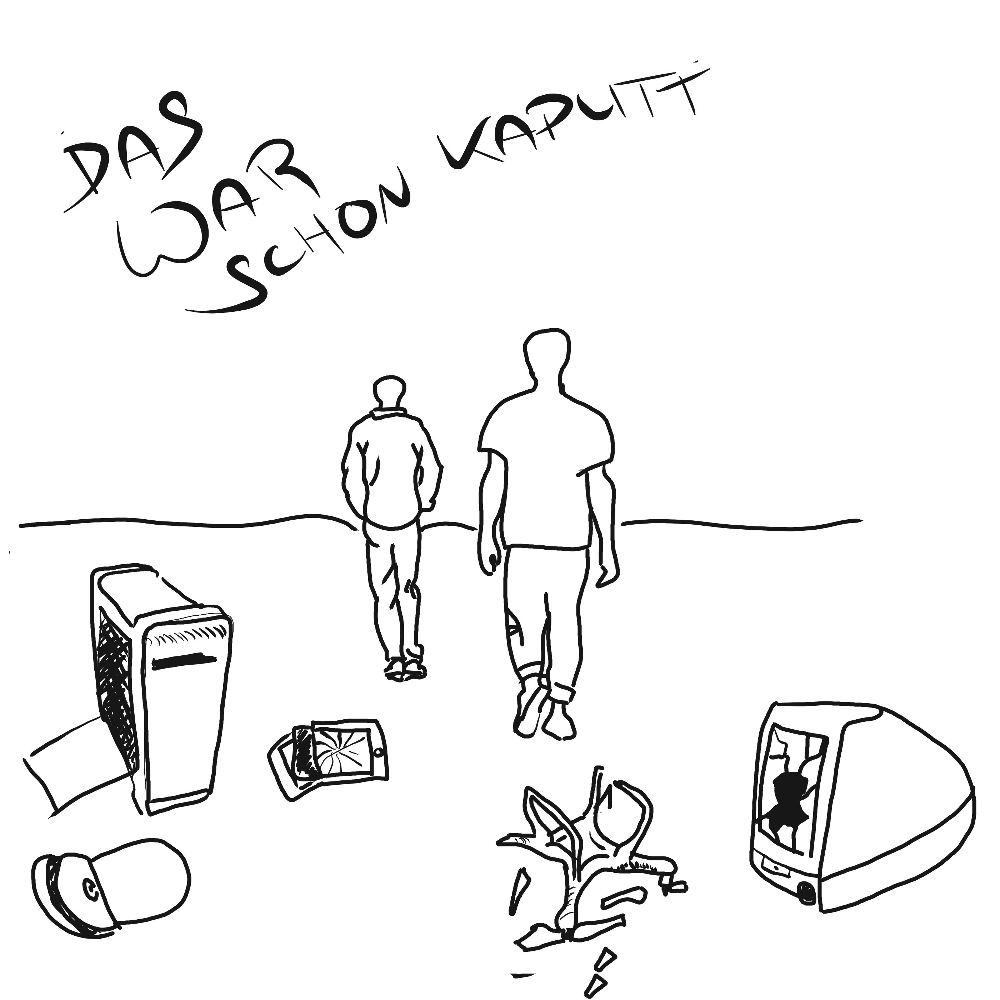
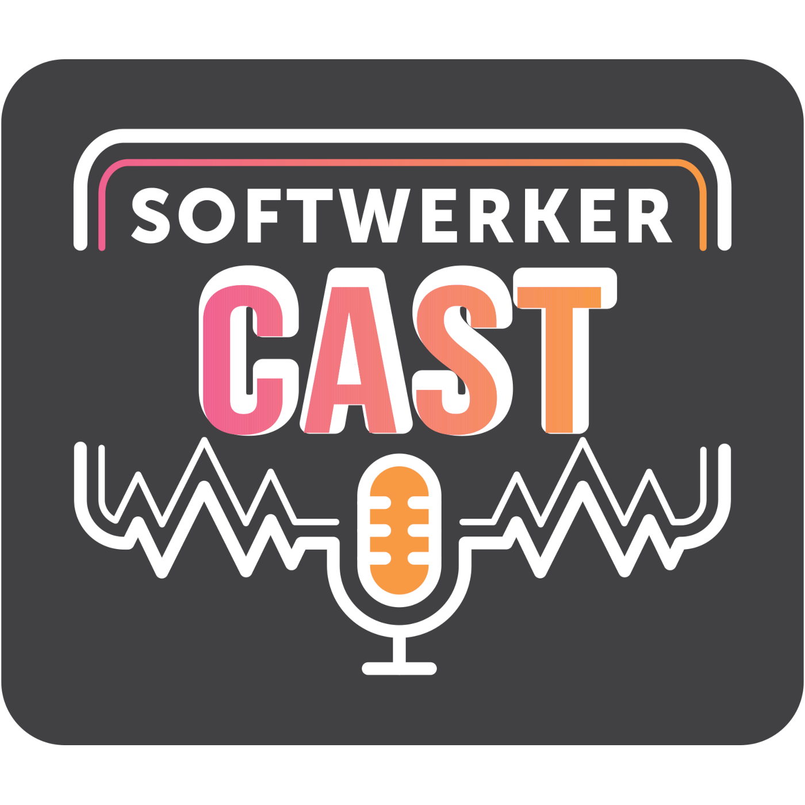
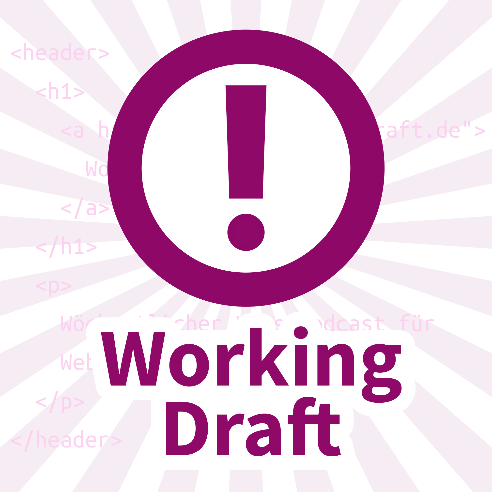
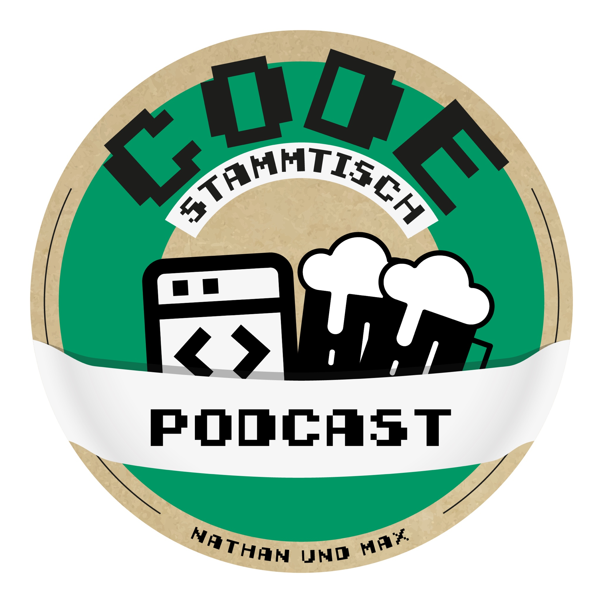

# GermanTechPodcasts

A curated list of German Tech Podcasts :de: :austria: :switzerland:

All listed podcasts are available as [OPML file (podcasts.opml)](./podcasts.opml) to import those into your podcatcher as well.

## Table of Contents

* [Podcasts](#podcasts) (80 podcasts)
  * [0d - Zeroday](#0d-zeroday)
  * [Apfelfunk](#apfelfunk)
  * [Armchair Investigators](#armchair-investigators)
  * [Auslegungssache](#auslegungssache)
  * [Autoweird](#autoweird)
  * [Binärgewitter](#binargewitter)
  * [Bit-Rauschen](#bit-rauschen)
  * [Bits & Böses - Der Tech Crime Podcast](#bits-and-boses-der-tech-crime-podcast)
  * [Bits und so](#bits-und-so)
  * [Breach FM](#breach-fm)
  * [c't uplink](#ct-uplink)
  * [Click! Clack! Hack!](#click-clack-hack)
  * [Code and Ship](#code-and-ship)
  * [Code Culture](#code-culture)
  * [Computer und Kommunikation (Deutschlandfunk)](#computer-und-kommunikation-deutschlandfunk)
  * [Das Duumvirat](#das-duumvirat)
  * [DAS WAR SCHON KAPUTT](#das-war-schon-kaputt)
  * [Der GameDev Podcast](#der-gamedev-podcast)
  * [DevCouch](#devcouch)
  * [Digitalisierungsfieber](#digitalisierungsfieber)
  * [Engineering Kiosk](#engineering-kiosk)
  * [Female TechTalk](#female-techtalk)
  * [FOCUS ON: DevOps](#focus-on-devops)
  * [FOCUS ON: Linux](#focus-on-linux)
  * [Gamedev für die Platte - Der Unreal Podcast](#gamedev-fur-die-platte-der-unreal-podcast)
  * [GNU/Linux.ch](#gnu-linux-ch)
  * [Herzbergs Hörsaal](#herzbergs-horsaal)
  * [Hobby Spieleentwickler Podcast](#hobby-spieleentwickler-podcast)
  * [Index out of bounds](#index-out-of-bounds)
  * [INNOQ Podcast](#innoq-podcast)
  * [INNOQ Security Podcast](#innoq-security-podcast)
  * [ISMS X-Plain](#isms-x-plain)
  * [IT ist alles](#it-ist-alles)
  * [IT-Berufe Podcast](#it-berufe-podcast)
  * [IT@DB](#itatdb)
  * [Ja sia!](#ja-sia)
  * [knowIT](#knowit)
  * [Kurz informiert by heise online](#kurz-informiert-by-heise-online)
  * [Logbuch Digitalien](#logbuch-digitalien)
  * [Logbuch: Netzpolitik](#logbuch-netzpolitik)
  * [Mac & I](#mac-and-i)
  * [Macht der Craft](#macht-der-craft)
  * [Mein Scrum ist kaputt!](#mein-scrum-ist-kaputt)
  * [Mind the Tech](#mind-the-tech)
  * [Mixedcast](#mixedcast)
  * [Nachgehackt](#nachgehackt)
  * [Netzpolitik](#netzpolitik)
  * [Neuland](#neuland)
  * [Open Source Couch](#open-source-couch)
  * [Open Source in der Industrie](#open-source-in-der-industrie)
  * [Percepticon](#percepticon)
  * [programmier.bar](#programmier-bar)
  * [Python Podcast](#python-podcast)
  * [RadioTux](#radiotux)
  * [Ready for Review](#ready-for-review)
  * [Rheingehäckt](#rheingehackt)
  * [Schlüsseltechnologie](#schlusseltechnologie)
  * [Schwarz, Code, Gold – Deutschland, Entwicklungsland?](#schwarz-code-gold-deutschland-entwicklungsland)
  * [Security-Insider](#security-insider)
  * [She for what? She for IT!](#she-for-what-she-for-it)
  * [She Likes Tech](#she-likes-tech)
  * [Software-Architektur als Beruf](#software-architektur-als-beruf)
  * [SoftwareArchitektur im Stream](#softwarearchitektur-im-stream)
  * [SoftwerkerCast](#softwerkercast)
  * [Speak 1337](#speak-1337)
  * [Super Duper Developers Club](#super-duper-developers-club)
  * [t3n Catch up](#t3n-catch-up)
  * [t3n Daily](#t3n-daily)
  * [t3n Interview](#t3n-interview)
  * [Techtiefen](#techtiefen)
  * [The World of IT-Security](#the-world-of-it-security)
  * [TILpod](#tilpod)
  * [todo:cast](#todo-cast)
  * [Unmute IT](#unmute-it)
  * [Unter 4 Ohren](#unter-4-ohren)
  * [Wartungsfenster](#wartungsfenster)
  * [Web & Design Podcast](#web-and-design-podcast)
  * [Wo wir sind ist vorne](#wo-wir-sind-ist-vorne)
  * [Working Draft](#working-draft)
  * [WP Sofa](#wp-sofa)
* [Archived podcasts](#archived-podcasts) (7 podcasts)
  * [Chaosradio](#chaosradio)
  * [Codestammtisch](#codestammtisch)
  * [Freakshow](#freakshow)
  * [GeekWeek](#geekweek)
  * [heise Developer: SoftwareArchitekTOUR](#heise-developer-softwarearchitektour)
  * [Request for Comments](#request-for-comments)
  * [SELECTrageFROMit;](#selectragefromit)
* [Legend](#legend)
* [How to contribute](#how-to-contribute)
* [In the press](#in-the-press)
* [Frequently Asked Questions](#frequently-asked-questions)
* [Other](#other)
</ul>

## Podcasts

<h3 id="0d-zeroday">0d - Zeroday</h3>

Deutschsprachiger Podcast zu den Themen IT-Sicherheit und Privatsphäre. Stefan und Sven unterhalten sich über aktuelle News und allgemeine Themen rund um Security und Privacy.

* Number of published episodes: 103
* Last episode published: 🟢 Friday, 24 February 2023
* Weekly downloads (avg): 2000 (updated: 2023-01-16)
* [0d - Zeroday Website](https://0x0d.de/)
* [0d - Zeroday @ Spotify](https://open.spotify.com/show/5XTyNo5r6H0rRptIgaE1w4)
* [0d - Zeroday @ Apple Podcasts](https://podcasts.apple.com/de/podcast/1190478484)
* [0d - Zeroday Podcast RSS](https://0x0d.de/feed/mp3/)
* Tags: Security, Informationssicherheit, Privatsphäre, Datenschutz

----

<h3 id="apfelfunk">Apfelfunk</h3>

Apfelfunk ist ein wöchentlicher Podcast über Apple-Themen. Jean-Claude Frick und Malte Kirchner berichten und bewerten darin die Neuigkeiten über den wichtigsten Computerkonzern der Welt.

* Number of published episodes: 368
* Last episode published: 🟢 Wednesday, 22 February 2023
* [Apfelfunk Website](http://www.apfelfunk.com/)
* [Apfelfunk @ Spotify](https://open.spotify.com/show/7FQLyWiNhMR0KS93ReaI4h)
* [Apfelfunk @ Apple Podcasts](https://podcasts.apple.com/de/podcast/1081146940)
* [Apfelfunk Podcast RSS](https://feeds.soundcloud.com/users/soundcloud:users:201768667/sounds.rss)
* Tags: Apple, Hardware

----

<h3 id="armchair-investigators">Armchair Investigators</h3>

Ein Dialog über Malware, Cybercrime und Cyberspionage

* Number of published episodes: 8
* Last episode published: 🟢 Wednesday, 08 February 2023
* [Armchair Investigators Website](https://armchairinvestigators.de/)
* [Armchair Investigators @ Spotify](https://open.spotify.com/show/1xaPIhkQWfAtmHPg8llCEJ)
* [Armchair Investigators @ Apple Podcasts](https://podcasts.apple.com/de/podcast/1555931250)
* [Armchair Investigators Podcast RSS](https://armchairinvestigators.de/feed/podcast/)
* Tags: Malware, Cybercrime, Cyberspionage, Security

----

<h3 id="auslegungssache">Auslegungssache</h3>

Sie möchten beim Thema Datenschutz auf dem Laufenden bleiben, aber keine seitenlange Literatur wälzen? Dann wenden Sie sich vertrauensvoll an unser Juristen-Redakteurs-Duo. Alle 14 Tage bespricht c&#39;t-Redakteur Holger Bleich mit Joerg Heidrich aktuelle Entwicklungen rund um den Datenschutz. Joerg ist beim c&#39;t-Mutterschiff Heise Medien als Justiziar für das Thema zuständig und hat täglich mit der europäischen Datenschutz-Grundverordnung (DSGVO) zu tun. Wechselnde Gäste ergänzen das Duo.

* Number of published episodes: 81
* Last episode published: 🟢 Friday, 24 February 2023
* [Auslegungssache Website](https://heise.de/-4571821)
* [Auslegungssache @ Spotify](https://open.spotify.com/show/3Jrnu7vrTurguBaCiPapkA)
* [Auslegungssache @ Apple Podcasts](https://podcasts.apple.com/de/podcast/1485860893)
* [Auslegungssache Podcast RSS](https://ct-auslegungssache.podigee.io/feed/mp3)
* Tags: Datenschutz

----

<h3 id="autoweird">Autoweird</h3>

@Autoweird.fm ist der regelmäßig erscheinende Podcast rund um die Themen Software Entwicklung, Agilität und Software Crafting.

* Number of published episodes: 120
* Last episode published: 🟢 Thursday, 09 February 2023
* Weekly downloads (avg): 175 (updated: 2022-12-29)
* [Autoweird Website](https://autoweird.fm/)
* [Autoweird @ Spotify](https://open.spotify.com/show/6TDrYLHYxoo7VjvSglunew)
* [Autoweird @ Apple Podcasts](https://podcasts.apple.com/de/podcast/1180414602)
* [Autoweird Podcast RSS](http://autoweird.fm/feed/podcast/)
* Tags: Software-Crafting, Agilität, Softskills, Nerdquatsch, Funktionale Programmierung, Testing, Development Trends, Craft-Beer

----

<h3 id="binargewitter">Binärgewitter</h3>

Ein Podcast über Web, Entwicklung, Mobile und Technologie. Betrachtet aus der Sicht von Entwicklern bzw. Open Source Begeisterten. Das heißt aber nicht, dass wir alles mit einer Rosa-Roten Brille sehen. Wir suchen bei Apple und Microsoft genauso das Gute und Schlechte wie auch bei Linux und anderen Open Source Projekten. Wir wollen realistisch sein. Auch wenn wir damit anecken sollten.

* Number of published episodes: 50
* Last episode published: 🟢 Saturday, 18 February 2023
* [Binärgewitter Website](http://blog.binaergewitter.de/)
* [Binärgewitter @ Spotify](https://open.spotify.com/show/19LedqK0fGWfzfKzySDoVW)
* [Binärgewitter @ Apple Podcasts](https://podcasts.apple.com/de/podcast/216877594)
* [Binärgewitter Podcast RSS](http://feed.binaergewitter.de/binaergewitter_mp3.xml)
* Tags: Open Source, Software Development, Web

----

<h3 id="bit-rauschen">Bit-Rauschen</h3>

Prozessoren, Grafikkarten, Notebooks, Desktop-PCs, Server, KI, Rechenzentren und IT-Markt: In &#34;Bit-Rauschen&#34;, dem Prozessor-Podcast des Computermagazins c’t, dreht sich alles um Chips.

* Number of published episodes: 56
* Last episode published: 🟢 Wednesday, 15 February 2023
* [Bit-Rauschen Website](https://www.ct.de/bit-rauschen)
* [Bit-Rauschen @ Spotify](https://open.spotify.com/show/6JD6gwqgVR27GYZACrWOT1)
* [Bit-Rauschen @ Apple Podcasts](https://podcasts.apple.com/de/podcast/1549821753)
* [Bit-Rauschen Podcast RSS](https://bit-rauschen.podigee.io/feed/mp3)
* Tags: Hardware, CPU

----

<h3 id="bits-and-boses-der-tech-crime-podcast">Bits &amp; Böses - Der Tech Crime Podcast</h3>

Komm mit in die dunklen Ecken des Internets. Wir blicken in der ersten Staffel auf einen Fall von Identitätsdiebstahl bei Instagram und schauen uns an, wie er hätte verhindert werden können, wie die Polizei nach Cyber-Kriminellen fahndet und was man noch tun kann, wenn es eigentlich schon zu spät ist.

* Number of published episodes: 7
* Last episode published: 🟡 Tuesday, 20 December 2022
* [Bits &amp; Böses - Der Tech Crime Podcast Website](https://bitsundboeses.podigee.io/)
* [Bits &amp; Böses - Der Tech Crime Podcast @ Spotify](https://open.spotify.com/show/4RhbOvfpOLJDFwui3ujVn9)
* [Bits &amp; Böses - Der Tech Crime Podcast @ Apple Podcasts](https://podcasts.apple.com/de/podcast/1652515781)
* [Bits &amp; Böses - Der Tech Crime Podcast Podcast RSS](https://bitsundboeses.podigee.io/feed/mp3)
* Tags: Tech Crime

----

<h3 id="bits-und-so">Bits und so</h3>

Die wöchentliche Talkrunde rund um Apple, Mac, iPod &#43; iPhone, Gadgets und so. Fast live aus München.

* Number of published episodes: 10
* Last episode published: 🟢 Sunday, 19 February 2023
* [Bits und so Website](http://www.bitsundso.de/)
* [Bits und so @ Apple Podcasts](https://podcasts.apple.com/de/podcast/202753375)
* [Bits und so Podcast RSS](http://www.bitsundso.de/feed/)
* Tags: Hardware, Apple

----

<h3 id="breach-fm">Breach FM</h3>

Ransomware Attacken, Phishing oder DDoS - jeden Tag aufs Neue werden Unternehmen Ziel von Angriffen. Was sind die Geschichten dahinter, wie laufen die Attacken ab und wie kann Schaden verhindert werden? Kim und Robert haben tagtäglich Einblicke in die Info Sec Welt und teilen in diesem Podcast mit Euch ihre Erfahrungen. Schaltet ein, wenn ihr regelmäßige Updates zu aktuellen Sicherheitslücken, Diskussionen zu Technologie Trends oder anderen Themen aus der Welt der Info Sec haben möchtet!

* Number of published episodes: 20
* Last episode published: 🟢 Wednesday, 15 February 2023
* [Breach FM Website](https://breachfm.transistor.fm/)
* [Breach FM @ Spotify](https://open.spotify.com/show/4ooV9mM8Qiyfkj9jUkdZjj)
* [Breach FM @ Apple Podcasts](https://podcasts.apple.com/de/podcast/1641279793)
* [Breach FM Podcast RSS](https://feeds.transistor.fm/breach-fm-der-infosec-podcast)
* Tags: Security

----

<h3 id="ct-uplink">c&#39;t uplink</h3>

Mitglieder der c&#39;t-Redaktion diskutieren über die aktuellen Themen aus dem c’t Magazin und was sonst noch so in der IT-Welt passiert.

* Number of published episodes: 475
* Last episode published: 🟢 Saturday, 25 February 2023
* [c&#39;t uplink Website](https://www.heise.de/ct/entdecken/?hauptrubrik=%40ctmagazin&amp;unterrubrik=c%27t&#43;uplink)
* [c&#39;t uplink @ Spotify](https://open.spotify.com/show/4LdN7lGr9winLtQSqoIjVD)
* [c&#39;t uplink @ Apple Podcasts](https://podcasts.apple.com/de/podcast/835717958)
* [c&#39;t uplink Podcast RSS](https://ct-uplink.podigee.io/feed/mp3)

----

<h3 id="click-clack-hack">Click! Clack! Hack!</h3>

Ein Podcast über den nahezu unendlich tiefen Kaninchenbau der mechanische Tastaturen. Ich erzähle euch was es neues im Hobby der mechanical Keyboards gibt, Groupbuys, Interestchecks, Neue Keyboards, Keycaps und Switches und noch viel viel mehr....

* Number of published episodes: 58
* Last episode published: 🟢 Monday, 20 February 2023
* [Click! Clack! Hack! Website](https://www.nerdbude.com/podcast/)
* [Click! Clack! Hack! @ Apple Podcasts](https://podcasts.apple.com/de/podcast/1551770169)
* [Click! Clack! Hack! Podcast RSS](https://www.nerdbude.com/podcast/feed/feed.xml)
* Tags: Hardware, Tastaturen

----

<h3 id="code-and-ship">Code and Ship</h3>

Jonathan und Ingmar sprechen übers Programmieren und Ausliefern von Software Projekten. Außerdem tauschen die beiden Bremer sich über Tools, Frameworks und das Leben als Softwareentwickler aus.

* Number of published episodes: 47
* Last episode published: 🟢 Tuesday, 17 January 2023
* [Code and Ship Website](https://codeandship.rocks/)
* [Code and Ship @ Spotify](https://open.spotify.com/show/68VGe4DFCUxvcJp44VDVL3)
* [Code and Ship @ Apple Podcasts](https://podcasts.apple.com/de/podcast/1458278980)
* [Code and Ship Podcast RSS](https://codeandship.rocks/podcast/index.xml)

----

<h3 id="code-culture">Code Culture</h3>

Lucas Rott und Markus Herhoffer erzählen alle 14 Tage von Code und Nerd-Kultur. Mit News aus der Tech-Bubble, einem Thema der Woche über Software development und dem Code der Woche.

* Number of published episodes: 98
* Last episode published: 🟢 Sunday, 19 February 2023
* [Code Culture Website](https://codeculture.podigee.io/)
* [Code Culture @ Spotify](https://open.spotify.com/show/01ZL2aPP50lLW51u2aTOkN)
* [Code Culture @ Apple Podcasts](https://podcasts.apple.com/de/podcast/1516904389)
* [Code Culture Podcast RSS](https://codeculture.podigee.io/feed/mp3)

----

<h3 id="computer-und-kommunikation-deutschlandfunk">Computer und Kommunikation (Deutschlandfunk)</h3>

Jeden Samstag das Neueste aus Computertechnik und Informationstechnologie. Beiträge, Reportagen und Interviews zu IT-Sicherheit, Informatik, Datenschutz, Smartphones, Cloud-Computing und IT-Politik. Die Trends der IT werden kompakt und informativ zusammengefasst.

* Number of published episodes: 20
* Last episode published: 🟢 Saturday, 25 February 2023
* [Computer und Kommunikation (Deutschlandfunk) Website](https://www.deutschlandfunk.de/computer-und-kommunikation-102.html)
* [Computer und Kommunikation (Deutschlandfunk) @ Spotify](https://open.spotify.com/show/4uy56W83RGe8SKmzNpyfAc)
* [Computer und Kommunikation (Deutschlandfunk) @ Apple Podcasts](https://podcasts.apple.com/de/podcast/173754605)
* [Computer und Kommunikation (Deutschlandfunk) Podcast RSS](https://www.deutschlandfunk.de/computer-und-kommunikation-102.xml)
* Tags: News

----

<h3 id="das-duumvirat">Das Duumvirat</h3>

Im Podcast Das Duumvirat unterhalten wir uns über verschiedene Mac-Themen aus dem Alltag von Anwendern. Wir schauen über den Tellerrand. Und manchmal haben wir auch Gäste.

* Number of published episodes: 50
* Last episode published: 🟢 Thursday, 02 February 2023
* [Das Duumvirat Website](https://www.trommelspeicher.de/podcast/)
* [Das Duumvirat @ Apple Podcasts](https://podcasts.apple.com/de/podcast/1212750085)
* [Das Duumvirat Podcast RSS](https://www.trommelspeicher.de/resource/podcast/feed.xml)
* Tags: Hardware, Software, Apple

----

<h3 id="das-war-schon-kaputt">DAS WAR SCHON KAPUTT</h3>

Wir sind ein Laber-Technik-Lebensweisheiten-Podcast, mit News, Retrogeschichten und gelegentlich Filmbesprechungen. Bob berichtet was er wieder mal kaputt gemacht hat und Jay erklärt warum es kaputt gegangen ist. Technik ist vergänglich, einiges setzt sich nie durch anderes gerät in Vergessenheit. In unserem Podcast erklären wir dir wie man Emails per Post versendet, Podcasts auf Kassette veröffentlicht, mit einem Raumschiff aus Knetmasse zum Mars fliegt und Linux auf einem Toaster installiert. Außerdem sprechen wir über die Dinge die die Technikwelt gerade bewegen. Klingt abgedreht? Ist es auch. Hör rein dann verpasst du nichts.

* Number of published episodes: 41
* Last episode published: 🟢 Friday, 24 February 2023
* [DAS WAR SCHON KAPUTT Website](http://www.daswarschonkaputt.tech/)
* [DAS WAR SCHON KAPUTT @ Spotify](https://open.spotify.com/show/5F92Db3OFLQXxdh2OIXEzI)
* [DAS WAR SCHON KAPUTT Podcast RSS](https://daswarschonkaputt.tech/feed/dwsk.xml)
* Tags: Technews, Linux, Darknet, Retro-Tech

----

<h3 id="der-gamedev-podcast">Der GameDev Podcast</h3>

Wir reden über Spieleentwicklung und allgemein über die Branche aber gehen auch ins Detail wenn es um Software, Tipps und Fragen geht.

* Number of published episodes: 65
* Last episode published: 🟢 Saturday, 04 February 2023
* Weekly downloads (avg): 570 (updated: 2023-01-01)
* [Der GameDev Podcast Website](https://gamedevpodcast.de/)
* [Der GameDev Podcast @ Spotify](https://open.spotify.com/show/1AyPHtyeaeROvPtLsw1prl)
* [Der GameDev Podcast @ Apple Podcasts](https://podcasts.apple.com/de/podcast/1143613851)
* [Der GameDev Podcast Podcast RSS](http://feed.gamedevpodcast.de/)
* Tags: Game Development, Spieleentwicklung, 3D, VFX, Producing, Video games, AI, Procedural generation, Indie games

----

<h3 id="devcouch">DevCouch</h3>

Der Unterhaltungs-Podcast für .NET Entwickler - ca. alle zwei Wochen treffen sich die freiberuflichen Entwickler Oliver Vogel, Thomas Krause und Manuel Wenk um über allerlei News und Infos aus der .NET und Microsoft Azure Welt zu berichten. Ist das Essen schon da?

* Number of published episodes: 95
* Last episode published: 🟢 Tuesday, 14 February 2023
* Weekly downloads (avg): 471 (updated: 2023-01-03)
* [DevCouch Website](https://devcouch.de/)
* [DevCouch @ Spotify](https://open.spotify.com/show/0MfjnJ0I7SxJ89JIBWIcJJ)
* [DevCouch @ Apple Podcasts](https://podcasts.apple.com/de/podcast/1249563765)
* [DevCouch Podcast RSS](https://devcouch.de/feed/mp4/)
* Tags: .NET

----

<h3 id="digitalisierungsfieber">Digitalisierungsfieber</h3>

Digitalisierungsfieber, dem Podcast für IT Security, Datenschutz, und IT Service! Erfahren Sie, wie Sie Ihr Unternehmen sicher in das 21. Jahrhundert steuern und so bestens für die Zukunft gewappnet sind. Im Angesicht der Digitalisierung hat IT Security oberste Priorität!

* Number of published episodes: 150
* Last episode published: 🟢 Thursday, 23 February 2023
* [Digitalisierungsfieber Website](https://andreaskunz.it/)
* [Digitalisierungsfieber @ Spotify](https://open.spotify.com/show/3ByjcOlWeQxCfVwSfxn4gd)
* [Digitalisierungsfieber @ Apple Podcasts](https://podcasts.apple.com/de/podcast/1490620957)
* [Digitalisierungsfieber Podcast RSS](https://andreaskunz.libsyn.com/rss)
* Tags: Security, Datenschutz

----

<h3 id="engineering-kiosk">Engineering Kiosk</h3>

Der Engineering Kiosk ist der deutschsprachige Software-Engineering-Podcast mit Wolfgang Gassler und Andy Grunwald rund um die Themen Engineering-Kultur, Open Source, Menschen, Technologie und allen anderen Bereichen, die damit in Verbindung stehen.

* Number of published episodes: 61
* Last episode published: 🟢 Tuesday, 21 February 2023
* Weekly downloads (avg): 1099 (updated: 2023-01-31)
* [Engineering Kiosk Website](https://engineeringkiosk.dev/)
* [Engineering Kiosk @ Spotify](https://open.spotify.com/show/0tJRC0UsObPCWLmmzmOkIs)
* [Engineering Kiosk @ Apple Podcasts](https://podcasts.apple.com/de/podcast/1603082924)
* [Engineering Kiosk Podcast RSS](https://feeds.redcircle.com/0ecfdfd7-fda1-4c3d-9515-476727f9df5e)
* Tags: Development, Tech-Kultur, Open Source, DevOps, Cloud, Softwareentwicklung

----

<h3 id="female-techtalk">Female TechTalk</h3>

Student*innen der Informatik, die einen Podcast machen, damit ihr alle checkt wie geil Informatik eigentlich ist.

* Number of published episodes: 29
* Last episode published: 🟢 Wednesday, 22 February 2023
* [Female TechTalk Website](https://www.female-techtalk.com/)
* [Female TechTalk @ Spotify](https://open.spotify.com/show/23CmXEDANTleEB6hmeVj4W)
* [Female TechTalk @ Apple Podcasts](https://podcasts.apple.com/de/podcast/1589781968)
* [Female TechTalk Podcast RSS](https://anchor.fm/s/58b9bd94/podcast/rss)
* Tags: Female host

----

<h3 id="focus-on-devops">FOCUS ON: DevOps</h3>

Der FOCUS ON: DevOps Podcast beschäftigt sich mit verschiedenen Methoden und Werkzeugen rund um das Thema DevOps. Dabei wechseln sich technische mit methodischen Folgen ab. Unser Ziel ist es über relevante Themen zu informieren und auch die Hersteller auf dem Markt als Gäste mit einzubinden.

* Number of published episodes: 58
* Last episode published: 🟢 Tuesday, 14 February 2023
* [FOCUS ON: DevOps Website](https://ageofdevops.de/index.php/series/fodo/)
* [FOCUS ON: DevOps @ Spotify](https://open.spotify.com/show/0gXBw5mGcqXQkPW9h2JTaa)
* [FOCUS ON: DevOps @ Apple Podcasts](https://podcasts.apple.com/de/podcast/1542623849)
* [FOCUS ON: DevOps Podcast RSS](https://ageofdevops.de/feed/podcast/fodo)
* Tags: DevOps, Cloud

----

<h3 id="focus-on-linux">FOCUS ON: Linux</h3>

Der FOCUS ON: Linux Podcast beschäftigt sich mit verschiedenen Themen rund um Linux. Unser Ziel ist es, euch monatlich über die Entwicklungen und Neuigkeiten zu informieren und auch praktische Tool-Tipps an die Hand zu geben.

* Number of published episodes: 49
* Last episode published: 🟢 Thursday, 23 February 2023
* Weekly downloads (avg): 710 (updated: 2022-10-26)
* [FOCUS ON: Linux Website](https://ageofdevops.de/index.php/series/fol/)
* [FOCUS ON: Linux @ Spotify](https://open.spotify.com/show/4Yj9EaidQuwEZL0NkAafzh)
* [FOCUS ON: Linux @ Apple Podcasts](https://podcasts.apple.com/de/podcast/1606139089)
* [FOCUS ON: Linux Podcast RSS](https://ageofdevops.de/feed/podcast/fol)
* Tags: Linux, Open Source

----

<h3 id="gamedev-fur-die-platte-der-unreal-podcast">Gamedev für die Platte - Der Unreal Podcast</h3>

Wir talken GameDev und haben Unreal News.

* Number of published episodes: 41
* Last episode published: 🟢 Tuesday, 21 February 2023
* [Gamedev für die Platte - Der Unreal Podcast Website](https://gamedevfuerdieplatte.podbean.com/)
* [Gamedev für die Platte - Der Unreal Podcast @ Spotify](https://open.spotify.com/show/3UtoyAbMfEvkSIx5w3HohY)
* [Gamedev für die Platte - Der Unreal Podcast Podcast RSS](https://feed.podbean.com/gamedevfuerdieplatte/feed.xml)
* Tags: Unreal, Game Development

----

<h3 id="gnu-linux-ch">GNU/Linux.ch</h3>

Ein monatlicher Podcast der GNU/Linux.ch Community mit Themen und Interviews rund um die Themen GNU/Linux, Freie Software und Freie Gesellschaft.

* Number of published episodes: 38
* Last episode published: 🟢 Wednesday, 01 February 2023
* [GNU/Linux.ch Website](https://gnulinux.ch/)
* [GNU/Linux.ch @ Spotify](https://open.spotify.com/show/0rs1Zm91TsjHhGo2lt0uPi)
* [GNU/Linux.ch @ Apple Podcasts](https://podcasts.apple.com/de/podcast/1527155920)
* [GNU/Linux.ch Podcast RSS](https://gnulinux.ch/podcast/gnulinux_newscast_rss.xml)
* Tags: Linux, GNU

----

<h3 id="herzbergs-horsaal">Herzbergs Hörsaal</h3>

Dieser Podcast ist ein Hörsaal für die Ohren meiner Studierenden an der THM und alle Interessierten. Die Themen sind u.a.: Grundlagen der Informatik (GDI), Objekt-Orientierte Programmierung (OOP/Java), Programmierung interaktiver Systeme (PiS), Quantencomputing (QC), Wissenschaftliches Arbeiten (in der Informatik) (WA bzw. WAI), Bits und Bäume: Digitalisierung nachhaltig gestalten (BuB).

* Number of published episodes: 100
* Last episode published: 🟢 Thursday, 12 January 2023
* [Herzbergs Hörsaal Website](https://www.thm.de/site/hochschule/service/schulportal/lehrerinnen-und-lehrer/studieren-probieren/podcast-herzbergs-hoersaal.html)
* [Herzbergs Hörsaal @ Spotify](https://open.spotify.com/show/5FDlXkn4fnAgp2ucaT7hL6)
* [Herzbergs Hörsaal @ Apple Podcasts](https://podcasts.apple.com/de/podcast/1510742953)
* [Herzbergs Hörsaal Podcast RSS](https://anchor.fm/s/ba9c0bc/podcast/rss)
* Tags: Bildung

----

<h3 id="hobby-spieleentwickler-podcast">Hobby Spieleentwickler Podcast</h3>

Zwei Softwareentwickler und Spiele-Enthusiasten entwickeln in ihrer Freizeit Videospiele und sprechen in einem Podcast über das, was sie tun, geben Tipps und diskutieren Technik sowie Methoden zur Spieleentwicklung.

* Number of published episodes: 15
* Last episode published: 🟢 Wednesday, 28 December 2022
* [Hobby Spieleentwickler Podcast Website](https://www.hobbyspieleentwicklerpodcast.de/)
* [Hobby Spieleentwickler Podcast @ Spotify](https://open.spotify.com/show/0T08Oz5l2ztunuVZCBPyvG?si=bad7bdc63e9c4bba)
* [Hobby Spieleentwickler Podcast @ Apple Podcasts](https://podcasts.apple.com/de/podcast/1554911727)
* [Hobby Spieleentwickler Podcast Podcast RSS](https://hobbyspieleentwicklerpodcast.de/podcast.xml)
* Tags: Game Development

----

<h3 id="index-out-of-bounds">Index out of bounds</h3>

Du bist Entwickler/Developer? Dann Lauscher auf! Thomas und Christian sprechen im &#34;Index out of bounds&#34; Entwickler/Developer Podcast über ihre persönlichen Erfahrungen aus der Welt der Programmierung von Software, Websites, Apps und was es sonst noch so gibt. Schon seit Jahren tauschen sich die beiden leidenschaftlich gerne über Entwicklung/Development, den Spaß am Programmieren und Technologie aus. Hin und wieder sind da auch ein paar helle Momente dabei! Ein Podcast von Programmierern für Programmierer.

* Number of published episodes: 46
* Last episode published: 🟢 Sunday, 26 February 2023
* [Index out of bounds Website](https://anchor.fm/indexoutofbounds)
* [Index out of bounds @ Spotify](https://open.spotify.com/show/2r1FGvYRkSYq4SmXyVKmnA)
* [Index out of bounds @ Apple Podcasts](https://podcasts.apple.com/de/podcast/1564647339)
* [Index out of bounds Podcast RSS](https://anchor.fm/s/54509264/podcast/rss)
* Tags: Softwareentwicklung

----

<h3 id="innoq-podcast">INNOQ Podcast</h3>

In dieser Serie diskutieren wir interessante Themen aus Software-Entwicklung und -Architektur – immer mit dem Fokus auf Praxistauglichkeit.

* Number of published episodes: 119
* Last episode published: 🟢 Monday, 13 February 2023
* [INNOQ Podcast Website](https://www.innoq.com/de/podcast/)
* [INNOQ Podcast @ Spotify](https://open.spotify.com/show/20svL8wDDgtidO2Qwf3EWx)
* [INNOQ Podcast @ Apple Podcasts](https://podcasts.apple.com/de/podcast/672695146)
* [INNOQ Podcast Podcast RSS](https://innoq.podigee.io/feed/aac)
* Tags: Softwareentwicklung, Software-Architektur

----

<h3 id="innoq-security-podcast">INNOQ Security Podcast</h3>

In diesem Podcast sprechen wir über die Grundlagen von IT-Security. Ein praktischer Einstieg für alle, die an Software arbeiten.

* Number of published episodes: 71
* Last episode published: 🟢 Thursday, 26 January 2023
* [INNOQ Security Podcast Website](https://www.innoq.com/de/podcast/?channel=security)
* [INNOQ Security Podcast @ Spotify](https://open.spotify.com/show/44tnFXbuDShbJ7vNecXCaF)
* [INNOQ Security Podcast @ Apple Podcasts](https://podcasts.apple.com/de/podcast/1518284030)
* [INNOQ Security Podcast Podcast RSS](https://innoqsecurity.podigee.io/feed/aac)
* Tags: Security

----

<h3 id="isms-x-plain">ISMS X-Plain</h3>

Dieser Podcast unterstützt schnell, konkret und umfänglich beim Einstieg in die Themen Informationssicherheit, ISMS, ISO27001 und TISAX und richtet sich an IT-Leiter, Informationssicherheitsbeauftragte (ISB / CISO), Auditoren, Mitarbeitende, die sich tiefer den Aufgaben Informationssicherheit und Informationssicherheitsmanagement widmen wollen. Im Austausch unter unseren Expertinnen und Experten, mit interessanten Interviewpartner*innen und der Betrachtung aktuellster Entwicklungen bleibst du bei allen Änderungen und neuen Versionen der Normen auf dem Laufenden und kennst die Standards - für Eure Informationssicherheit.

* Number of published episodes: 45
* Last episode published: 🟢 Sunday, 05 February 2023
* [ISMS X-Plain Website](https://www.abat.de/wissen/podcast-isms-x-plain)
* [ISMS X-Plain @ Spotify](https://open.spotify.com/show/5VGQNDbDqDciA4gFY3gXho)
* [ISMS X-Plain @ Apple Podcasts](https://podcasts.apple.com/de/podcast/1550125725)
* [ISMS X-Plain Podcast RSS](https://isms-x-plain.podigee.io/feed/mp3)
* Tags: Informationssicherheit, Security

----

<h3 id="it-ist-alles">IT ist alles</h3>

Nur etwas mehr als 60 Jahre liegen zwischen dem ersten Start eines Motorflugzeugs und dem ersten bemannten Flug zum Mond. Das Handy wurde in nur 30 Jahren zum wichtigsten Kommunikationskanal unserer Zeit. Und IT? Die entwickelt sich nicht weniger rasant und macht in einer vernetzten und digitalen Welt vor keinem Bereich mehr halt. Im Podcast sprechen wir über Trendthemen, die zwar nichts mit Raketenwissenschaft zu tun haben, dafür aber Menschen auf dem Weg in eine digitale Zukunft begleiten. Bist Du bereit?

* Number of published episodes: 52
* Last episode published: 🟢 Wednesday, 15 February 2023
* [IT ist alles Website](https://www.pco-online.de/magazin/2020/07/podcast)
* [IT ist alles @ Spotify](https://open.spotify.com/show/46EUTeJsHSfscbkrI38f6p)
* [IT ist alles @ Apple Podcasts](https://podcasts.apple.com/de/podcast/1524049773)
* [IT ist alles Podcast RSS](https://it-ist-alles.podigee.io/feed/mp3)
* Tags: Security

----

<h3 id="it-berufe-podcast">IT-Berufe Podcast</h3>

Der Podcast für Auszubildende, Ausbilder und IHK-Prüfer in den IT-Berufen (Fachinformatiker für Anwendungsentwicklung/Systemintegration/Daten- und Prozessanalyse/Digitale Vernetzung, IT-Systemelektroniker, Kaufmann für IT-Systemmanagement, Kaufmann für Digitalisierungsmanagement).

* Number of published episodes: 193
* Last episode published: 🟡 Monday, 24 October 2022
* Weekly downloads (avg): 5000 (updated: 2022-12-27)
* [IT-Berufe Podcast Website](https://it-berufe-podcast.de/episoden/)
* [IT-Berufe Podcast @ Spotify](https://open.spotify.com/show/3Z9nS0wsn9akCfo6zrmNb1)
* [IT-Berufe Podcast @ Apple Podcasts](https://podcasts.apple.com/de/podcast/979050513)
* [IT-Berufe Podcast Podcast RSS](https://it-berufe-podcast.de/feed/podcast/)
* Tags: IT-Berufe, Ausbildung

----

<h3 id="itatdb">IT@DB</h3>

IT@DB ist ein Podcast für IT Fach- und Führungskräfte (w/m/d). Hier erhältst du einen exklusiven Einblick zu spannenden IT Projekten der Deutschen Bahn.

* Number of published episodes: 58
* Last episode published: 🟢 Friday, 20 January 2023
* [IT@DB Website](https://cqlshb.podcaster.de/)
* [IT@DB @ Spotify](https://open.spotify.com/show/3uV0oOeigGJCAAQbXZ49Dv)
* [IT@DB @ Apple Podcasts](https://podcasts.apple.com/de/podcast/1462447493)
* [IT@DB Podcast RSS](https://cqlshb.podcaster.de/it-at-db.rss)

----

<h3 id="ja-sia">Ja sia!</h3>

Ja sia! Der Technikpodcast von und mit Chris und Pati. Wir bringen euch regelmäßig neue Infos zu aktuellen technologischen- und dazugehörigen wissenschaftlichen Themen kombiniert mit der einen oder anderen unterhaltsamen Spaßrubrik. ;)

* Number of published episodes: 64
* Last episode published: 🟢 Tuesday, 21 February 2023
* [Ja sia! Website](https://www.ja-sia.de/)
* [Ja sia! @ Spotify](https://open.spotify.com/show/6hjVDLM5ldA2t3YEwLfeKI)
* [Ja sia! @ Apple Podcasts](https://podcasts.apple.com/de/podcast/1527996174)
* [Ja sia! Podcast RSS](https://www.ja-sia.de/jasia.rss)

----

<h3 id="knowit">knowIT</h3>

know Information Technology (kurz knowIT) - in diesem Sinne behandelt der Podcast aktuelle und zukünftige Themen der Informatik, mit Blick auf die wissenschaftliche Relevanz und die praktische Anwendbarkeit. Wir, das sind Prof. Dr. Claudia Heß und Prof. Dr. Sibylle Kunz, greifen Themen auf die euch und uns interessieren und besprechen diese mit Expert:innen und interessanten Gästen.

* Number of published episodes: 16
* Last episode published: 🟡 Monday, 31 October 2022
* [knowIT Website](https://inside.iu-fernstudium.de/knowit/)
* [knowIT @ Spotify](https://open.spotify.com/show/3DPCT4FTVIhmllxyZ31Z3l)
* [knowIT @ Apple Podcasts](https://podcasts.apple.com/de/podcast/1564646449)
* [knowIT Podcast RSS](https://anchor.fm/s/57935150/podcast/rss)
* Tags: Female host

----

<h3 id="kurz-informiert-by-heise-online">Kurz informiert by heise online</h3>

Die IT-News des Tages von heise online

* Number of published episodes: 292
* Last episode published: 🟢 Friday, 24 February 2023
* [Kurz informiert by heise online Website](http://www.heise.de/)
* [Kurz informiert by heise online @ Spotify](https://open.spotify.com/show/2etf1jog8leNHbnhIArM9Z)
* [Kurz informiert by heise online @ Apple Podcasts](https://podcasts.apple.com/de/podcast/1485884061)
* [Kurz informiert by heise online Podcast RSS](https://www.heise.de/rss/topnews-audio.rss)
* Tags: News, Business

----

<h3 id="logbuch-digitalien">Logbuch Digitalien</h3>

Der Podcast über unsere digitale Lebens- und Arbeitswelt mit Markus Hörster und Christian Cordes. Alle vier Wochen dienstags um 19.00 Uhr im Radio auf Radio Okerwelle (UKW 104,6 in der Region Braunschweig) und nach der Ausstrahlung als Podcast. Wir beschäftigen uns mit allen Themen, die etwas mit Digitalien zu tun haben.

* Number of published episodes: 72
* Last episode published: 🟢 Thursday, 26 January 2023
* [Logbuch Digitalien Website](https://www.logbuch-digitalien.de/)
* [Logbuch Digitalien @ Spotify](https://open.spotify.com/show/5HxbvAOx6qOMOXbtulHji1)
* [Logbuch Digitalien @ Apple Podcasts](https://podcasts.apple.com/de/podcast/1240755398)
* [Logbuch Digitalien Podcast RSS](https://www.logbuch-digitalien.de/feed/podcast/)
* Tags: News, Digitalisierung

----

<h3 id="logbuch-netzpolitik">Logbuch: Netzpolitik</h3>

Logbuch:Netzpolitik ist ein in der Regel wöchentlich erscheinender Podcast, der im Dialog zwischen Linus Neumann und Tim Pritlove die wichtigsten Themen und Ereignisse mit netzpolitischem Bezug aufgreift und diskutiert.

* Number of published episodes: 457
* Last episode published: 🟢 Friday, 24 February 2023
* [Logbuch: Netzpolitik Website](https://logbuch-netzpolitik.de/)
* [Logbuch: Netzpolitik @ Apple Podcasts](https://podcasts.apple.com/de/podcast/476856034)
* [Logbuch: Netzpolitik Podcast RSS](https://feeds.metaebene.me/lnp/m4a)
* Tags: Politik, Gesellschaft, Internet

----

<h3 id="mac-and-i">Mac &amp; I</h3>

Redakteure von heise Mac &amp; i beschäftigen sich jeden Monat mit Apple-Produkten, -Betriebssystemen und dem Drumherum, stellen Testergebnisse vor und geben Tipps.

* Number of published episodes: 39
* Last episode published: 🟢 Friday, 24 February 2023
* [Mac &amp; I Website](https://www.heise.de/mac-and-i/meldung/Mac-i-Der-Apple-Podcast-4681220.html)
* [Mac &amp; I @ Spotify](https://open.spotify.com/show/5Tcgc97HvYREYM7kIRsxii)
* [Mac &amp; I @ Apple Podcasts](https://podcasts.apple.com/de/podcast/1499510618)
* [Mac &amp; I Podcast RSS](https://mac-and-i.podigee.io/feed/mp3)
* Tags: Hardware, Apple

----

<h3 id="macht-der-craft">Macht der Craft</h3>

Von Menschen für Menschen, die Software entwickeln, ist dieser Podcast gedacht. Damit Du in diesem Leben durch stetiges Lernen, den bestmöglichen Code kreieren kannst. Wir erzählen dir von agiler Softwareentwicklung, Software Craft, Methoden, Techniken und allem, was dazu gehört, um deine Fähigkeiten zu verbessern. Das Bestmögliche zu erschaffen, bedeutet mit dem Puls der Zeit zu gehen und ständig zu lernen.

* Number of published episodes: 10
* Last episode published: 🟢 Friday, 27 January 2023
* [Macht der Craft Website](https://macht-der-craft.soler-sanandres.net/)
* [Macht der Craft @ Spotify](https://open.spotify.com/show/5232Av5Ibaf4shvJzpSKEa)
* [Macht der Craft Podcast RSS](https://macht-der-craft.soler-sanandres.net/feed/podcast)
* Tags: Softwareentwicklung

----

<h3 id="mein-scrum-ist-kaputt">Mein Scrum ist kaputt!</h3>

Scrum kann doch inzwischen eh jeder? Von wegen! Denn - ganz unter uns: genug falsch machen kann man ohne Probleme. Daher möchten wir über Stolpersteine sprechen, über Smells und unsere Erfahrungen mitteilen, die wir mit Scrum, Kanban und Agil im Allgemeinen gemacht haben.

* Number of published episodes: 120
* Last episode published: 🟢 Friday, 13 January 2023
* Weekly downloads (avg): 14449 (updated: 2022-12-28)
* [Mein Scrum ist kaputt! Website](https://meinscrumistkaputt.de/)
* [Mein Scrum ist kaputt! @ Spotify](https://open.spotify.com/show/7lECdowQCq0OWlf0EZnSpL)
* [Mein Scrum ist kaputt! @ Apple Podcasts](https://podcasts.apple.com/de/podcast/1150361013)
* [Mein Scrum ist kaputt! Podcast RSS](https://meinscrumistkaputt.de/feed/podcast/)
* Tags: Agilität, Scrum, Kanban, Management, Agile, Agile Software Development, Product Owner, Scrum Master, Product Management, Project Management, Female host

----

<h3 id="mind-the-tech">Mind the Tech</h3>

Mind the Tech ist ein Podcast, der die dunklen Seiten der IT- und Tech-Welt beleuchtet. Dazu zählen legendäre Hackerangriffe, Datendiebstähle und Cyberattacken. Ebenso kommen die unzähligen Geschichten von Menschen auf den Tisch, die es mit Recht und Gesetz im Web nicht so ernst nehmen – und irgendwann die Konsequenzen ihres Handelns zu spüren bekommen. Wir widmen uns Antitrends und Mythen, stellen Entwicklungen im und rund ums Internet in Frage, wägen ab. Denn wir sind fest davon überzeugt: Nur wenn wir uns ihren Schattenseiten widmen, können wir die (digitale) Welt zu einem besseren Ort machen.

* Number of published episodes: 60
* Last episode published: 🟢 Monday, 13 February 2023
* [Mind the Tech Website](https://www.mindthetech.de/)
* [Mind the Tech @ Spotify](https://open.spotify.com/show/6FydYmBjELizU8k8DOIcaA)
* [Mind the Tech @ Apple Podcasts](https://podcasts.apple.com/de/podcast/1515173582)
* [Mind the Tech Podcast RSS](https://mind-the-tech.podigee.io/feed/mp3)
* Tags: Cyber, Crime, Gesellschaft, Female host, Security

----

<h3 id="mixedcast">Mixedcast</h3>

Der MIXEDCAST ist Deutschlands Podcast über Virtual Reality, Augmented Reality, Mixed Reality, Künstliche Intelligenz und generell neue Formen der Mensch-Computer-Interaktion. Wir sprechen über Themen wie Virtual Reality für Games, Entertainment und das Business, neue Augmented-Reality-Technologien oder Transhumanisums und wie sich die Beziehung zwischen Mensch, Computer und digitaler Welt verändert.

* Number of published episodes: 346
* Last episode published: 🟢 Saturday, 25 February 2023
* [Mixedcast Website](https://mixed.de/podcast/)
* [Mixedcast @ Spotify](https://open.spotify.com/show/7nqUnwk9j5qFfjACXzc8Yg)
* [Mixedcast @ Apple Podcasts](https://podcasts.apple.com/de/podcast/1141873988)
* [Mixedcast Podcast RSS](https://feeds.soundcloud.com/users/soundcloud:users:246129251/sounds.rss)
* Tags: Virtual Reality, Augmented Reality, Mixed Reality, Künstliche Intelligenz

----

<h3 id="nachgehackt">Nachgehackt</h3>

Die Welt wird immer digitaler und IT-Sicherheit auch im Alltag immer wichtiger. Im Podcast „Nachgehackt“ spricht Moderator  Henrik Hanses mit Expertinnen, Experten und anderen spannenden Gästen über unterschiedliche Aspekte der IT Security – und zwar so, dass es auch für Laien verständlich ist.

* Number of published episodes: 7
* Last episode published: 🟢 Tuesday, 14 February 2023
* [Nachgehackt Website](https://nachgehacktpodcast.podigee.io/)
* [Nachgehackt @ Spotify](https://open.spotify.com/show/0fn3tYRiZAR3wlkSw5vJdQ)
* [Nachgehackt @ Apple Podcasts](https://podcasts.apple.com/de/podcast/1641242207)
* [Nachgehackt Podcast RSS](https://nachgehacktpodcast.podigee.io/feed/mp3)
* Tags: Security

----

<h3 id="netzpolitik">Netzpolitik</h3>

Wir thematisieren die wichtigen Fragestellungen rund um Internet, Gesellschaft und Politik und zeigen Wege auf, wie man sich auch selbst mit Hilfe des Netzes für digitale Freiheiten und Offenheit engagieren kann. Mit netzpolitik.org beschreiben wir, wie die Politik das Internet durch Regulierung verändert und wie das Netz Politik, Öffentlichkeiten und alles andere verändert.

* Number of published episodes: 25
* Last episode published: 🟢 Saturday, 25 February 2023
* [Netzpolitik Website](https://netzpolitik.org/podcast/)
* [Netzpolitik @ Spotify](https://open.spotify.com/show/2GLuMhSNEFzUIXfx9BDxBt)
* [Netzpolitik @ Apple Podcasts](https://podcasts.apple.com/de/podcast/1281525246)
* [Netzpolitik Podcast RSS](https://netzpolitik.org/category/netzpolitik-podcast/?feed=itunes&amp;)
* Tags: Internet, Gesellschaft, Politik

----

<h3 id="neuland">Neuland</h3>

Mehr Wissen über die digitale Welt. Experten des Hasso-Plattner-Instituts sprechen verständlich über digitale Entwicklungen und Trends, über Chancen und Risiken der Digitalisierung. Jede Sendung widmet sich einem gesellschaftlich relevanten Thema: Von der Macht der Künstlichen Intelligenz über die Blockchain bis zu Hetze in den sozialen Medien.

* Number of published episodes: 66
* Last episode published: 🟢 Wednesday, 15 February 2023
* [Neuland Website](https://podcast.hpi.de/)
* [Neuland @ Spotify](https://open.spotify.com/show/0kd8vXJDv3sN7VMtcLRsH9)
* [Neuland @ Apple Podcasts](https://podcasts.apple.com/de/podcast/1448992875)
* [Neuland Podcast RSS](https://podcast.hpi.de/feed.xml)
* Tags: Digitalisierung, IT, Forschung, Wissenspodcast, Bildung

----

<h3 id="open-source-couch">Open Source Couch</h3>

Oli und Michael sprechen über alles Wichtige aus der Welt der Open Source, Technologie und dem Geek-tum.

* Number of published episodes: 35
* Last episode published: 🟢 Sunday, 15 January 2023
* [Open Source Couch Website](https://www.opensourcecouch.de/)
* [Open Source Couch @ Spotify](https://open.spotify.com/show/3fNThjRvMKJhhyg7eCTY8v)
* [Open Source Couch @ Apple Podcasts](https://podcasts.apple.com/de/podcast/1529154227)
* [Open Source Couch Podcast RSS](https://letscast.fm/podcasts/die-open-source-couch-0743e028/feed)
* Tags: Open Source

----

<h3 id="open-source-in-der-industrie">Open Source in der Industrie</h3>

Wir berichten alle zwei Wochen über Open Source Anwendungen, Ideen und Konzepte aus der Industrie.

* Number of published episodes: 28
* Last episode published: 🟢 Tuesday, 21 February 2023
* [Open Source in der Industrie Website](https://opensourcepodcast.podigee.io/)
* [Open Source in der Industrie @ Spotify](https://open.spotify.com/show/7e0khh6f5m1NArO3ggwCSH)
* [Open Source in der Industrie Podcast RSS](https://opensourcepodcast.podigee.io/feed/mp3)
* Tags: Industrie, Open Source

----

<h3 id="percepticon">Percepticon</h3>

Ein Podcast über die dunkle Seite der Digitalisierung: Spionage, Hacker, Sabotage, Subversion, Desinformation und die Cyber Konflikte der Vergangenheit und Zukunft. Irgendwo zwischen IT-Sicherheit und Cyber Security geht es um die großen Linien, um eine kritische, politik- bzw. sozialwissenschaftliche Einordnung der Phänomene, statt um das Verbreiten von FUD: Fear, Uncertainty and Doubt. Betrieben wird das ganze von Dr. Matthias Schulze, der unter percepticon.de schon seit Jahren dazu bloggt.

* Number of published episodes: 30
* Last episode published: 🟡 Monday, 24 October 2022
* Weekly downloads (avg): 375 (updated: 2023-01-02)
* [Percepticon Website](https://percepticon.de/category/podcast/)
* [Percepticon @ Spotify](https://open.spotify.com/show/1BgA82Dtniy7Aaj2aktJI2)
* [Percepticon @ Apple Podcasts](https://podcasts.apple.com/de/podcast/1458318548)
* [Percepticon Podcast RSS](https://percepticon.de/category/podcast/feed/podcast/)
* Tags: IT-Sicherheit, Cyber Security, Sicherheitspolitik, Security

----

<h3 id="programmier-bar">programmier.bar</h3>

Mit geballter Dev-Power nehmen Dennis, Fabi, Sebi und Jojo neue Podcastfolgen auf und werden dabei regelmäßig von Gäst:innen aus der Branche unterstützt. Taucht in unseren Deep Dives mit uns in Frameworks und Datenbanken ein, hört euch in den CTO-Specials die Erfahrungen führender Persönlichkeiten großer Unternehmen an und bleibt mit unseren News-Folgen stets am Ball in der Welt der App- und Webentwicklung.

* Number of published episodes: 227
* Last episode published: 🟢 Friday, 24 February 2023
* Weekly downloads (avg): 8936 (updated: 2022-08-04)
* [programmier.bar Website](https://www.programmier.bar/podcast)
* [programmier.bar @ Spotify](https://open.spotify.com/show/0ik0sXv9paTQCeThcOLCCJ)
* [programmier.bar @ Apple Podcasts](https://podcasts.apple.com/de/podcast/1371409964)
* [programmier.bar Podcast RSS](https://feeds.buzzsprout.com/176239.rss)
* Tags: Softwareentwicklung, News

----

<h3 id="python-podcast">Python Podcast</h3>

Ein deutschsprachiger Podcast rund um die Programmiersprache Python

* Number of published episodes: 48
* Last episode published: 🟢 Friday, 27 January 2023
* Weekly downloads (avg): 3470 (updated: 2023-02-15)
* [Python Podcast Website](https://python-podcast.de/)
* [Python Podcast @ Spotify](https://open.spotify.com/show/5AvPhPaP1ZNSjNUXY3Gf6M)
* [Python Podcast @ Apple Podcasts](https://podcasts.apple.com/de/podcast/1445331513)
* [Python Podcast Podcast RSS](https://python-podcast.de/show/feed/podcast/m4a/rss.xml)
* Tags: Python, Softwareentwicklung

----

<h3 id="radiotux">RadioTux</h3>

Rund um Open Source, Freie Software, Linux und gesellschaftspolitische Themen.

* Number of published episodes: 1
* Last episode published: 🟢 Saturday, 31 December 2022
* [RadioTux Website](https://www.radiotux.de/)
* [RadioTux @ Spotify](https://open.spotify.com/show/3ycOmt9723grwgr0wCbTye)
* [RadioTux @ Apple Podcasts](https://podcasts.apple.com/de/podcast/122070498)
* [RadioTux Podcast RSS](http://prometheus.radiotux.de/index.php?/feeds/categories/12-Sendung.rss)
* Tags: Linux

----

<h3 id="ready-for-review">Ready for Review</h3>

Sandra Parsick &amp; Daniel Zenzes präsentieren mit Ready for Review einen bunten Mix aus aktuellen IT-Themen und ihrem täglichen Entwickler-Alltag.

* Number of published episodes: 42
* Last episode published: 🟢 Wednesday, 15 February 2023
* Weekly downloads (avg): 66 (updated: 2022-07-29)
* [Ready for Review Website](https://ready-for-review.dev/)
* [Ready for Review @ Spotify](https://open.spotify.com/show/7dxK2wi4ZMGEYO3UHhTSc4)
* [Ready for Review @ Apple Podcasts](https://podcasts.apple.com/de/podcast/1535026156)
* [Ready for Review Podcast RSS](https://ready-for-review.podigee.io/feed/mp3)
* Tags: Software Development, Softwareentwicklung, Java, JavaScript, Female host

----

<h3 id="rheingehackt">Rheingehäckt</h3>

Wie können wir Cybersicherheit als gesamtgesellschaftliches Problem verstehen? Wolfgang Straßer, langjähriger Experte im Bereich Cybersicherheit und Marian Blok, Politikberater mit Schwerpunkt Cybersecurity, sprechen mit Cyber-Experten aus Unternehmen, Behörden und Verbänden.

* Number of published episodes: 8
* Last episode published: 🟡 Tuesday, 25 October 2022
* [Rheingehäckt Website](https://www.at-yet.de/aktuelles)
* [Rheingehäckt @ Spotify](https://open.spotify.com/show/1CFAcjQuET8Yv35k6v38fs)
* [Rheingehäckt @ Apple Podcasts](https://podcasts.apple.com/de/podcast/1585954195)
* [Rheingehäckt Podcast RSS](https://2axxur.podcaster.de/rheingehaeckt.rss)
* Tags: Security

----

<h3 id="schlusseltechnologie">Schlüsseltechnologie</h3>

Die IT hat unser Leben in den letzten Jahrzehnten von Grund auf verändert. Aber wie funktioniert sie wirklich? Das möchte ttimeless mal erklärt bekommen. Zum Glück hat Xyrill Antworten.

* Number of published episodes: 33
* Last episode published: 🟢 Thursday, 09 February 2023
* [Schlüsseltechnologie Website](https://xyrillian.de/noises/stp/)
* [Schlüsseltechnologie @ Apple Podcasts](https://podcasts.apple.com/de/podcast/1559995829)
* [Schlüsseltechnologie Podcast RSS](https://xyrillian.de/noises/stp/rss.xml)

----

<h3 id="schwarz-code-gold-deutschland-entwicklungsland">Schwarz, Code, Gold – Deutschland, Entwicklungsland?</h3>

Digitalisierung in Deutschland? Sagen wir mal so: Niemand klebt sich heute das Qualitätssiegel „Made in Germany“ stolz auf den Laptop-Deckel. Als IT-Standort sind wir zurecht digitales Schlusslicht in Europa. Aber, halt, Moment! Das wollen wir so nicht akzeptieren! Wir suchen jenseits vergeigter IT-Projekte, knapp vorbei an der Breitband-Wüste und mittendrin im LTE-Flickenteppich auf die Antwort nach einer zentralen Frage: Ist Deutschland ein Software-Entwicklungsland?

* Number of published episodes: 13
* Last episode published: 🟡 Monday, 28 November 2022
* [Schwarz, Code, Gold – Deutschland, Entwicklungsland? Website](https://www.brandad-systems.de/podcast-schwarz-code-gold-deutschland-entwicklungsland)
* [Schwarz, Code, Gold – Deutschland, Entwicklungsland? @ Spotify](https://open.spotify.com/show/5hXUx2Y3sbCL9O5xPdE8i6)
* [Schwarz, Code, Gold – Deutschland, Entwicklungsland? @ Apple Podcasts](https://podcasts.apple.com/de/podcast/1597296417)
* [Schwarz, Code, Gold – Deutschland, Entwicklungsland? Podcast RSS](https://feed.schwarz-code-gold.de)
* Tags: Softwareentwicklung, Made in Germany, Computerspiele, Digtalisierung, E-Health, Startups

----

<h3 id="security-insider">Security-Insider</h3>

Der Security-Insider Podcast ist ein Podcast für Security-Profis mit Infos, Nachrichten und Meinungen rund um die IT-Sicherheit. Hier unterhält sich Chefredakteur Peter Schmitz mit seinem Co-Host Dirk Srocke und manchmal auch mit spannenden Gästen. Zum Gespräch stehen alle Themen rund um die IT-Sicherheit, Datenschutz und Compliance.

* Number of published episodes: 68
* Last episode published: 🟢 Monday, 06 February 2023
* Weekly downloads (avg): 1060 (updated: 2023-01-16)
* [Security-Insider Website](https://www.security-insider.de/)
* [Security-Insider @ Spotify](https://open.spotify.com/show/3n8Pbu19oN32bzq7zsQbvC)
* [Security-Insider @ Apple Podcasts](https://podcasts.apple.com/de/podcast/1470962583)
* [Security-Insider Podcast RSS](https://security-insider.podigee.io/feed/mp3)
* Tags: Security, IT-Sicherheit, Cybersecurity, Datenschutz, Compliance, Malware, Sicherheitslücken

----

<h3 id="she-for-what-she-for-it">She for what? She for IT!</h3>

Fünf schnelle Fragen an…. In unserem She for IT Podcast geht es um Themen rund um IT und digitale Transformation – und das mit der besonderen weiblichen Note. Unsere Moderatorinnen interviewen IT-Frauen, die etwas zu sagen haben. Locker, spannend und kurzweilig. Hören Sie rein, wo immer Sie auch sind. Langeweile ist woanders!

* Number of published episodes: 35
* Last episode published: 🟢 Friday, 03 February 2023
* [She for what? She for IT! Website](https://www.adesso.de/de/unternehmen/she-for-it/podcasts.jsp)
* [She for what? She for IT! @ Spotify](https://open.spotify.com/show/2WKgGIRsBWp7VkC5hMI66p)
* [She for what? She for IT! @ Apple Podcasts](https://podcasts.apple.com/de/podcast/1538127890)
* [She for what? She for IT! Podcast RSS](https://sheforwhat-sheforit.podigee.io/feed/mp3)
* Tags: Female host

----

<h3 id="she-likes-tech">She Likes Tech</h3>

Jung, weiblich, genial: Im Tech-Podcast von NDR Info sucht die Tech-Journalistin Svea Eckert immer nach Antworten von Expertinnen aus der IT-Welt. In aufwendigen Recherchen taucht sie ein in die Welt der Querdenker, die sich über Telegram oder YouTube radikalisieren. Sie begegnet auch angeblichen Coaches, die Magersüchtige auf Instagram anschreiben. Svea nimmt euch in diesem Podcast mit auf ihre Recherchen, damit ihr die Tech-Welt besser versteht. Mit Experimenten zeigt sie euch, was gerade nicht so gut läuft und welche Ideen es gibt, die Technik für uns alle etwas besser zu machen.

* Number of published episodes: 46
* Last episode published: 🟡 Tuesday, 27 December 2022
* [She Likes Tech Website](https://www.ndr.de/nachrichten/info/podcast4808.html)
* [She Likes Tech @ Spotify](https://open.spotify.com/show/6fE6BwxM7bHI9vseET01YA)
* [She Likes Tech @ Apple Podcasts](https://podcasts.apple.com/de/podcast/1530596058)
* [She Likes Tech Podcast RSS](https://www.ndr.de/nachrichten/info/podcast4808.xml)
* Tags: Female host

----

<h3 id="software-architektur-als-beruf">Software-Architektur als Beruf</h3>

Bei &#34;Software-Architektur als Beruf&#34; erzählen Menschen, wie ihr beruflicher Werdegang aussieht und welche Rolle Software-Architektur dabei spielt.

* Number of published episodes: 17
* Last episode published: 🟢 Tuesday, 17 January 2023
* [Software-Architektur als Beruf Website](https://software-architektur.tv/beruf.html)
* [Software-Architektur als Beruf @ Spotify](https://open.spotify.com/show/2DpgXYFgzqOvNy30pLRj0S)
* [Software-Architektur als Beruf @ Apple Podcasts](https://podcasts.apple.com/de/podcast/1609845784)
* [Software-Architektur als Beruf Podcast RSS](https://1evriw.podcaster.de/software-architektur-als-beruf.rss)
* Tags: Karriere, Technologie

----

<h3 id="softwarearchitektur-im-stream">SoftwareArchitektur im Stream</h3>

Live-Diskussion zu Software-Architektur im Stream. Einmal in der Woche diskutiert Eberhard Wolff Software-Architektur im Live-Stream auf YouTube und Twitch - oft zusammen mit einem Gast. Zuschauer können über den Chat mitdiskutieren oder Fragen stellen. Der Podcast enthält die Audio-Spur des Streams.

* Number of published episodes: 150
* Last episode published: 🟢 Friday, 24 February 2023
* [SoftwareArchitektur im Stream Website](https://software-architektur.tv/)
* [SoftwareArchitektur im Stream @ Spotify](https://open.spotify.com/show/7ySg1eZoWYBshd6QpGaW8B)
* [SoftwareArchitektur im Stream @ Apple Podcasts](https://podcasts.apple.com/de/podcast/1538545458)
* [SoftwareArchitektur im Stream Podcast RSS](https://1evriw.podcaster.de/software-architektur-im-stream.rss)
* Tags: Bildung, How To, Technologie

----

<h3 id="softwerkercast">SoftwerkerCast</h3>

Der SoftwerkerCast präsentiert euch Softwerker-Wissen zum Reinhören und Nachhören. Wie auch bei den anderen Softwerker-Formaten erwartet euch im SoftwerkerCast das volle Themenspektrum aus der bunten Welt der Softwareentwicklung: von A wie APM bis Z wie Zero Downtime. Paradigmen und neue Trends, Evergreens und Eintagsfliegen.

* Number of published episodes: 15
* Last episode published: 🟢 Wednesday, 15 February 2023
* [SoftwerkerCast Website](https://www.codecentric.de/softwerkercast)
* [SoftwerkerCast @ Spotify](https://open.spotify.com/show/0GMFlDJabOtXYm8u8HfAvL)
* [SoftwerkerCast @ Apple Podcasts](https://podcasts.apple.com/de/podcast/1592472699)
* [SoftwerkerCast Podcast RSS](https://softwerkercast.podigee.io/feed/mp3)
* Tags: Softwareentwicklung, Software Development, Cloud, IT Security, Platform Engineering

----

<h3 id="speak-1337">Speak 1337</h3>

Ich bin Cedric und in diesem Podcast rede ich immer wieder mal über Informatik, Datenschutz, Sicherheit und alles erwähnenswerte. Mit dabei sind immer wieder sehr bekannte und engagierte Menschen, die Experte auf ihrem Gebiet sind.

* Number of published episodes: 33
* Last episode published: 🟢 Thursday, 09 February 2023
* Weekly downloads (avg): 180 (updated: 2022-08-01)
* [Speak 1337 Website](https://the-morpheus.de/)
* [Speak 1337 @ Spotify](https://open.spotify.com/show/0xlIih789FcMbZaASyhuAm)
* [Speak 1337 @ Apple Podcasts](https://podcasts.apple.com/de/podcast/1577956101)
* [Speak 1337 Podcast RSS](https://anchor.fm/s/c821b10/podcast/rss)
* Tags: Informatik, Datenschutz, Sicherheit, Security

----

<h3 id="super-duper-developers-club">Super Duper Developers Club</h3>

Jede Woche setzen wir uns mit Expert:innen aus der Webentwicklung zusammen. Immer eine Stunde und immer ein neues Thema. Wir glauben, dass zu guten und erfolgreichen Web-Projekte immer mehr gehört, als nur Programmierung. All diese Bestandteile werden in unserem Podcast besprochen.

* Number of published episodes: 19
* Last episode published: 🟢 Tuesday, 21 February 2023
* [Super Duper Developers Club Website](https://superdev.club/podcasts/)
* [Super Duper Developers Club @ Spotify](https://open.spotify.com/show/5Ax1DMiSeTUTHMZwxtX1yR)
* [Super Duper Developers Club @ Apple Podcasts](https://podcasts.apple.com/de/podcast/1649104892)
* [Super Duper Developers Club Podcast RSS](https://anchor.fm/s/bcd04b04/podcast/rss)
* Tags: Webentwicklung, Softwareentwicklung, Web

----

<h3 id="t3n-catch-up">t3n Catch up</h3>

Digitalisierung ist komplex. Heute entsteht dies, morgen das. Und was übermorgen noch wichtig ist, wissen die wenigsten. Wir schon! Im Podcast besprechen wir mit den Expert:innen unserer Redaktion die wichtigsten Entwicklungen der Woche und der Zukunft. Wir geben Wissensvorsprung und Impulse.

* Number of published episodes: 35
* Last episode published: 🟢 Wednesday, 22 February 2023
* [t3n Catch up Website](https://t3n.de/podcast#catchup)
* [t3n Catch up @ Spotify](https://open.spotify.com/show/0Bjrzu6l2RtRRyvTf0QEKQ)
* [t3n Catch up @ Apple Podcasts](https://podcasts.apple.com/de/podcast/1627024991)
* [t3n Catch up Podcast RSS](https://t3n-catch-up.podigee.io/feed/mp3)

----

<h3 id="t3n-daily">t3n Daily</h3>

Dein täglicher Podcast mit dem, was wichtig war und was wichtig wird im digitalen Kosmos und dem Arbeitsleben der Zukunft. Die perfekte Begleitung zum Abschluss des Arbeitstages und auf dem Weg in den Abend.

* Number of published episodes: 119
* Last episode published: 🟢 Friday, 24 February 2023
* [t3n Daily Website](https://t3n.de/podcast#daily)
* [t3n Daily @ Spotify](https://open.spotify.com/show/1Fc1zS8yvRS7Zf0leKn54o)
* [t3n Daily @ Apple Podcasts](https://podcasts.apple.com/de/podcast/1643152920)
* [t3n Daily Podcast RSS](https://t3n-daily.podigee.io/feed/mp3)
* Tags: News

----

<h3 id="t3n-interview">t3n Interview</h3>

In diesem Podcast diskutiert die t3n-Redaktion mit Gästen über die spannendsten digitalen Themen unserer Zeit. Ob innovative Führungskonzepte, die Digitalisierung der Gesellschaft, smarte Gadgets, neue Mobilität oder Zukunftstechnologien. Jeden Freitag um 10 Uhr!

* Number of published episodes: 478
* Last episode published: 🟢 Friday, 24 February 2023
* [t3n Interview Website](https://t3n.de/podcast#interview)
* [t3n Interview @ Spotify](https://open.spotify.com/show/7obTbZaywhQEiUUOMswQBQ)
* [t3n Interview @ Apple Podcasts](https://podcasts.apple.com/de/podcast/1115601393)
* [t3n Interview Podcast RSS](https://t3n-podcast.podigee.io/feed/mp3)

----

<h3 id="techtiefen">Techtiefen</h3>

Ausführliche, häufig zeitlose Gespräche von Gastgeber Nico Kreiling mit wechselnden Gästen der IT-Welt zu deren Fach-Gebieten. Von Nerds, für Nerds!

* Number of published episodes: 41
* Last episode published: 🟢 Monday, 06 February 2023
* Weekly downloads (avg): 900 (updated: 2022-08-01)
* [Techtiefen Website](https://techtiefen.de/)
* [Techtiefen @ Spotify](https://open.spotify.com/show/6hyfYJi5yvjWgcqOTtNzRo)
* [Techtiefen @ Apple Podcasts](https://podcasts.apple.com/de/podcast/1349481289)
* [Techtiefen Podcast RSS](https://techtiefen.de//index.php/feed/mp3/)
* Tags: Softwareentwicklung, Data Science, Machine Learning

----

<h3 id="the-world-of-it-security">The World of IT-Security</h3>

IT-Security, unendliche Weiten ... So oder so ähnlich lässt sich die Größenordnung von alldem, was IT-Security betrifft, beschreiben - Netzwerk, Cloud, Endpoint, E-Mail, SOC, Schwachstellen, Sicherheitsvorfall, Awareness und vieeeles mehr. Klingt unfassbar kompliziert – ist aber auch unfassbar spannend. In unserem Podcast berichten wir über aktuelle Themen und zeigen euch, warum das Thema IT-Sicherheit auch für euren Alltag extrem wichtig ist. Denn das ist unsere Leidenschaft: eure Unternehmen und eure Arbeit sicher zu machen. Habt ihr heute schon auf einen Link geklickt? 😉

* Number of published episodes: 16
* Last episode published: 🟢 Wednesday, 18 January 2023
* [The World of IT-Security Website](https://www.suresecure.de/aktuelles/podcast)
* [The World of IT-Security @ Spotify](https://open.spotify.com/show/38ro5pDX7ToVMA9w6RVyNM)
* [The World of IT-Security @ Apple Podcasts](https://podcasts.apple.com/de/podcast/1567043544)
* [The World of IT-Security Podcast RSS](https://feeds.buzzsprout.com/1779426.rss)
* Tags: Security

----

<h3 id="tilpod">TILpod</h3>

Sujeevan und Dirk reden über Themen, die Ihnen in der letzten Zeit untergekommen sind. Die Abkürzung &#34;TIL&#34; steht für &#34;Today I learned&#34;, es geht also um Themen, die neu für die beiden waren oder die sie in der letzten Zeit erst so richtig verstanden haben. Dazu kommen Hinweise, wie sie versuchen, ihr Arbeitsleben zu verbessern und zusätzlich gibt es auch den einen oder anderen Karrierehinweis.

* Number of published episodes: 29
* Last episode published: 🟢 Tuesday, 31 January 2023
* [TILpod Website](https://tilpod.net/)
* [TILpod @ Spotify](https://open.spotify.com/show/53zmbsz2sGO4UoSe8Qviyu)
* [TILpod @ Apple Podcasts](https://podcasts.apple.com/de/podcast/1542159410)
* [TILpod Podcast RSS](https://tilpod.net/feed/mp3)
* Tags: Tech-Kultur, Open Source, Karriere, DevOps, Selfimprovement

----

<h3 id="todo-cast">todo:cast</h3>

todo:cast ist ein deutschsprachiger Podcast für die großen und kleinen Fragen des Entwickler*innenalltags. Schon seit Langem tauschen sich Malte und Robin-Manuel in regelmäßigen Abständen über diverse Themen aus ihrem Alltag in der Softwareentwicklung aus. Dabei lernen sie jedes Mal etwas Neues! Warum also das Ganze nicht aufzeichnen und als Podcast zur Verfügung stellen?

* Number of published episodes: 58
* Last episode published: 🟢 Monday, 27 February 2023
* [todo:cast Website](https://todocast.io/)
* [todo:cast @ Spotify](https://open.spotify.com/show/2tIlVD6vBAtEhOZM4jS1mw)
* [todo:cast @ Apple Podcasts](https://podcasts.apple.com/de/podcast/1467179396)
* [todo:cast Podcast RSS](https://feeds.soundcloud.com/users/soundcloud:users:637814493/sounds.rss)
* Tags: Softwareentwicklung

----

<h3 id="unmute-it">Unmute IT</h3>

Wir sind UNMUTE IT, der Podcast von und mit Frauen aus der IT. Wir erzählen von unseren Erfahrungen, begegneten Herausforderungen, Tipps &amp; Tricks und teilen die eine oder andere Anekdote. Frauen gehören in STEM Felder.Mit unserer Präsenz wollen wir dies untermauern und Frauen motivieren, sich mit dem Thema zu beschäftigen und den Schritt in die IT zu gehen.

* Number of published episodes: 34
* Last episode published: 🟢 Friday, 17 February 2023
* Weekly downloads (avg): 177 (updated: 2023-01-21)
* [Unmute IT Website](https://linkr.bio/unmute-it)
* [Unmute IT @ Spotify](https://open.spotify.com/show/4v3xXuY5Km98xnmeXeGZgx)
* [Unmute IT Podcast RSS](https://feeds.soundcloud.com/users/soundcloud:users:965624446/sounds.rss)
* Tags: Female host, Development, Softwareentwicklung

----

<h3 id="unter-4-ohren">Unter 4 Ohren</h3>

IT Security Podcast

* Number of published episodes: 37
* Last episode published: 🟢 Saturday, 28 January 2023
* [Unter 4 Ohren Website](https://www.all-about-security.de/unter4ohren/)
* [Unter 4 Ohren @ Spotify](https://open.spotify.com/show/7EQFf6fL4dytVJWB4DXYsQ)
* [Unter 4 Ohren @ Apple Podcasts](https://podcasts.apple.com/de/podcast/1551939691)
* [Unter 4 Ohren Podcast RSS](https://www.all-about-security.de/feed/mp3/)
* Tags: Security

----

<h3 id="wartungsfenster">Wartungsfenster</h3>

Alle 14 Tage laden wir zu einer kleinen Kaminzimmerrunde rund um den Themenkomplex Datacenter, Cloud und IT ein. In Ermangelung eines Kaminzimmers sitzen wir in der Hot Aisle eines Datacenters, statt feudaler Sessel gibt es faltbare Campingstühle, und die Cognacschwenker durften wir auch nicht mit reinnehmen. :/

* Number of published episodes: 27
* Last episode published: 🟢 Tuesday, 14 February 2023
* Weekly downloads (avg): 100 (updated: 2022-07-31)
* [Wartungsfenster Website](https://wartungsfenster.podigee.io/)
* [Wartungsfenster @ Spotify](https://open.spotify.com/show/063YcVklbp1N8z1ZHSA709)
* [Wartungsfenster @ Apple Podcasts](https://podcasts.apple.com/de/podcast/1607047978)
* [Wartungsfenster Podcast RSS](https://wartungsfenster.podigee.io/feed/mp3)
* Tags: Datacenter, Cloud, Microsoft, Security, Female host

----

<h3 id="web-and-design-podcast">Web &amp; Design Podcast</h3>

In diesem Podcast geht es um Web und User Interface Design, Freelancing, Arbeitsprozesse, Kunden und alles, wo sich diese Bereiche überschneiden.

* Number of published episodes: 179
* Last episode published: 🟢 Wednesday, 22 February 2023
* [Web &amp; Design Podcast Website](https://www.jonasarleth.com/podcast)
* [Web &amp; Design Podcast @ Spotify](https://open.spotify.com/show/6P3ovTvnUXUQZdjEMLEBer)
* [Web &amp; Design Podcast @ Apple Podcasts](https://podcasts.apple.com/de/podcast/1197452865)
* [Web &amp; Design Podcast Podcast RSS](https://feeds.soundcloud.com/users/soundcloud:users:283362505/sounds.rss)
* Tags: User Interface Design, Web Design, Freelancing

----

<h3 id="wo-wir-sind-ist-vorne">Wo wir sind ist vorne</h3>

Latenight-Frontend-Talkshow rund um Webdesign und Entwicklung. Es reden sich um &lt;HEAD&gt; und Kragen: HTML-Fundamentalist Moritz Gießmann und JavaScript Jongleur Constantin Groß.

* Number of published episodes: 54
* Last episode published: 🟢 Sunday, 26 February 2023
* [Wo wir sind ist vorne Website](https://wowirsindistvorne.show/)
* [Wo wir sind ist vorne @ Spotify](https://open.spotify.com/show/54K1DpiQYHBHSnIO6OzSKs)
* [Wo wir sind ist vorne @ Apple Podcasts](https://podcasts.apple.com/de/podcast/1500485579)
* [Wo wir sind ist vorne Podcast RSS](https://wowirsindistvorne.show/feed/mp3/)
* Tags: Frontend, UX, HTML, CSS, JavaScript, Tooling, Frameworks, Accessibility

----

<h3 id="working-draft">Working Draft</h3>

Wöchentlicher Podcast für Webdesigner:innen und -entwickler:innen

* Number of published episodes: 574
* Last episode published: 🟢 Thursday, 23 February 2023
* [Working Draft Website](https://workingdraft.de/)
* [Working Draft @ Spotify](https://open.spotify.com/show/78iH7cIFzu1ejoB6aQUsIh)
* [Working Draft @ Apple Podcasts](https://podcasts.apple.com/de/podcast/402204581)
* [Working Draft Podcast RSS](https://workingdraft.de/feed/)
* Tags: Softwareentwicklung

----

<h3 id="wp-sofa">WP Sofa</h3>

Wir berichten zweiwöchentlich über News und Updates aus dem WordPress Universum.

* Number of published episodes: 174
* Last episode published: 🟢 Saturday, 25 February 2023
* [WP Sofa Website](https://wp-sofa.de/)
* [WP Sofa @ Spotify](https://open.spotify.com/show/5deyJkxMw1cAMKGxnrx5wO)
* [WP Sofa Podcast RSS](https://wp-sofa.de/feed/mp3/)
* Tags: Wordpress

----

## Archived podcasts

<h3 id="chaosradio">Chaosradio</h3>

Im monatlichen Chaosradio informiert der Chaos Computer Club Berlin seit 1995 über die Auswirkungen von Technik auf die Gesellschaft.

* Number of published episodes: 266
* Last episode published: 🔴 Sunday, 26 June 2022
* [Chaosradio Website](https://chaosradio.de/)
* [Chaosradio @ Apple Podcasts](https://podcasts.apple.com/de/podcast/135057225)
* [Chaosradio Podcast RSS](https://chaosradio.de/feed/m4a)
* Tags: Chaos Computer Club, Gesellschaft, Politik

----

<h3 id="codestammtisch">Codestammtisch</h3>

Zwei Softwareentwickler — Max und Nathan — unterhalten sich ein Getränk lang über Themen aus der Softwareentwicklung. Da beide keine Ahnung von Bier haben, aber es gerne trinken, trinken die beiden meistens Bier.

* Number of published episodes: 91
* Last episode published: 🔴 Monday, 25 April 2022
* [Codestammtisch Website](https://codestammtis.ch/)
* [Codestammtisch @ Apple Podcasts](https://podcasts.apple.com/de/podcast/1410854302)
* [Codestammtisch Podcast RSS](https://codestammtis.ch/feed/mp3/)

----

<h3 id="freakshow">Freakshow</h3>

Freak Show ist ein Podcast, der sich mit dem Leben mit Technik im 21. Jahrhundert auseinandersetzt und dabei eine Vielzahl von Themen anschneidet. Es ist kein Geheimnis, dass das Team sich viel und gerne mit Apple und seinen Produkten, Programmierung, Bitcoin, Gitarren, Podcasting und anderen Lastern herumschlägt. Aber wir reden auch über was anderes.

* Number of published episodes: 264
* Last episode published: 🔴 Friday, 12 November 2021
* [Freakshow Website](https://freakshow.fm/)
* [Freakshow @ Apple Podcasts](https://podcasts.apple.com/de/podcast/277518737)
* [Freakshow Podcast RSS](https://feeds.metaebene.me/freakshow/m4a)

----

<h3 id="geekweek">GeekWeek</h3>

Nothing But Tech - Aus Deutschland, der Schweiz und den USA. geek-week.de berichtet jede Woche über jüngste Entwicklungen aus der Online- und Tech-Welt.

* Number of published episodes: 100
* Last episode published: 🔴 Monday, 18 July 2022
* [GeekWeek Website](https://geek-week.de/)
* [GeekWeek @ Spotify](https://open.spotify.com/show/4GrgnNFNgHNbZxu6DVxJIy)
* [GeekWeek Podcast RSS](https://geekweekde.libsyn.com/rss)
* Tags: News, Hardware, Cloud

----

<h3 id="heise-developer-softwarearchitektour">heise Developer: SoftwareArchitekTOUR</h3>

Der Podcast für den praktizierenden Softwarearchitekten

* Number of published episodes: 92
* Last episode published: 🔴 Wednesday, 08 June 2022
* [heise Developer: SoftwareArchitekTOUR Website](https://www.heise.de/developer/SoftwareArchitekTOUR-4076349.html)
* [heise Developer: SoftwareArchitekTOUR @ Spotify](https://open.spotify.com/show/2Uc7vL8U6kUZYSCOvDIJ67)
* [heise Developer: SoftwareArchitekTOUR @ Apple Podcasts](https://podcasts.apple.com/de/podcast/313825047)
* [heise Developer: SoftwareArchitekTOUR Podcast RSS](https://softwarearchitektour.podigee.io/feed/mp3)

----

<h3 id="request-for-comments">Request for Comments</h3>

RFC definieren das Internet. Nahezu jeder Informationsaustausch zwischen zwei Rechnern verläuft über Protokolle, die einmal durch einen Request for Comments definiert und standardisiert wurden. Genug Material, um darüber zu reden.

* Number of published episodes: 20
* Last episode published: 🔴 Monday, 18 May 2020
* [Request for Comments Website](https://requestforcomments.de/)
* [Request for Comments @ Apple Podcasts](https://podcasts.apple.com/de/podcast/1082223939)
* [Request for Comments Podcast RSS](https://requestforcomments.de/feed/m4a)

----

<h3 id="selectragefromit">SELECTrageFROMit;</h3>

Der etwas andere Podcast über IT-Themen. Echte Erfahrungen aus dem Feld. Ungefiltert, ehrlich, ungeschnitten. (Mitschnitt von Twitch Live Diskussionen zwischen IT-Administratoren)

* Number of published episodes: 3
* Last episode published: 🔴 Wednesday, 03 February 2021
* [SELECTrageFROMit; Website](https://linktr.ee/selectragefromit)
* [SELECTrageFROMit; @ Spotify](https://open.spotify.com/show/0grOBOKTLvtBKwj9ZpxpAW)
* [SELECTrageFROMit; @ Apple Podcasts](https://podcasts.apple.com/de/podcast/1547576873)
* [SELECTrageFROMit; Podcast RSS](https://anchor.fm/s/6c46c0c8/podcast/rss)
* Tags: DevOps, Admin, Hardware

----

## Legend

We calculate a traffic light indicator on when the last podcast episode was published:
* 🔴 Last Episode published > 6 months ago
* 🟡 Last Episode published something between 2 months and 6 months ago
* 🟢 Last Episode published within today and last 2 month

## How to contribute

If you want to 
* add a new podcast to the list, check out our [Contribution Guide](/CONTRIBUTING.md)
* modify the tooling and structure, check out our [Development Guide](/DEVELOPMENT.md)

## In the press

* [Deutschsprachige Tech-Podcasts @ GNU/Linux.ch](https://gnulinux.ch/deutschsprachige-tech-podcasts)

## Frequently Asked Questions

### Why is this repository in English?

... but it has mainly German content?

Tricky question and both languages (German or English) would be feasible candidates for this repository's primary language.
Eventually, we decided to do a split:

#### On GitHub: English

On GitHub, the primary language is English.
Mainly because the engineering community primarily communicates in English (yeah, there are also a lot of Chinese repositories).
For all German speaking people, we also did an episode and talked about this topic why
[English is an important language in software engineering](https://engineeringkiosk.dev/podcast/episode/26-my-english-is-not-the-yellow-from-the-egg-arbeiten-in-internationalen-teams/).
Hence, we went for English in the GitHub version because this repository contains software written/commented in English.
This leads to a language mix in the `README.md` because the titles and descriptions of the podcasts are German.
This is a tradeoff we took, at least for now.

### On the website: German

We have a German version available on the [Engineering Kiosk website](https://engineeringkiosk.dev/deutsche-tech-podcasts/) because the whole website is German.

## Other

If you seek more german speaking _technology_ related podcasts without guidelines (see [our policies](./CONTRIBUTING.md)), have a look at the [technology section at fyyd.de](https://fyyd.de/discover/cat/technology/0).